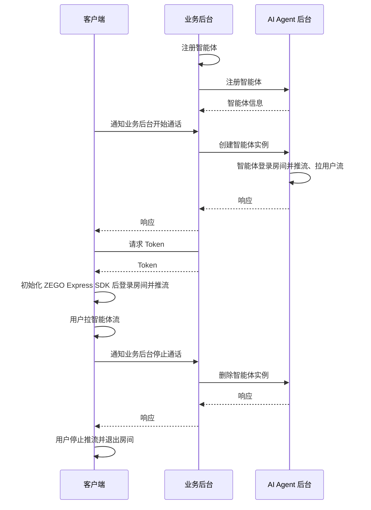

export const getPlatformData = (props, data) => {
    const platform = (props.platform ?? "Android").toLowerCase();
    for (const [key, value] of Object.entries(data)) {
        const pList = key.split(",").map((v) => v.toLowerCase());
        if (pList.includes(platform)) {
            return value;
        }
    }
    return data["Android"] || data["android"] || data["default"];
};

export const getPlatformData2 = (props, data) => {
    const platform = (props.platform ?? "default").toLowerCase();
    for (const [key, value] of Object.entries(data)) {
        const pList = key.split(",").map((v) => v.toLowerCase());
        if (pList.includes(platform)) {
            return value;
        }
    }
    return data["default"];
};

export const expressSDKMap = {
  'Android': <a href="https://doc-zh.zego.im/article/3575" target='_blank'>ZEGO Express SDK</a>,
  'iOS': <a href="https://doc-zh.zego.im/article/3574" target='_blank'>ZEGO Express SDK</a>,
  'Web': <a href="https://doc-zh.zego.im/article/6839" target='_blank'>ZEGO Express SDK</a>,
}

# 快速发起语音通话

本文档用于说明如何快速集成客户端 SDK （ZEGO Express SDK）并实现与智能体进行语音互动。

## 前提条件

- 已在 [ZEGO 控制台](https://console.zego.im/) 创建项目，并申请有效的 AppID 和 AppSign，详情请参考 [控制台 - 项目信息](https://doc-zh.zego.im/article/12107)。
:::if{props.platform="undefined|iOS"}
<div>
- 已联系 ZEGO 技术支持获取支持 AI 回声消除的 {getPlatformData(props,expressSDKMap)}，并集成到您的项目中。
</div>
:::
- 已按 [业务后台快速开始指引](/aiagent-server/quick-start) 集成了 AI Agent 相关服务端 API。

## 示例代码
以下是接入实时互动 AI Agent API 的业务后台示例代码，您可以参考示例代码来实现自己的业务逻辑。

<CardGroup cols={2}>
<Card title="业务后台示例代码"  href="https://github.com/ZEGOCLOUD/ai_agent_quick_start_server" target="_blank">
包含最基本的获取 ZEGO Token、注册智能体、创建智能体实例、删除智能体实例等能力。
</Card>
</CardGroup>

以下是客户端示例代码，，您可以参考示例代码来实现自己的业务逻辑。

<CardGroup cols={2}>
:::if{props.platform=undefined}
<Card title="Android 客户端示例代码" href="https://github.com/ZEGOCLOUD/ai_agent_quick_start/tree/master/android" target="_blank">
包含最基本的登录、推流、拉流、退出房间等能力。
</Card>
:::
:::if{props.platform="iOS"}
<Card title="iOS 客户端示例代码" href="https://github.com/ZEGOCLOUD/ai_agent_quick_start/tree/master/ios" target="_blank">
包含最基本的登录、推流、拉流、退出房间等能力。
</Card>
:::
:::if{props.platform="flutter"}
<Card title="iOS 客户端示例代码" href="https://github.com/ZEGOCLOUD/ai_agent_quick_start/tree/master/flutter" target="_blank">
包含最基本的登录、推流、拉流、退出房间等能力。
</Card>
:::
:::if{props.platform="Web"}
<Card title="Web 客户端示例代码" href="https://github.com/ZEGOCLOUD/ai_agent_quick_start/tree/master/web" target="_blank">
包含最基本的登录、推流、拉流、退出房间等能力。
</Card>
:::
</CardGroup>

:::if{props.platform="undefined|flutter|Web"}
以下视频演示了如何跑通服务端和客户端（Web）示例代码并跟智能体进行语音互动。
<Video src="https://media-resource.spreading.io/docuo/workspace564/27e54a759d23575969552654cb45bf89/557a014d7c.mp4" />
:::
:::if{props.platform="iOS"}
以下视频演示了如何跑通服务端和客户端（iOS）示例代码并跟智能体进行语音互动。
<Video src="https://media-resource.spreading.io/docuo/workspace564/27e54a759d23575969552654cb45bf89/aaaa65c2d4.mp4" />
:::

## 整体业务流程

1. 服务端，参考[业务后台快速开始](/aiagent-server/quick-start)文档跑通业务后台示例代码，部署好业务后台
    - 接入实时互动 AI Agent API 管理智能体。
2. 客户端，跑通示例代码
    - 通过业务后台创建和管理智能体。
    - 集成  {getPlatformData(props,expressSDKMap)} 完成实时通信。

完成以上两个步骤后即可实现将智能体加入房间并与真实用户进行实时互动。



## 核心能力实现

### 集成 ZEGO Express SDK

:::if{props.platform=undefined}

请参考 [集成 SDK > 2.2 > 方式2](https://doc-zh.zego.im/article/3575#2) 手动集成 SDK。集成 SDK 后按以下步骤初始化 ZegoExpressEngine。

<div>
<Steps>
<Step title="添加权限声明">
进入 "app/src/main" 目录，打开 "AndroidManifest.xml" 文件，添加权限。
```xml AndroidManifest.xml
<uses-permission android:name="android.permission.ACCESS_NETWORK_STATE" />
<uses-permission android:name="android.permission.INTERNET" />
<uses-permission android:name="android.permission.RECORD_AUDIO" />
```
</Step>
<Step title="运行时申请录音权限">
```java
private final ActivityResultLauncher<String> requestPermissionLauncher = registerForActivityResult(
    new ActivityResultContracts.RequestPermission(), new ActivityResultCallback<Boolean>() {
        @Override
        public void onActivityResult(Boolean isGranted) {
            if (isGranted) {
                // 同意权限
            }
        }
    });
//发起请求
requestPermissionLauncher.launch(Manifest.permission.RECORD_AUDIO);
```
</Step>
<Step title="创建并初始化 ZegoExpressEngine">
```java {3}
ZegoEngineProfile zegoEngineProfile = new ZegoEngineProfile();
zegoEngineProfile.appID = ; // 从即构控制台获取的 appId
zegoEngineProfile.scenario = ZegoScenario.HIGH_QUALITY_CHATROOM;
zegoEngineProfile.application = getApplication();
ZegoExpressEngine.createEngine(zegoEngineProfile, null);
```
</Step>
</Steps>
</div>
:::

:::if{props.platform="iOS"}

请参考 [集成 SDK > 2.2 > 方式三](https://doc-zh.zego.im/article/3574#2_2) 手动集成 SDK。集成 SDK 后按以下步骤初始化 ZegoExpressEngine。

<div>
<Steps>
<Step title="在 Info.plist 文件声明必要的权限">
```xml Info.plist
<?xml version="1.0" encoding="UTF-8"?>
<!DOCTYPE plist PUBLIC "-//Apple//DTD PLIST 1.0//EN" "http://www.apple.com/DTDs/PropertyList-1.0.dtd">
<plist version="1.0">
<dict>
    ...
    <key>UIBackgroundModes</key>
    <array>
        <string>audio</string>
    </array>
    <key>NSMicrophoneUsageDescription</key>
    <string>需要访问麦克风以进行语音聊天</string>
</dict>
</plist>
```
</Step>
<Step title="运行时申请录音权限">
```objectivec
- (void)requestAudioPermission:(void(^)(BOOL granted))completion {
    /// 需要在项目的 Info.plist 文件中添加麦克风权限的使用说明
    AVAudioSession *audioSession = [AVAudioSession sharedInstance];
    [audioSession requestRecordPermission:^(BOOL granted) {
        dispatch_async(dispatch_get_main_queue(), ^{
            completion(granted);
        });
    }];
}
```
</Step>
<Step title="创建并初始化 ZegoExpressEngine">

```objectivec {4}
-(void)initZegoExpressEngine{
    ZegoEngineProfile* profile = [[ZegoEngineProfile alloc]init];
    profile.appID = kZegoPassAppId;
    profile.scenario = ZegoScenarioHighQualityChatroom; //设置该场景可以避免申请相机权限，接入方应按自己的业务场景设置具体值

    [ZegoExpressEngine createEngineWithProfile:profile eventHandler:self];
}
```
</Step>
</Steps>
</div>

:::

:::if{props.platform="flutter"}

请参考 [集成 SDK > 2.2 > 方式一](https://doc-zh.zego.im/article/13196#2_2) 手动集成 SDK。集成 SDK 后按以下步骤初始化 ZegoExpressEngine。
> 如果包含web平台,  请参考 [集成 SDK > 3.4](https://doc-zh.zego.im/article/13196#3_3) 手动引入 JS文件。

<div>
<Steps>
<Step title="进入 android/app/src/main 目录，打开 AndroidManifest.xml 文件，添加权限">
```xml AndroidManifest.xml
<uses-permission android:name="android.permission.RECORD_AUDIO" />
<uses-permission android:name="android.permission.MODIFY_AUDIO_SETTINGS" />
<uses-permission android:name="android.permission.INTERNET" />
<uses-permission android:name="android.permission.BLUETOOTH" />
<uses-permission android:name="android.permission.ACCESS_WIFI_STATE" />
<uses-permission android:name="android.permission.ACCESS_NETWORK_STATE" />
```
</Step>
<Step title="进入 ios/Runner 目录，打开 Info.plist 文件，添加权限">
```xml Info.plist
<?xml version="1.0" encoding="UTF-8"?>
<!DOCTYPE plist PUBLIC "-//Apple//DTD PLIST 1.0//EN" "http://www.apple.com/DTDs/PropertyList-1.0.dtd">
<plist version="1.0">
<dict>
    ...
    <key>UIBackgroundModes</key>
    <array>
        <string>audio</string>
    </array>
    <key>NSMicrophoneUsageDescription</key>
    <string>需要访问麦克风以进行语音聊天</string>
</dict>
</plist>
```
</Step>
<Step title="进入 ios 目录，打开 Podfile 文件，添加权限">
```xml Podfile {5-12}
post_install do |installer|
  installer.pods_project.targets.each do |target|
    flutter_additional_ios_build_settings(target)

    # Start of the permission_handler configuration
    target.build_configurations.each do |config|
      config.build_settings['GCC_PREPROCESSOR_DEFINITIONS'] ||= [
        '$(inherited)',
        'PERMISSION_MICROPHONE=1',
      ]
    end
    # End of the permission_handler configuration
  end
end
```
</Step>
<Step title="运行时申请麦克风权限">
```dart
import 'package:permission_handler/permission_handler.dart';

void main() {
  WidgetsFlutterBinding.ensureInitialized();

  Permission.microphone.request().then((status) {
    runApp(const MyApp());
  });
}
```
</Step>
<Step title="创建并初始化 ZegoExpressEngine">
```dart {3}
await ZegoExpressEngine.createEngineWithProfile(
  /// 设置该场景可以避免申请相机权限，接入方应按自己的业务场景设置具体值
  ZegoEngineProfile(ZegoKey.appId, ZegoScenario.HighQualityChatroom),
);
```
</Step>
</Steps>
</div>

:::

:::if{props.platform="Web"}

请参考 [集成 SDK > 方式 1](https://doc-zh.zego.im/article/6839#2_1) 使用 npm 集成 SDK v3.9.123或更高版本。集成 SDK 后按以下步骤初始化 ZegoExpressEngine。

1 实例化 ZegoExpressEngine

2 检查系统要求（WebRTC 支持和麦克风权限）

```javascript {7,9}
import { ZegoExpressEngine } from "zego-express-engine-webrtc";

const appID = 1234567 // 从即构控制台获取
const server = 'xxx' // 从即构控制台获取

// 实例化 ZegoExpressEngine传入appId和server等配置
const zg = new ZegoExpressEngine(appID, server);
// 检查系统要求
const checkSystemRequirements = async () => {
    // 检测是否支持webRTC
    const rtc_sup = await zg.checkSystemRequirements("webRTC");
    if (!rtc_sup.result) {
      // 浏览器不支持webrtc
  }
    // 检测是否开启麦克风权限
    const mic_sup = await zg.checkSystemRequirements("microphone");
    if (!mic_sup.result) {
      // 未开启麦克风权限
  }
}
checkSystemRequirements()
```
:::

### 通知业务后台开始通话

可在客户端真实用户进入房间后立即通知业务后台开始通话，异步调用可加降低通话接通时间。业务后台收到开始通话通知后，使用与客户端相同的 roomID 及关联的 userID 和 streamID 创建智能体实例，这样智能体就能与真实用户在同一个房间内进行相互推拉流实现语音互动。

<Warning title="注意">默认情况下一个账号下最多同时存在 10 个智能体实例，超过限制后创建智能体实例会失败，如需调整请联系 ZEGO 商务。</Warning>

<Accordion title="通知业务后台的示例代码" defaultOpen="false">

<Note title="说明">以下示例在通知业务后台开始通话时，并没有传递 roomID、userID、streamID 等参数，是因为本示例客户端与业务后台约定好了固定值。实际使用时，请根据业务需求传递对应的参数。</Note>

:::if{props.platform=undefined}
```java
// 通知业务后台开始通话
private void start() {
    RequestBody body = RequestBody.create("", MediaType.parse("application/json; charset=utf-8"));
    Request request = new Request.Builder().url(YOUR_SERVER_URL + "/api/start").post(body).build();

    new OkHttpClient.Builder().build().newCall(request).enqueue(new Callback() {
        @Override
        public void onFailure(@NonNull Call call, @NonNull IOException e) {

        }

        @Override
        public void onResponse(@NonNull Call call, @NonNull Response response) throws IOException {

        }
    });
}
```
:::
:::if{props.platform="iOS"}
```objectivec
// 通知业务后台开始通话
/**
 * 开始与AI智能体进行通话
 *
 * @param completion 完成回调，返回操作结果
 * @discussion 该方法会向服务器发送开始通话的请求，用于初始化AI智能体实例
 */
- (void)doStartCallWithCompletion:(void (^)(NSInteger code, NSString *message, NSDictionary *data))completion {
    // 构建请求URL
    NSString *url = [NSString stringWithFormat:@"%@/api/start", self.currentBaseURL];
    NSURL *requestURL = [NSURL URLWithString:url];

    // 创建请求
    NSMutableURLRequest *request = [[NSMutableURLRequest alloc] initWithURL:requestURL];
    request.HTTPMethod = @"POST";

    // 设置请求头
    [request setValue:@"application/json" forHTTPHeaderField:@"Content-Type"];

    // 创建请求参数
    NSMutableDictionary *params = [NSMutableDictionary dictionary];
    NSData *jsonData = [NSJSONSerialization dataWithJSONObject:params options:0 error:nil];
    request.HTTPBody = jsonData;

    // 创建会话
    NSURLSession *session = [NSURLSession sharedSession];

    // 发送请求
    NSURLSessionDataTask *task = [session dataTaskWithRequest:request
                                           completionHandler:^(NSData * _Nullable data,
                                                            NSURLResponse * _Nullable response,
                                                            NSError * _Nullable error) {
        dispatch_async(dispatch_get_main_queue(), ^{
            if (error) {
                if (completion) {
                    completion(-1, @"网络请求失败", nil);
                }
                return;
            }

            NSHTTPURLResponse *httpUrlResponse = (NSHTTPURLResponse *)response;
            if (httpUrlResponse.statusCode != 200) {
                if (completion) {
                    completion(httpUrlResponse.statusCode,
                             [NSString stringWithFormat:@"服务器错误: %ld", (long)httpUrlResponse.statusCode],
                             nil);
                }
                return;
            }

            NSError *jsonError;
            NSDictionary *dict = [NSJSONSerialization JSONObjectWithData:data options:0 error:&jsonError];
            if (jsonError) {
                if (completion) {
                    completion(-2, @"解析响应数据失败", nil);
                }
                return;
            }

            // 解析响应数据
            NSInteger code = [dict[@"code"] integerValue];
            NSString *message = dict[@"message"];
            NSDictionary *responseData = dict[@"data"];

            if (completion) {
                completion(code, message, responseData);
            }
        });
    }];

    [task resume];
}
```
:::
:::if{props.platform="flutter"}
```dart
// 通知业务后台开始通话
Future<Map<String, dynamic>> startCall() async {
  try {
    final response = await http.post(
      Uri.parse('$_currentBaseUrl/api/start'),
      headers: {'Content-Type': 'application/json'},
    );

    if (response.statusCode == 200) {
      final json = jsonDecode(response.body);
      return json;
    }
    return {'code': -1, 'message': '请求失败'};
  } catch (e) {
    return {'code': -1, 'message': e.toString()};
  }
}
```
:::
:::if{props.platform="Web"}
```javascript
// 通知业务后台开始通话
async function startCall() {
  try {
    const response = await fetch(`${YOUR_SERVER_URL}/api/start`, { // YOUR_SERVER_URL 为您的业务后台地址
      method: 'POST',
      headers: {
        'Content-Type': 'application/json',
      }
    });

    const data = await response.json();
    console.log('开始通话结果:', data);
    return data;
  } catch (error) {
    console.error('开始通话失败:', error);
    throw error;
  }
}
```
:::
</Accordion>

### 用户进入房间并推流

真实用户登录房间后推流。

:::if{props.platform="undefined|iOS"}
<Note title="说明">
在此场景下需要开启 AI 回声消除以获得更好的效果。
</Note>
:::

登录用的 token 需要从您的业务后台获取，请参考完整示例代码。

<Note title="说明">
请确保 roomID、userID、streamID 在一个 ZEGO APPID 下是唯一的。
- roomID: 由用户自己定义生成规则,会用来登录 Express SDK 的房间。仅支持数字，英文字符 和 '~', '!', '@', '#', '
<Content platform="Web"/>, '%', '^', '&', '*', '(', ')', '_', '+', '=', '-', '`', ';', '’', ',', '.', '\<', '\>', ''。如果需要与 Web SDK 互通，请不要使用 '%'。
- userID: 长度不超过32字节。仅支持数字，英文字符 和 '~', '!', '@', '#', '
<Content platform="Web"/>, '%', '^', '&', '*', '(', ')', '_', '+', '=', '-', '`', ';', '’', ',', '.', '\<', '\>', '\'。如果需要与 Web SDK 互通，请不要使用 '%'。
- streamID: 长度不超过256字节。仅支持数字，英文字符 和 '-', '_'。
</Note>

:::if{props.platform=undefined}
```java 客户端登录房间并推流 {5,6,12-17,25,30}
private void loginRoom(String userId, String userName, String userName, String token,
    IZegoRoomLoginCallback callback) {
    ZegoEngineConfig config = new ZegoEngineConfig();
    HashMap<String, String> advanceConfig = new HashMap<String, String>();
    advanceConfig.put("set_audio_volume_ducking_mode", "1");
    advanceConfig.put("enable_rnd_volume_adaptive", "true");
    config.advancedConfig = advanceConfig;
    ZegoExpressEngine.setEngineConfig(config);
    ZegoExpressEngine.getEngine().setRoomScenario(ZegoScenario.HIGH_QUALITY_CHATROOM);
    ZegoExpressEngine.getEngine().setAudioDeviceMode(ZegoAudioDeviceMode.GENERAL);

    ZegoExpressEngine.getEngine().enableAEC(true);
    //请注意：开启 AI 回声消除需要联系 ZEGO 技术支持获取对应版本的 ZEGOExpress SDK
    ZegoExpressEngine.getEngine().setAECMode(ZegoAECMode.AI_AGGRESSIVE2);
    ZegoExpressEngine.getEngine().enableAGC(true);
    ZegoExpressEngine.getEngine().enableANS(true);
    ZegoExpressEngine.getEngine().setANSMode(ZegoANSMode.MEDIUM);

    ZegoRoomConfig roomConfig = new ZegoRoomConfig();
    roomConfig.isUserStatusNotify = true;
    roomConfig.token = token;  // 需要 token 鉴权，从您的业务后台获取，生成方式请参考ZEGO官网文档

    String roomId ;   // 自定义用来登录的房间的Id，格式请参考说明
    String userSteamID // 自定义用于推流的流Id，格式请参考说明
    ZegoExpressEngine.getEngine()
        .loginRoom(roomId, new ZegoUser(userId, userName), roomConfig, (errorCode, extendedData) -> {
            Timber.d(
                "loginRoom() called with: errorCode = [" + errorCode + "], extendedData = [" + extendedData + "]");
            if (errorCode == 0) {
                // 登录成功以后进行推流
                ZegoExpressEngine.getEngine().startPublishingStream(userSteamID);
                // 设置麦克风静音状态，false 表示不静音，true 表示静音
                ZegoExpressEngine.getEngine().muteMicrophone(false);
            }
            if (callback != null) {
                callback.onRoomLoginResult(errorCode, extendedData);
            }

        });
}
```
:::
:::if{props.platform="iOS"}
```objectivec 客户端登录房间并推流 {6-7,9,16-20,23}
// 记录智能体
self.streamToPlay = [self getAgentStreamID];

ZegoEngineConfig* engineConfig = [[ZegoEngineConfig alloc] init];
engineConfig.advancedConfig = @{
    @"set_audio_volume_ducking_mode":@1,/**该配置是用来做音量闪避的**/
    @"enable_rnd_volume_adaptive":@"true",/**该配置是用来做播放音量自适用**/
};
[ZegoExpressEngine setEngineConfig:engineConfig];

//这个设置只影响AEC（回声消除），我们这里设置为ModeGeneral，是会走我们自研的回声消除，这比较可控，
//如果其他选项，可能会走系统的回声消除，这在iphone手机上效果可能会更好，但如果在一些android机上效果可能不好
[[ZegoExpressEngine sharedEngine] setAudioDeviceMode:ZegoAudioDeviceModeGeneral];

//请注意：开启 AI 回声消除需要联系 ZEGO 技术支持获取对应的ZegoExpressionEngine.xcframework，具备该能力的版本还未发布官网
[[ZegoExpressEngine sharedEngine] enableAGC:TRUE];
[[ZegoExpressEngine sharedEngine] enableAEC:TRUE];
[[ZegoExpressEngine sharedEngine] setAECMode:ZegoAECModeAIAggressive2];
[[ZegoExpressEngine sharedEngine] enableANS:TRUE];
[[ZegoExpressEngine sharedEngine] setANSMode:ZegoANSModeMedium];

// 登录房间
[self loginRoom:^(int errorCode, NSDictionary *extendedData) {
    if (errorCode!=0) {
        NSString* errorMsg =[NSString stringWithFormat:@"进入语音房间失败:%d", errorCode];
        completion(NO, errorMsg);
        return;
    }

    //进房后开始推流
    [self startPushlishStream];
}];
```
:::
:::if{props.platform="flutter"}
```dart 客户端登录房间并推流 {11-21,25-27,30-33,40}
final String _userId = 'user_id_1';
final String _roomId = 'room_id_1';
final String _userStreamId = 'user_stream_id_1';

/// 生成 RTC Token [参考文档]（https://doc-zh.zego.im/article/14350）
final token = await getToken();
if (token.isEmpty) {
  return false;
}

/// 下面用来做应答延迟优化的，需要集成对应版本的ZegoExpressEngine sdk，请联系即构同学
ZegoExpressEngine.setEngineConfig(
  ZegoEngineConfig(
    advancedConfig: {
      /**该配置是用来做音量闪避的**/
      'set_audio_volume_ducking_mode': '1',
      /**该配置是用来做播放音量自适用**/
      'enable_rnd_volume_adaptive': 'true'
    },
  ),
);


/// 启用3A
ZegoExpressEngine.instance.enableAGC(true);
ZegoExpressEngine.instance.enableAEC(true);
if (!kIsWeb) {
  ZegoExpressEngine.instance.setAECMode(ZegoANSMode.AIAGGRESSIVE2);

  /// 这个设置只影响AEC（回声消除），我们这里设置为ModeGeneral，是会走我们自研的回声消除，这比较可控，
  /// 如果其他选项，可能会走系统的回声消除，这在iphone手机上效果可能会更好，但如果在一些android机上效果可能不好
  ZegoExpressEngine.instance.setAudioDeviceMode(
    ZegoAudioDeviceMode.General,
  );
}
ZegoExpressEngine.instance.enableANS(true);
ZegoExpressEngine.instance.setANSMode(ZegoANSMode.Medium);

/// 登录房间
final user = ZegoUser(_userId, _userId);
final roomConfig = ZegoRoomConfig.defaultConfig()
  ..isUserStatusNotify = true
  ..token = token;
final loginResult = await ZegoExpressEngine.instance.loginRoom(
  _roomId,
  user,
  config: roomConfig,
);
if (0 != loginResult.errorCode && 1002001 != loginResult.errorCode) {
  return false;
}

/// 开始推流（打开麦克风）
await ZegoExpressEngine.instance.muteMicrophone(false);
await ZegoExpressEngine.instance.startPublishingStream(_userStreamId);
```
:::
:::if{props.platform="Web"}

```javascript 客户端登录房间并推流 {22-23}
const userId = "" // 登录 Express SDK房间用户ID
const roomId = "" // RTC 房间 ID
const userStreamId = "" // 用户推流 ID
async function enterRoom() {
  try {
    // 生成 RTC Token [参考文档]（https://doc-zh.zego.im/article/7646）
    const token = await Api.getToken();
    // 登录房间
    await zg.loginRoom(roomId, token, {
      userID: userId,
      userName: "",
    });

    // 创建本地音频流
    const localStream = await zg.createZegoStream({
      camera: {
        video: false,
        audio: true,
      },
    });
    if (localStream) {
      // 推送本地流
      await zg.startPublishingStream(userStreamId, localStream);
    }
  } catch (error) {
    console.error("进入房间失败:", error);
    throw error;
  }
}
enterRoom()
```
:::

### 拉智能体流

默认只有一个真实用户及智能体在同一个房间内，所以拉流时默认新增的就是智能体流。

:::if{props.platform=undefined}

```java 客户端拉智能体的流 {9-16}
// 监听回调
void setEventHandler() {
    ZegoExpressEngine.getEngine().setEventHandler(new IZegoEventHandler() {
        @Override
        // 房间内其他用户推流/停止推流时，我们会在这里收到相应用户的音视频流增减的通知
        public void onRoomStreamUpdate(String roomID, ZegoUpdateType updateType, ArrayList<ZegoStream> streamList, JSONObject extendedData) {
            super.onRoomStreamUpdate(roomID, updateType, streamList, extendedData);
            //当 updateType 为 ZegoUpdateType.ADD 时，代表有音视频流新增，此时我们可以调用 startPlayingStream 接口拉取该音视频流
            if (updateType == ZegoUpdateType.ADD) {
                ZegoStream stream = streamList.get(0);
                // 默认新增是智能体流，直接拉流
                ZegoExpressEngine.getEngine().startPlayingStream(stream.streamID);
            }
        }
    });
}
```
:::
:::if{props.platform="iOS"}

```objectivec 客户端拉智能体的流 {10}
//监听房间流信息更新状态，拉取智能体流播放
- (void)onRoomStreamUpdate:(ZegoUpdateType)updateType
                streamList:(NSArray<ZegoStream *> *)streamList
              extendedData:(nullable NSDictionary *)extendedData
                    roomID:(NSString *)roomID{
    if (updateType == ZegoUpdateTypeAdd) {
        for (int i=0; i<streamList.count; i++) {
            ZegoStream* item = [streamList objectAtIndex:i];

            [self startPlayStream:item.streamID];
        }
    } else if(updateType == ZegoUpdateTypeDelete) {
        for (int i=0; i<streamList.count; i++) {
            ZegoStream* item = [streamList objectAtIndex:i];
            [[ZegoExpressEngine sharedEngine] stopPlayingStream:item.streamID];
        }
    }
}
```
:::
:::if{props.platform="flutter"}
```dart 客户端拉智能体的流
  ZegoExpressEngine.onRoomStreamUpdate = _onRoomStreamUpdate;

  void _onRoomStreamUpdate(
    String roomID,
    ZegoUpdateType updateType,
    List<ZegoStream> streamList,
    Map<String, dynamic> extendedData,
  ) {
    if (updateType == ZegoUpdateType.Add) {
      for (var stream in streamList) {
        ZegoExpressEngine.instance.startPlayingStream(stream.streamID);
      }
    } else if (updateType == ZegoUpdateType.Delete) {
      for (var stream in streamList) {
        ZegoExpressEngine.instance.stopPlayingStream(stream.streamID);
      }
    }
  }
```
:::
:::if{props.platform="Web"}

```javascript 客户端拉智能体的流 {9}
// 监听远端流更新事件
function setupEvent() {
  zg.on("roomStreamUpdate",
    async (roomID, updateType, streamList) => {
      if (updateType === "ADD" && streamList.length > 0) {
        try {
          for (const stream of streamList) {
            // 拉智能体流
            const mediaStream = await zg.startPlayingStream(stream.streamID);
            if (!mediaStream) return;
            const remoteView = await zg.createRemoteStreamView(mediaStream);
            if (remoteView) {
             // 这里需要页面上有个id为remoteSteamView的容器接收智能体流 [参考文档]（https://doc-zh.zego.im/article/api?doc=Express_Video_SDK_API~javascript_web~class~ZegoStreamView）
              remoteView.play("remoteSteamView", {
                enableAutoplayDialog: false,
              });
            }
          }
        } catch (error) {
          console.error("拉流失败:", error);
        }
      }
    }
  );
}
```
:::


恭喜你🎉！完成这一步骤后，您已经可以用语音问智能体任何问题，智能体都会用语音回答您的问题！

### 退出房间结束通话

客户端调用退出登录接口退出房间，并停止推拉流。同时通知业务后台本次通话结束。业务后台收到结束通话通知后会删除智能体实例，智能体实例会自动退出房间并停止推拉流。这样一次完整的互动就结束了。

:::if{props.platform=undefined}
```java {4,16}
// 通知业务后台结束通话
private void stop() {
    RequestBody body = RequestBody.create("", MediaType.parse("application/json; charset=utf-8"));
    Request request = new Request.Builder().url(YOUR_SERVER_URL + "/api/stop").post(body).build();

    new OkHttpClient.Builder().build().newCall(request).enqueue(new Callback() {
        @Override
        public void onFailure(@NonNull Call call, @NonNull IOException e) {

        }

        @Override
        public void onResponse(@NonNull Call call, @NonNull Response response) throws IOException {
            if (response.isSuccessful()) {
                // 退出房间
                ZegoExpressEngine.getEngine().logoutRoom();
            }
        }
    });
}

```
:::
:::if{props.platform="iOS"}
```objectivec {9,69}
/**
 * 通知业务后台结束通话
 *
 * @param completion 完成回调，返回操作结果
 * @discussion 该方法会向服务器发送结束通话的请求，用于释放AI智能体实例
 */
- (void)doStopCallWithCompletion:(void (^)(NSInteger code, NSString *message, NSDictionary *data))completion {
    // 构建请求URL
    NSString *url = [NSString stringWithFormat:@"%@/api/stop", self.currentBaseURL];
    NSURL *requestURL = [NSURL URLWithString:url];

    // 创建请求
    NSMutableURLRequest *request = [[NSMutableURLRequest alloc] initWithURL:requestURL];
    request.HTTPMethod = @"POST";

    // 设置请求头
    [request setValue:@"application/json" forHTTPHeaderField:@"Content-Type"];

    // 创建请求参数
    NSMutableDictionary *params = [NSMutableDictionary dictionary];
    NSData *jsonData = [NSJSONSerialization dataWithJSONObject:params options:0 error:nil];
    request.HTTPBody = jsonData;

    // 创建会话
    NSURLSession *session = [NSURLSession sharedSession];

    // 发送请求
    NSURLSessionDataTask *task = [session dataTaskWithRequest:request
                                           completionHandler:^(NSData * _Nullable data,
                                                            NSURLResponse * _Nullable response,
                                                            NSError * _Nullable error) {
        dispatch_async(dispatch_get_main_queue(), ^{
            if (error) {
                if (completion) {
                    completion(-1, @"网络请求失败", nil);
                }
                return;
            }

            NSHTTPURLResponse *httpUrlResponse = (NSHTTPURLResponse *)response;
            if (httpUrlResponse.statusCode != 200) {
                if (completion) {
                    completion(httpUrlResponse.statusCode,
                             [NSString stringWithFormat:@"服务器错误: %ld", (long)httpUrlResponse.statusCode],
                             nil);
                }
                return;
            }

            NSError *jsonError;
            NSDictionary *dict = [NSJSONSerialization JSONObjectWithData:data options:0 error:&jsonError];
            if (jsonError) {
                if (completion) {
                    completion(-2, @"解析响应数据失败", nil);
                }
                return;
            }

            // 解析响应数据
            NSInteger code = [dict[@"code"] integerValue];
            NSString *message = dict[@"message"];
            NSDictionary *responseData = dict[@"data"];

            if (completion) {
                completion(code, message, responseData);
            }

            // 退出房间
            [[ZegoExpressEngine sharedEngine] logoutRoom];
        });
    }];

    [task resume];
}
```
:::
:::if{props.platform="flutter"}
```dart
// 通知业务后台结束通话
Future<Map<String, dynamic>> stopCall() async {
  try {
    final response = await http.post(
      Uri.parse('$_currentBaseUrl/api/stop'),
      headers: {'Content-Type': 'application/json'},
    );

    if (response.statusCode == 200) {
      final json = jsonDecode(response.body);
      return json;
    }
    return {'code': -1, 'message': '请求失败'};
  } catch (e) {
    return {'code': -1, 'message': e.toString()};
  }
}

/// 停止与AI智能体的会话
Future<bool> stop() async {
  stopCall();

  final String _roomId = 'room_id_1';

  final engine = ZegoExpressEngine.instance;

  /// 停止推流
  await engine.stopPublishingStream();

  /// 登出房间
  await engine.logoutRoom(_roomId);

  return true;
}
```
:::
:::if{props.platform="Web"}
```javascript {4,21}
// 退出房间
async function stopCall() {
  try {
    const response = await fetch(`${YOUR_SERVER_URL}/api/stop`, { // YOUR_SERVER_URL 为您的业务后台地址
      method: 'POST',
      headers: {
        'Content-Type': 'application/json',
      }
    });

    const data = await response.json();
    console.log('结束通话结果:', data);
    return data;
  } catch (error) {
    console.error('结束通话失败:', error);
    throw error;
  }
}
stopCall();
zg.destroyLocalStream(localStream);
zg.logoutRoom();
```
:::


以上就是您实现与智能体进行实时语音互动的完整核心流程。

## ZEGO Express SDK 最佳配置实践

为了获得最佳的音频通话体验，建议按照以下最佳实践配置 ZEGO Express SDK。这些配置可以显著提升智能体语音交互的质量。

:::if{props.platform="undefined|iOS"}

**进房间前设置：**
<div>
- 开启传统音频 3A 处理（回声消除AEC、自动增益控制AGC、噪声抑制ANS）
- 设置房间的使用场景为高品质语聊房场景，SDK 会针对不同的场景采取不同的优化策略
- 设置音频设备模式为默认模式
- 开启 AI 回声消除，提高回声消除效果（该功能需要联系 ZEGO 技术支持获取对应版本的 ZEGOExpress SDK）
- 配置音量闪避，避免声音冲突
- 启用播放音量自适应，提升用户体验
- 启用 AI 降噪，设置适当的噪声抑制级别
</div>
:::

:::if{props.platform=undefined}

```java
ZegoEngineConfig config = new ZegoEngineConfig();
HashMap<String, String> advanceConfig = new HashMap<String, String>();
// 配置音量闪避，避免声音冲突
advanceConfig.put("set_audio_volume_ducking_mode", "1");
// 启用播放音量自适应
advanceConfig.put("enable_rnd_volume_adaptive", "true");
config.advancedConfig = advanceConfig;
ZegoExpressEngine.setEngineConfig(config);
//设置房间的使用场景为高品质语聊房场景
ZegoExpressEngine.getEngine().setRoomScenario(ZegoScenario.HIGH_QUALITY_CHATROOM);
// 设置音频设备模式  默认模式
ZegoExpressEngine.getEngine().setAudioDeviceMode(ZegoAudioDeviceMode.GENERAL);
// 开启传统音频 3A 处理
ZegoExpressEngine.getEngine().enableAEC(true);
ZegoExpressEngine.getEngine().enableAGC(true);
ZegoExpressEngine.getEngine().enableANS(true);
// 开启 AI 回声消除，请注意：开启 AI 回声消除需要联系 ZEGO 技术支持获取对应版本的 ZEGOExpress SDK
ZegoExpressEngine.getEngine().setAECMode(ZegoAECMode.AI_AGGRESSIVE2);
// 开启 AI 降噪，适度的噪声抑制
ZegoExpressEngine.getEngine().setANSMode(ZegoANSMode.MEDIUM);
```
:::

:::if{props.platform="iOS"}

```objectivec
ZegoEngineProfile* profile = [[ZegoEngineProfile alloc]init];
profile.appID = kZegoAppId;
profile.scenario = ZegoScenarioHighQualityChatroom; //高品质语聊房场景，设置该场景可以避免申请相机权限，接入方应按自己的业务场景设置具体值
ZegoEngineConfig* engineConfig = [[ZegoEngineConfig alloc] init];
engineConfig.advancedConfig = @{
    @"set_audio_volume_ducking_mode":@1,/**配置音量闪避，避免声音冲突**/
    @"enable_rnd_volume_adaptive":@"true",/**启用播放音量自适应**/
};
[ZegoExpressEngine setEngineConfig:engineConfig];
[ZegoExpressEngine createEngineWithProfile:profile eventHandler:self];
// 开启传统音频 3A 处理
[[ZegoExpressEngine sharedEngine] enableAGC:TRUE];
[[ZegoExpressEngine sharedEngine] enableAEC:TRUE];
[[ZegoExpressEngine sharedEngine] enableANS:TRUE];
// 开启 AI 回声消除，请注意：开启 AI 回声消除需要联系 ZEGO 技术支持获取对应版本的 ZEGOExpress SDK
[[ZegoExpressEngine sharedEngine] setAECMode:ZegoAECModeAIAggressive2];
// 开启 AI 降噪，适度的噪声抑制
[[ZegoExpressEngine sharedEngine] setANSMode:ZegoANSModeMedium];

```
:::

:::if{props.platform="Web"}

<div>
- 开启传统音频 3A 处理（回声消除AEC、自动增益控制AGC、噪声抑制ANS）
- 设置房间的使用场景为高品质语聊房场景，SDK 会针对不同的场景采取不同的优化策略
- 推流时，设置推流参数配置自动切换为可用的 `videoCodec`
</div>

```javascript
// 引入必要的模块
import { ZegoExpressEngine } from "zego-express-engine-webrtc";
import { VoiceChanger } from "zego-express-engine-webrtc/voice-changer";

// 加载音频处理模块，需要在 new ZegoExpressEngine 前调用
ZegoExpressEngine.use(VoiceChanger);

// 实例化 ZegoExpressEngine，设置房间的使用场景为高品质语聊房场景
const zg = new ZegoExpressEngine(appid, server, { scenario: 7 })

// 传统音频 3A 处理，SDK 默认开启

// 创建本地媒体流
const localStream = await zg.createZegoStream();

// 推送本地媒体流，需要设置自动切换为可用的 videoCodec
await zg.startPublishingStream(userStreamId, localStream, {
  enableAutoSwitchVideoCodec: true,
});

// 检查系统要求
async function checkSystemRequirements() {
  // 检测是否支持WebRTC
  const rtcSupport = await zg.checkSystemRequirements("webRTC");
  if (!rtcSupport.result) {
    console.error("浏览器不支持WebRTC");
    return false;
  }

  // 检测麦克风权限
  const micSupport = await zg.checkSystemRequirements("microphone");
  if (!micSupport.result) {
    console.error("未获得麦克风权限");
    return false;
  }

  return true;
}
```

## 其他优化建议
<div>
- **浏览器兼容性**：推荐使用 Chrome、Firefox、Safari 等现代浏览器的最新版本
- **网络环境**：确保网络连接稳定，建议使用有线网络或信号良好的Wi-Fi
- **音频设备**：使用质量较好的麦克风和扬声器
- **页面优化**：避免在同一页面运行过多JavaScript任务，可能会影响音频处理性能
- **HTTPS环境**：在生产环境中使用HTTPS协议，以确保获取麦克风权限
</div>
:::

## 监听异常回调

<Warning title="注意">由于 LLM 和 TTS 等参数比较多且复杂，在接入测试过程中容易因为参数配置错误导致的智能体不回答或者不说话等各种异常问题。我们强烈建议您在接入测试过程中监听异常回调，并根据回调信息快速排查问题。</Warning>

<Card title="接收回调" href="/aiagent-server/callbacks/receiving-callback" target="_blank">
点击查看监听异常回调指引。监听回调中 Event 为 Exception 的事件。通过 Data.Code 和 Data.Message 可以快速定位问题。
</Card>
<Content platform="Web"/>