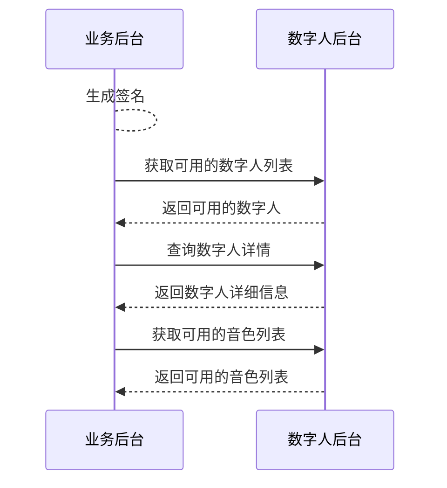

# 查询数字人资产

- - -

## 简介

数字人资产是指数字人和音色，可用于 [合成实时流式数字人视频](/aigc-digital-human-server/basic/digital-human-livestreaming)。

其中：
- 数字人：您在 ZEGO 所能使用的数字人，包括 ZEGO 提供的公共数字人和您在 ZEGO 定制的专属数字人。
- 音色：您在 ZEGO 所能使用的数字人音色，包括 ZEGO 提供的公共音色和您在 ZEGO 定制的专属音色。

本文介绍如何基于服务端 API 快速实现查询数字人资产。

<Note title="说明">
如需了解定制数字人和声音的价格，请联系 ZEGO 商务人员。
</Note>

## 前提条件

在查询数字人资产前，请确保：
- 在 [ZEGO 控制台](https://console.zego.im) 创建项目，并申请有效的 AppID，详情请参考 [控制台 - 项目管理 - 项目信息](https://doc-zh.zego.im/article/12107)。
- 已联系 ZEGO 技术支持开通数字人 API 服务和相关接口的权限。

## 实现流程

### 1 生成签名

根据 [调用方式](/aigc-digital-human-server/server-apis/accessing-server-apis#签名机制) 的签名机制生成签名，签名需设置在下文请求的公共参数中，ZEGO 服务端在收到请求后将对签名进行验证，以校验请求方的合法性。

### 2 查询数字人列表

调用 [查询数字人列表](/aigc-digital-human-server/server-apis/digital-human-management/get-digital-human-list) 接口获取 AppID 下可用数字人的信息列表，从中选择所需数字人 ID（`DigitalHumanId`）。

### 3 查询数字人详情

调用 [查询数字人信息](/aigc-digital-human-server/server-apis/digital-human-management/get-digital-human-info) 接口，传入所获取的 `DigitalHumanId`，查询该数字人的详细信息，包括该数字人支持的动作列表，以便后续用于 [动作驱动数字人](/aigc-digital-human-server/server-apis/digital-human-streaming/do-action) 。

### 4 查询音色列表

调用 [查询音色列表](/aigc-digital-human-server/server-apis/digital-human-management/get-timbre-list) 接口，传入所获取的 `DigitalHumanId`，查询与数字人形象关联的音色信息列表，从中选择所需音色 ID（`TimbreId`），以便后续用于 [合成实时流式数字人视频](/aigc-digital-human-server/basic/digital-human-livestreaming)。

## 下一步

您从上述流程中获取了数字人形象 ID 和音色 ID 后，就可以开始 [合成实时流式数字人视频](/aigc-digital-human-server/basic/digital-human-livestreaming)。

