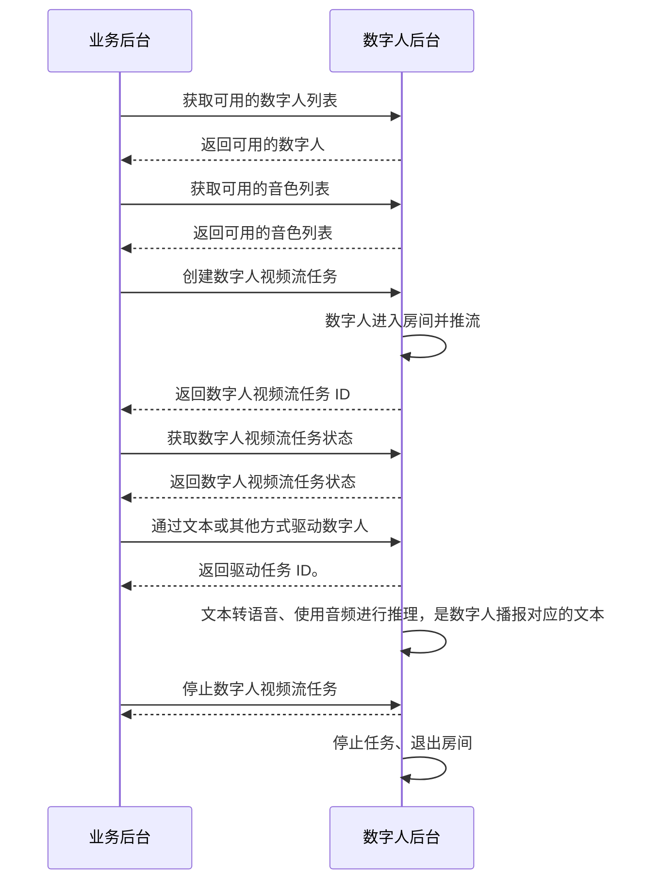

# 合成实时流式数字人视频

- - -

## 简介

本文介绍如何基于服务端 API 快速实现合成实时流式视频。

<Note title="说明">
流式数字人视频生成与推流需要与 [实时音视频](https://doc-zh.zego.im/article/195) 搭配使用。
</Note>

## 前提条件

在合成实时流式视频前，请确保：
- 在 [ZEGO 控制台](https://console.zego.im) 创建项目，并申请有效的 AppID，详情请参考 [控制台 - 项目管理 - 项目信息](https://doc-zh.zego.im/article/12107)。
- 已联系 ZEGO 技术支持开通数字人 API 服务和相关接口的权限。
- 已获取数字人 ID 和音色 ID，详情请参考 [查询数字人资产](/aigc-digital-human-server/basic/describe-assets)。
- 您的项目已 [集成实时音视频 SDK](https://doc-zh.zego.im/article/195)。

## 实现流程

### 1 生成签名

根据 [调用方式](/aigc-digital-human-server/server-apis/accessing-server-apis#签名机制) 的签名机制生成签名，签名需设置在下文请求的公共参数中，ZEGO 服务端在收到请求后将对签名进行验证，以校验请求方的合法性。

### 2 获取可用的数字人列表

调用 [查询数字人列表](/aigc-digital-human-server/server-apis/digital-human-management/get-digital-human-list) 获取可用的数字人。

### 3 获取可用的音色列表

调用 [查询音色列表](/aigc-digital-human-server/server-apis/digital-human-management/get-timbre-list) 获取音色。

### 4 创建数字人视频流任务

调用 [创建数字人视频流任务](/aigc-digital-human-server/server-apis/digital-human-streaming/create-digital-human-stream-task) 创建一个数字人视频流任务，生成数字人实时画面。

### 5 获取数字人视频流任务状态

调用 [获取数字人视频流任务状态](/aigc-digital-human-server/server-apis/digital-human-streaming/get-digital-human-stream-task-status) 获取数字人视频流任务状态，如果状态为 `3：推流中` 则表示任务已经正在运行，客户端可以进入房间拉取到数字人的视频流。

### 6 驱动数字人说话

通过 [文本](/aigc-digital-human-server/server-apis/digital-human-streaming/drive-by-text)、[音频](/aigc-digital-human-server/server-apis/digital-human-streaming/drive-by-audio)、[RTC 音频流](/aigc-digital-human-server/server-apis/digital-human-streaming/drive-by-rtc-stream) 或 [Web Socket 接口](/aigc-digital-human-server/basic/digital-human-ws-drive)，驱动数字人说话。

### 7 停止数字人视频流任务

调用 [停止数字人视频流任务](/aigc-digital-human-server/server-apis/digital-human-streaming/stop-digital-human-stream-task) 停止数字人视频流任务。
