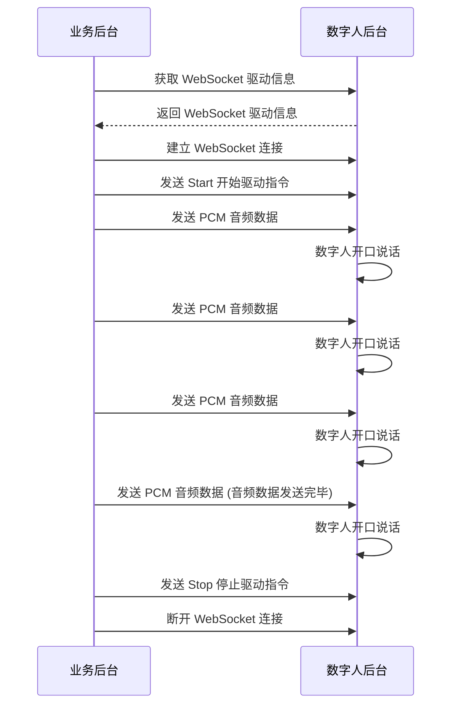

export const DriveIdNote = () => (
  <Note title="说明">请在每次使用 WebSocket 驱动时，都重新调用 DriveByWsStream 接口获取新的 DriveId。</Note>
);

# WebSocket 驱动数字人说话

- - -

## 简介

本文介绍如何使用 WebSocket 传输 PCM 音频数据驱动数字人说话。

## 前提条件

在使用 WebSokcet 驱动之前，请确保：
- 已 [创建数字人视频流任务](/aigc-digital-human-server/server-apis/digital-human-streaming/create-digital-human-stream-task)。

## 实现流程



### 1 获取 WebSocket 驱动信息

调用 [DriveByWsStream](/aigc-digital-human-server/server-apis/digital-human-streaming/drive-by-ws-stream) 接口获取 WebSocket 驱动信息，该接口返回 WebSocket 驱动信息，包含 WebSocket 地址（包含鉴权信息）、驱动任务 ID。

### 2 建立 WebSocket 连接

<Note title="说明">
* 对于同一个数字人视频流任务，请不要同时建立多个连接，并在不同的连接上并行发送数据。
* 建立 WebSocket 连接时，请跳过证书验证。
</Note>
通过 WebSocket 地址（包含鉴权信息）建立 WebSocket 连接。

### 3 发送 Start 开始驱动指令

WebSocket 连接建立后，通过该连接发送开始驱动指令。协议如下：

#### 请求参数
| 参数               | 类型   | 是否必填 | 描述             |
|------------------|------|------|-------------------------|
| Action      | String | 是    | 固定传：`Start`  |
| Payload      | Object | 是    | 请求体。         |
| └DriveId      | String   | 是    | 通过 [获取 WebSocket 驱动信息](/aigc-digital-human-server/server-apis/digital-human-streaming/drive-by-ws-stream) 接口的响应参数获取。<DriveIdNote /> |
| └SampleRate      | Number  | 否   | 音频采样率，目前支持以下两种采样率：<ul><li>`16000`</li><li>`24000`</li></ul> 如果不填，取值为 `16000`。 |

#### 请求示例
```json
{
    "Action": "Start",
    "Payload": {
        "DriveId": "xxxxxxxxxxx",
        "SampleRate": 16000
    }
}
```

### 4 发送 PCM 音频数据

通过 WebSocket 连接发送原生的 PCM 二进制音频数据给数字人 API 服务。

### 5 发送 Stop 停止驱动指令

当 PCM 音频数据发送完毕之后，请及时发送 `Stop` 指令，避免造成数字人卡顿。协议如下：

<Note title="说明">
如果未及时发送 Stop 指令，数字人后台会误判仍有剩余 PCM 数据未接收，从而持续等待，导致数据不足以完成推理，进而出现数字人卡顿的问题。
</Note>

#### 请求参数
| 参数               | 类型   | 是否必填 | 描述             |
|------------------|------|------|-------------------------|
| Action      | String | 是    | 固定传：`Stop`  |
| Payload      | Object | 是    | 请求体。         |
| └DriveId      | String   | 是    | 通过 [获取 WebSocket 驱动信息](/aigc-digital-human-server/server-apis/digital-human-streaming/drive-by-ws-stream) 接口的响应参数获取。<DriveIdNote /> |

#### 请求示例
```json
{
    "Action": "Stop",
    "Payload": {
        "DriveId": "xxxxxxxxxxx"
    }
}
```

### 6 断开 WebSocket 连接

如果后续没有 WebSocket 驱动的请求，请及时断开连接。


## 示例代码
以下是使用 WebSocket 传输 PCM 音频数据驱动数字人说话的业务后台示例代码，您可以参考示例代码来实现自己的业务逻辑。

<CodeGroup>
```go title="Go"
package main

import (
	"bytes"
	"crypto/md5"
	"crypto/tls"
	"encoding/hex"
	"encoding/json"
	"fmt"
	"io"
	"io/ioutil"
	"math/rand"
	"net/http"
	"net/url"
	"os"
	"strconv"
	"time"

	"github.com/gorilla/websocket"
)

// 配置信息
const (
	AppID        = 123456               // 替换为您的AppID
	ServerSecret = "your_server_secret" // 替换为您的ServerSecret
	TaskID       = "your_task_id"       // 替换为您的数字人视频流任务ID
	APIHost      = "aigc-digitalhuman-api.zegotech.cn"
	PCMFilePath  = "./audio.pcm" // 替换为您的PCM音频文件路径
)

// DriveByWsStreamResponse 获取WebSocket驱动信息的响应
type DriveByWsStreamResponse struct {
	Code      int    `json:"Code"`
	Message   string `json:"Message"`
	RequestID string `json:"RequestId"`
	Data      struct {
		DriveID    string `json:"DriveId"`
		WssAddress string `json:"WssAddress"`
	} `json:"Data"`
}

// StartCommand WebSocket开始驱动指令
type StartCommand struct {
	Action  string `json:"Action"`
	Payload struct {
		DriveID    string `json:"DriveId"`
		SampleRate int    `json:"SampleRate"`
	} `json:"Payload"`
}

// StopCommand WebSocket停止驱动指令
type StopCommand struct {
	Action  string `json:"Action"`
	Payload struct {
		DriveID string `json:"DriveId"`
	} `json:"Payload"`
}

func generateSignature(appId uint32, signatureNonce string, serverSecret string, timestamp int64) (Signature string) {
	data := fmt.Sprintf("%d%s%s%d", appId, signatureNonce, serverSecret, timestamp)
	h := md5.New()
	h.Write([]byte(data))
	return hex.EncodeToString(h.Sum(nil))
}

// 获取WebSocket驱动信息
func getDriveByWsStreamInfo() (*DriveByWsStreamResponse, error) {
	// 构造请求参数
	signatureNonce := strconv.FormatInt(rand.Int63(), 10)
	timestamp := time.Now().Unix()
	params := map[string]string{
		"Action":           "DriveByWsStream",
		"AppId":            strconv.FormatInt(AppID, 10),
		"SignatureNonce":   signatureNonce,
		"SignatureVersion": "2.0",
		"Timestamp":        strconv.FormatInt(timestamp, 10),
	}

	// 生成签名
	signature := generateSignature(AppID, signatureNonce, ServerSecret, timestamp)
	params["Signature"] = signature

	// 构造请求URL
	baseURL := fmt.Sprintf("https://%s/", APIHost)
	reqURL, err := url.Parse(baseURL)
	if err != nil {
		return nil, err
	}

	// 添加查询参数
	query := reqURL.Query()
	for k, v := range params {
		query.Set(k, v)
	}
	reqURL.RawQuery = query.Encode()

	// 构造请求体
	reqBody := map[string]string{
		"TaskId": TaskID,
	}
	reqBodyBytes, err := json.Marshal(reqBody)
	if err != nil {
		return nil, err
	}

	// 发送HTTP请求
	req, err := http.NewRequest("POST", reqURL.String(), bytes.NewBuffer(reqBodyBytes))
	if err != nil {
		return nil, err
	}
	req.Header.Set("Content-Type", "application/json")

	client := &http.Client{}
	resp, err := client.Do(req)
	if err != nil {
		return nil, err
	}
	defer resp.Body.Close()

	// 解析响应
	body, err := ioutil.ReadAll(resp.Body)
	if err != nil {
		return nil, err
	}

	var response DriveByWsStreamResponse
	err = json.Unmarshal(body, &response)
	if err != nil {
		return nil, err
	}

	if response.Code != 0 {
		return nil, fmt.Errorf("API error: %d - %s", response.Code, response.Message)
	}

	return &response, nil
}

// 使用WebSocket驱动数字人说话
func driveDigitalHumanWithWebSocket(wssAddress, driveID string, pcmFilePath string) error {
	// 1. 建立WebSocket连接
	dialer := websocket.DefaultDialer
	dialer.TLSClientConfig = &tls.Config{
		InsecureSkipVerify: true, // 忽略证书验证
	}
	c, _, err := dialer.Dial(wssAddress, nil)
	if err != nil {
		return fmt.Errorf("连接WebSocket失败: %v", err)
	}
	defer c.Close()

	// 2. 发送Start开始驱动指令
	startCmd := StartCommand{
		Action: "Start",
		Payload: struct {
			DriveID    string `json:"DriveId"`
			SampleRate int    `json:"SampleRate"`
		}{
			DriveID:    driveID,
			SampleRate: 16000, // 使用16000Hz采样率
		},
	}

	startCmdBytes, err := json.Marshal(startCmd)
	if err != nil {
		return fmt.Errorf("序列化Start指令失败: %v", err)
	}

	err = c.WriteMessage(websocket.TextMessage, startCmdBytes)
	if err != nil {
		return fmt.Errorf("发送Start指令失败: %v", err)
	}

	// 3. 读取PCM文件并发送音频数据
	pcmFile, err := os.Open(pcmFilePath)
	if err != nil {
		return fmt.Errorf("打开PCM文件失败: %v", err)
	}
	defer pcmFile.Close()

	// 每次读取并发送4KB的PCM数据
	buffer := make([]byte, 4096)
	for {
		n, err := pcmFile.Read(buffer)
		if err == io.EOF {
			break
		}
		if err != nil {
			return fmt.Errorf("读取PCM文件失败: %v", err)
		}

		// 发送PCM二进制数据
		err = c.WriteMessage(websocket.BinaryMessage, buffer[:n])
		if err != nil {
			return fmt.Errorf("发送PCM数据失败: %v", err)
		}

		// 控制发送速率，避免发送过快
		time.Sleep(100 * time.Millisecond)
	}

	// 4. 发送Stop停止驱动指令
	stopCmd := StopCommand{
		Action: "Stop",
		Payload: struct {
			DriveID string `json:"DriveId"`
		}{
			DriveID: driveID,
		},
	}

	stopCmdBytes, err := json.Marshal(stopCmd)
	if err != nil {
		return fmt.Errorf("序列化Stop指令失败: %v", err)
	}

	err = c.WriteMessage(websocket.TextMessage, stopCmdBytes)
	if err != nil {
		return fmt.Errorf("发送Stop指令失败: %v", err)
	}

	return nil
}

func main() {
	// 1. 获取WebSocket驱动信息
	fmt.Println("正在获取WebSocket驱动信息...")
	response, err := getDriveByWsStreamInfo()
	if err != nil {
		fmt.Printf("获取WebSocket驱动信息失败: %v\n", err)
		return
	}

	fmt.Printf("获取WebSocket驱动信息成功:\n")
	fmt.Printf("DriveId: %s\n", response.Data.DriveID)
	fmt.Printf("WssAddress: %s\n", response.Data.WssAddress)

	// 2. 使用WebSocket驱动数字人说话
	fmt.Println("正在使用WebSocket驱动数字人说话...")
	err = driveDigitalHumanWithWebSocket(response.Data.WssAddress, response.Data.DriveID, PCMFilePath)
	if err != nil {
		fmt.Printf("WebSocket驱动数字人说话失败: %v\n", err)
		return
	}

	fmt.Println("WebSocket驱动数字人说话成功!")
}
```

```js title="Node.js"
const crypto = require('crypto');
const fs = require('fs');
const WebSocket = require('ws');
const axios = require('axios');

// 配置信息
const CONFIG = {
    APP_ID: 123456,
    SERVER_SECRET: 'your_server_secret',
    TASK_ID: 'your_task_id',
    API_HOST: 'aigc-digitalhuman-api.zegotech.cn',
    PCM_FILE_PATH: './audio.pcm'
};

// 生成签名
function generateSignature(appId, signatureNonce, serverSecret, timestamp) {
    const data = `${appId}${signatureNonce}${serverSecret}${timestamp}`;
    return crypto.createHash('md5').update(data).digest('hex');
}

// 获取WebSocket驱动信息
async function getDriveByWsStreamInfo() {
    const signatureNonce = Math.random().toString();
    const timestamp = Math.floor(Date.now() / 1000);
    const signature = generateSignature(CONFIG.APP_ID, signatureNonce, CONFIG.SERVER_SECRET, timestamp);

    const params = new URLSearchParams({
        Action: 'DriveByWsStream',
        AppId: CONFIG.APP_ID.toString(),
        SignatureNonce: signatureNonce,
        SignatureVersion: '2.0',
        Timestamp: timestamp.toString(),
        Signature: signature
    });

    try {
        const response = await axios({
            method: 'post',
            url: `https://${CONFIG.API_HOST}/?${params.toString()}`,
            headers: { 'Content-Type': 'application/json' },
            data: { TaskId: CONFIG.TASK_ID }
        });

        if (response.data.Code !== 0) {
            throw new Error(`API error: ${response.data.Code} - ${response.data.Message}`);
        }

        return response.data.Data;
    } catch (error) {
        throw new Error(`获取WebSocket驱动信息失败: ${error.message}`);
    }
}

// 使用WebSocket驱动数字人说话
async function driveDigitalHumanWithWebSocket(wssAddress, driveId, pcmFilePath) {
    return new Promise((resolve, reject) => {
        const ws = new WebSocket(wssAddress, {
            rejectUnauthorized: false
        });

        ws.on('open', async () => {
            try {
                // 发送Start指令
                ws.send(JSON.stringify({
                    Action: 'Start',
                    Payload: {
                        DriveId: driveId,
                        SampleRate: 16000
                    }
                }));

                // 读取并发送音频数据
                const stream = fs.createReadStream(pcmFilePath, { highWaterMark: 4096 });
                for await (const chunk of stream) {
                    ws.send(chunk);
                    await new Promise(resolve => setTimeout(resolve, 100));
                }

                // 发送Stop指令
                ws.send(JSON.stringify({
                    Action: 'Stop',
                    Payload: { DriveId: driveId }
                }));

                ws.close();
                resolve();
            } catch (error) {
                reject(error);
            }
        });

        ws.on('error', reject);
    });
}

// 主函数
async function main() {
    try {
        console.log('正在获取WebSocket驱动信息...');
        const driveInfo = await getDriveByWsStreamInfo();
        console.log('获取WebSocket驱动信息成功:');
        console.log(`DriveId: ${driveInfo.DriveId}`);
        console.log(`WssAddress: ${driveInfo.WssAddress}`);

        console.log('正在使用WebSocket驱动数字人说话...');
        await driveDigitalHumanWithWebSocket(driveInfo.WssAddress, driveInfo.DriveId, CONFIG.PCM_FILE_PATH);
        console.log('WebSocket驱动数字人说话成功!');
    } catch (error) {
        console.error(`操作失败: ${error.message}`);
    }
}

main();
```
</CodeGroup>
