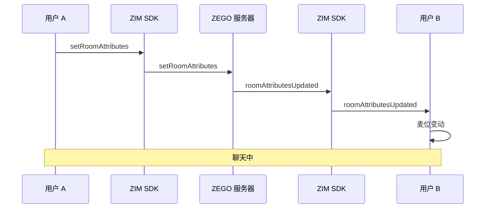
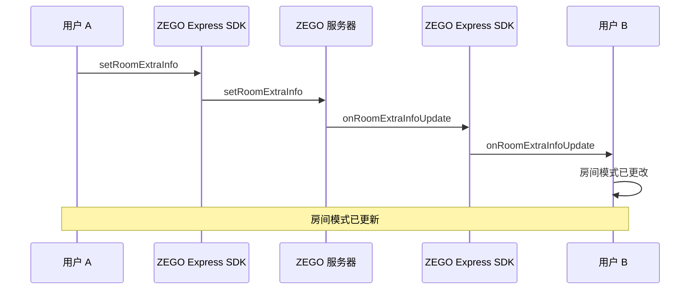
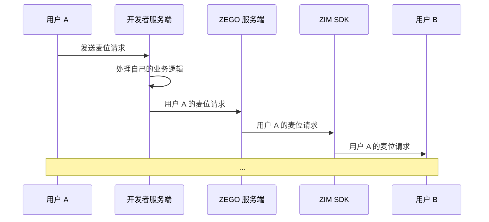

# 实现语聊房

- - -

本文档介绍如何在使用实时音视频产品（ZEGO Express SDK）实现基本音频通话功能的基础上，结合即时通讯产品（ZIM SDK）实现语聊房功能。

<Warning title="注意">
本文基于 [Swift 示例代码](https://github.com/ZEGOCLOUD/zegocloud_sdk_demo_ios/tree/master/best_practice) 来介绍的如何实现语聊房功能，因此文档中的部分方法为示例代码封装方法。
</Warning>


## 前提条件

在开始之前，请确保完成以下步骤：

- 已在项目中集成 ZEGO Express SDK，详情请参考 [快速开始 - 集成 SDK](/real-time-voice-ios/quick-start/integrating-sdk)。
- 下载本文档附带的 [Swift 示例代码](https://github.com/ZEGOCLOUD/zegocloud_sdk_demo_ios/tree/master/best_practice)。
- 在 [管理控制台](https://console.zego.im/ProjectManage) 中注册并创建项目，同时开通 “即时通讯” 服务。
  <Frame width="512" height="auto" caption=""></Frame>

## 预览效果

您可以通过本文档提供的 [Swift 示例代码](https://github.com/ZEGOCLOUD/zegocloud_sdk_demo_ios/tree/master/best_practice) 实现以下效果：

|主页|房主页面|听众页面|听众点击上麦请求|房主查看请求|
|--- | --- | --- |--- |--- |
|<Frame width="512" height="auto" caption=""></Frame>|<Frame width="512" height="auto" caption=""></Frame>|<Frame width="512" height="auto" caption=""></Frame>|<Frame width="512" height="auto" caption=""></Frame>|<Frame width="512" height="auto" caption=""></Frame>|

房主可以单击右下角的“锁定图标”来更改房间模式。
- 自由模式：听众点击麦位后，即可成为发言人。
- 请求模式：听众点击麦位触发上麦请求后，必须等待房主同意才可成为发言人。


## 技术原理

如果您需要了解推流及拉流的相关接口使用，请参考 [快速开始 - 实现音频通话文档](/real-time-video-ios-oc/quick-start/implementing-video-call)。

在一个语聊房中：

- 所有听众进入房间后可以开始拉流，以播放房间中发言人的声音。
- 发言人在上麦后即可开始推流，将本地音频推送给房间内的听众。

### 如何管理麦位

除了实现上述逻辑外，语聊房还需要管理发言人麦位。发言人麦位管理功能通常可以使用 ZIM SDK 的 [房间属性管理](/zim-ios/guides/room/room-properties) 实现。

该功能允许开发者客户端在房间中设置和同步自定义的房间属性。房间属性以 Key-Value 的方式存储在 ZEGO 服务器上，由 ZEGO 服务器解决写入冲突和其他问题，以确保数据一致性。

同时，开发者客户端对房间属性的修改会通过 ZEGO 服务器实时同步给房间中的所有其他听众。

<Warning title="注意">
- 每个房间最多允许设置 20 个属性，`key` 的长度限制为 16 字节，`value` 的长度限制为 1024 字节。 开发者如果需要提高属性限制上限，请联系 ZEGO 技术支持。
- 房间销毁后，设置的自定义属性也会同时销毁。
</Warning>


以用户 A 申请上麦为例，具体过程如下：




**使用房间属性标志发言人麦位：**

您可以使用语聊房中的麦位序号，作为房间属性的 Key，并使用 `userID` 作为房间属性的值，来表示房间的发言人麦位状态。

> 例如，如果 userID 为 “user123” 的用户位于 0 号麦位上，而 userID 为 “user456” 的用户位于 1 号麦位上，则其房间属性可设置如下：

```json
{
  "0":"user123", // 表示 user123 位于 0 号麦位上
  "1":"user456", // 表示 user456 位于 1 号麦位上
}
```

**房间属性功能的设计，可以解决语聊房场景中，一些常见麦位管理问题：**

<table>

<tbody><tr>
<th>功能</th>
<th>描述</th>
<th>用途</th>
</tr>
<tr>
<td>所有者</td>
<td>第一个设置 Key 的听众将成为该 Key 的所有者。默认情况下，只有所有者可以修改 Key。</td>
<td>可用于避免抢占发言人麦位时的冲突。</td>
</tr>
<tr>
<td>自动删除</td>
<td>在设置 Key 时，可以将 Key 配置为“所有者离开房间后自动删除”。</td>
<td>可用于实现“发言人离线后发言人麦位自动更新”的功能，避免由于开发者客户端断开连接导致发言人麦位混乱的问题。</td>
</tr>
<tr>
<td>强制修改</td>
<td>支持忽略所有者并强制修改 Key 对应的值。</td>
<td>可用于实现“房主强制将发言人从麦位上移除”的功能。</td>
</tr>
<tr>
<td>组合操作</td>
<td>可以将对不同 Key-Value 的多个操作组合成一个组合操作，避免其他用户操作相关 Key-Value 时产生冲突。</td>
<td>可用于实现更改发言人麦位的功能。</td>
</tr>
</tbody></table>


### 如何管理房间模式

在语聊房中，您可能需要支持房主修改房间模式：
- 自由模式：听众点击麦位后，即可成为发言人。
- 请求模式：麦下听众点击麦位触发上麦请求后，必须等待房主同意才可成为发言人。

房间模式可使用 Express SDK 的 [setRoomExtraInfo](https://doc-zh.zego.im/article/api?doc=Express_Video_SDK_API~objective-c_ios~class~ZegoExpressEngine#set-room-extra-info-for-key-room-id-callback) 实现。“房间附加信息”与上述的“房间属性”类似，也存储在 ZEGO 服务器上，但是“房间附加信息”的使用更简单：

没有复杂的参数，只支持设置 Key-Value 字符串（Key 最大 10 字节，Value 最大 128 字节），更适合与房间绑定的简单业务操作，如房间模式、房间公告等。

您可以将任何业务字段封装成 JSON 协议，并将其设置为“房间附加信息”以实现房间模式等业务逻辑。

当房主调用 [setRoomExtraInfo](https://doc-zh.zego.im/article/api?doc=Express_Video_SDK_API~objective-c_ios~class~ZegoExpressEngine#set-room-extra-info-for-key-room-id-callback) 方法时，房间内的用户可以通过 [onRoomExtraInfoUpdate](https://doc-zh.zego.im/article/api?doc=Express_Video_SDK_API~objective-c_ios~protocol~ZegoEventHandler#on-room-extra-info-update-room-id) 接收到设置的`房间附加信息`。




### 如何使用房间请求信令请求上麦

#### 什么是房间请求信令？

基于房间请求信令实现上麦请求的过程，房间请求信令是一种管理网络中通信和连接的协议或消息。ZEGO 将所有房间请求信令功能打包到一个 SDK 中，为您提供了一个现成的实时房间请求信令 API。


#### 如何通过 ZIM SDK 接口发送和接收房间请求消息

ZIM SDK 提供了丰富的功能来发送和接收消息，详情可参考 [收发消息](/zim-ios/guides/messaging/send-and-receive-messages)。此处，您需要使用可自定义的房间请求消息：[ZIMCommandMessage](https://doc-zh.zego.im/article/api?doc=zim_API~objectivec_ios~class~ZIMCommandMessage)

<Note title="说明">


此部分的完整示例代码，可参考 [ZIMService+Room.swift](https://github.com/ZEGOCLOUD/zegocloud_sdk_demo_ios/blob/master/best_practice/ZegoCloudSDKDemo/Internal/SDK/ZIM/ZIMService%2BRoomRequest.swift)。
</Note>


1. 通过调用 [sendMessage](https://doc-zh.zego.im/article/api?doc=zim_API~objective-c_ios~protocol~ZIM#send-message-message-to-conversation-id-conversation-type-config-notification-callback) 方法在房间中发送房间请求信令（[ZIMCommandMessage](https://doc-zh.zego.im/article/api?doc=zim_API~objectivec_ios~class~ZIMCommandMessage)）：

    ```swift
    zim?.sendMessage(commandMessage, toConversationID: currentRoom.baseInfo.roomID, conversationType: .room, config: ZIMMessageSendConfig(), notification: nil, callback: { message, errorInfo in
        // ...
    })
    ```


2. 发送后成功后，房间中的其他用户将通过 [receiveRoomMessage](https://doc-zh.zego.im/article/api?doc=zim_API~objective-c_ios~protocol~ZIMEventHandler#zim-receive-room-message-from-room-id) 回调接收房间请求信令。您可以通过以下方式监听此回调：

    ```swift
    func initWithAppID(_ appID: UInt32, appSign: String?) {
        let zimConfig: ZIMAppConfig = ZIMAppConfig()
        zimConfig.appID = appID
        zimConfig.appSign = appSign ?? ""
        self.zim = ZIM.shared()
        if self.zim == nil {
            self.zim = ZIM.create(with: zimConfig)
        }
        self.zim?.setEventHandler(self)
    }

    func zim(_ zim: ZIM, receiveRoomMessage messageList: [ZIMMessage], fromRoomID: String) {
        //...
    }
    ```

#### 如何自定义业务房间请求信令

<Note title="说明">


此部分的完整示例代码，可参考 [ZIMService.swift](https://github.com/ZEGOCLOUD/zegocloud_sdk_demo_ios/blob/master/best_practice/ZegoCloudSDKDemo/Internal/SDK/ZIM/ZIMService.swift)。
</Note>


**房间请求信令 JSON 编码**

由于简单的 String 本身难以表达复杂信息，房间请求信令可以封装在 JSON 格式中，使您更方便地编写房间请求信令的协议内容。

以最简单的房间请求信令的 JSON 格式为例：`{"room_request_type": 10000}`，在这样一份 JSON 房间请求信令中，您可以使用 action_type 字段来表达不同的房间请求信令类型，例如：

- 发送请求：`{"room_request_type": 10000}`
- 取消请求：`{"room_request_type": 10001}`
- 接受请求：`{"room_request_type": 10002}`
- 拒绝请求：`{"room_request_type": 10003}`

此外，您还可以为房间请求信令扩展其他常见字段，例如 `senderID` 及 `receiverID`：

```swift
extension ZIMService {

    func sendRoomRequest(_ receiverID: String, extendedData: String, callback: RoomRequestCallback?){
        // ...
    }
}

public class RoomRequest: NSObject, Codable {
    public var requestID : String
    public var actionType: RoomRequestAction
    public var senderID: String
    public var receiverID: String
    public var extendedData: String

    init(requestID: String = "", actionType: RoomRequestAction, senderID: String, receiverID: String, extendedData: String = "") {
        self.requestID = requestID
        self.actionType = actionType
        self.senderID = senderID
        self.receiverID = receiverID
        self.extendedData = extendedData
    }

    public func jsonString() -> String? {
        let jsonObject: [String: Any] = ["action_type" : actionType.rawValue, "sender_id": senderID, "receiver_id": receiverID, "request_id": requestID, "extended_data": extendedData]
        return jsonObject.jsonString
    }
}
```

**房间请求信令 JSON 解码**

接收房间请求信令的用户，可以解码 JSON 房间请求信令，并根据其中的字段了解和处理具体的业务逻辑，例如：

```swift
func zim(_ zim: ZIM, receiveRoomMessage messageList: [ZIMMessage], fromRoomID: String) {
    for message in messageList {
        if message.type == .command {
            let commandMessage: ZIMCommandMessage = message as! ZIMCommandMessage
            let signaling: String = String(data: commandMessage.message, encoding: .utf8) ?? ""
            let messageDict: [String: AnyObject] = convertStringToDictionary(text: message) ?? [:]
            if messageDict.keys.contains("action_type") && userInfo != nil {
                let sender = messageDict["sender_id"] as! String
                let receiver = messageDict["receiver_id"] as! String
                let extendedData: String = messageDict["extended_data"] as? String ?? ""
                let actionType: RoomRequestAction = RoomRequestAction(rawValue: messageDict["action_type"] as! UInt) ?? .request
                if userInfo?.userID == receiver {
                    switch actionType {
                        case .request:
                            //...
                            for delegate in zimEventHandlers.allObjects {
                                delegate.onInComingRoomRequestReceived?(request: roomRequest)
                            }
                        case .accept:
                            //...
                            for delegate in zimEventHandlers.allObjects {
                                delegate.onOutgoingRoomRequestAccepted?(request: roomRequest)
                            }
                        case .reject:
                            //...
                            for delegate in zimEventHandlers.allObjects {
                                    delegate.onOutgoingRoomRequestRejected?(request: roomRequest)
                                }
                        case .cancel:
                            //...
                            for delegate in zimEventHandlers.allObjects {
                                delegate.onInComingRoomRequestCancelled?(request: roomRequest)
                            }
                        }
                }
            }
            //...
        }
    }
    //...
}
```

**扩展房间请求信令**

基于这种模式，当您需要进行任何业务协议扩展时，只需扩展房间请求信令的 `extended_data` 字段，就可以轻松实现新的业务逻辑，例如：

- 静音听众：在收到相应的房间请求信令后，可阻止用户发送弹幕消息。
- 发送虚拟礼物：在收到房间请求信令后，可显示礼物特效。
- 移除听众：在收到房间请求信令后，提示听众已被移除并退出房间。

**其他扩展信息：**：

通过以下内容，可进一步了解麦位请求的实现，您将能够对您的业务进行扩展。


本文档中的演示是一个纯客户端 API + ZEGOCLOUD 解决方案。如果您有自己的业务服务端，并希望进行更多的逻辑扩展，您可以使用我们的 [服务端 API](/zim-server/overview) 来传递房间信令，并结合您服务端的房间业务逻辑，以提高您的应用的可靠性。




## 实现流程

### 集成并使用 ZIM SDK

如果您之前没有使用过 ZIM SDK，您可以阅读以下部分：

<Accordion title="1. 导入 ZIM SDK" defaultOpen="false">
开发者可使用 Swift Package Manager 自动集成 SDK，更多导入方式，请参考 [即时通讯-实现基本消息收发](/zim-ios/send-and-receive-messages#22-导入-sdk) 文档。

1. 打开 Xcode 并点击菜单栏 “File > Add Packages...”，在 “Apple Swift Packages” 弹窗的 “Search or Enter Package URL” 输入框中填写如下 URL 并敲击回车键确认：

    ```markdown
    https://github.com/zegolibrary/zim-ios
    ```

2. 在 “Dependency Rule” 中指定你想要集成的 SDK 版本（建议使用默认的 “Up to Next Major Version”），然后点击 “Add Package“ 导入 SDK。你也可以参考 [Apple 官方文档](https://developer.apple.com/documentation/xcode/adding-package-dependencies-to-your-app) 进行设置。
</Accordion>

<Accordion title="2. 创建和管理 SDK 实例" defaultOpen="false">
1. 导入 ZIM SDK：

    ```swift
    import ZIM
    ```
2. 在 SDK 中创建 ZIM 实例，一个实例对应的是一个用户，表示一个用户以客户端的身份登录系统。
    ```swift
    func initWithAppID(_ appID: UInt32, appSign: String?) {
        let zimConfig: ZIMAppConfig = ZIMAppConfig()
        zimConfig.appID = appID
        zimConfig.appSign = appSign
        self.zim = ZIM.shared()
        if self.zim == nil {
            self.zim = ZIM.create(with: zimConfig)
        }
        self.zim?.setEventHandler(self)
    }
    ```
</Accordion>


稍后，我们将为您提供如何使用 ZIM SDK 开发语聊房功能的详细说明。


### （必选）管理多个 SDK

在本文档描述的语聊房场景中，您需要使用 `ZIM SDK` 来实现发言人麦位管理功能，然后使用 `Express SDK` 实现语聊房功能。

为了使您的应用代码更加有条理，我们建议您通过使用以下方式来管理这些 SDK：

<Warning title="注意">


我们将在后续文档中使用 `ZIMService` 和 `ExpressService` 进行示例说明。
</Warning>

<Accordion title="1. 为每个 SDK 创建一个包装层，以便尽可能地重用代码。" defaultOpen="false">
为 `ZIM SDK` 创建一个 `ZIMService` 类，它管理与 SDK 的交互并存储所需数据，完整代码请参考 [ZIMService.swift](https://github.com/ZEGOCLOUD/zegocloud_sdk_demo_ios/blob/master/best_practice/ZegoCloudSDKDemo/Internal/SDK/ZIM/ZIMService.swift)。

```swift
class ZIMService: NSObject {

    // ...
    func initWithAppID(_ appID: UInt32, appSign: String?) {
        let zimConfig: ZIMAppConfig = ZIMAppConfig()
        zimConfig.appID = appID
        zimConfig.appSign = appSign
        self.zim = ZIM.shared()
        if self.zim == nil {
            self.zim = ZIM.create(with: zimConfig)
        }
        self.zim?.setEventHandler(self)
    }
    // ...
}
```


同样，为 `Express SDK` 创建一个 `ExpressService` 类，它管理与 SDK 的交互并存储所需数据，完整代码请参考 [ExpressService.swift](https://github.com/ZEGOCLOUD/zegocloud_sdk_demo_ios/tree/master/best_practice/ZegoCloudSDKDemo/Internal/SDK/Express/ExpressService.swift). 中的完整代码。

```swift

class ExpressService: NSObject {

    // ...
    public func initWithAppID(appID: UInt32, appSign: String) {
        let profile = ZegoEngineProfile()
        profile.appID = appID
        profile.appSign = appSign
        profile.scenario = .broadcast
        ZegoExpressEngine.createEngine(with: profile, eventHandler: self)
    }
    // ...
}
```

您可以根据需求，向服务中添加相关 SDK 接口的方法。

例如，当您需要登录时，可以向 `ZIMService` 添加 `connectUser` 方法。

```swift
class ZIMService: NSObject {

    // ...
    func connectUser(userID: String, userName: String, token: String?, callback: CommonCallback?) {
        let user = ZIMUserInfo()
        user.userID = userID
        user.userName = userName
        userInfo = user
        zim?.login(with: user, token: token ?? "") { error in
            callback?(Int64(error.code.rawValue), error.message)
        }
    }
}
```
</Accordion>

<Accordion title="2. 完成服务封装后，您可以通过创建 ZEGOSDKManager 进一步简化代码，以管理这些服务。" defaultOpen="false">
完整示例代码，请参考 [ZegoSDKManager.swift](https://github.com/ZEGOCLOUD/zegocloud_sdk_demo_ios/tree/master/best_practice/ZegoCloudSDKDemo/Internal/ZegoSDKManager.swift)。

```swift
class ZegoSDKManager: NSObject {

    static let shared = ZegoSDKManager()

    var expressService = ExpressService.shared
    var zimService = ZIMService.shared

    func initWithAppID(_ appID: UInt32, appSign: String) {
        expressService.initWithAppID(appID, appSign: appSign)
        zimService.initWithAppID(appID, appSign: appSign)
    }

}
```

通过此方式，您已实现了一个单例类，来管理您需要的 SDK 服务。因此，您可以在项目的任何地方获取此类的实例，并使用它来执行与 SDK 相关的逻辑，例如：


- 当应用启动时：调用 `ZegoSDKManager.shared.initWithAppID(appID,appSign);`
- 当需要登录时：调用 `ZegoSDKManager.shared.loginRoom(roomID,scenario,callback);`
- 当需要退出登录时：调用 `ZegoSDKManager.shared.logoutRoom();`

稍后，我们将介绍如何基于此添加语聊房功能。
</Accordion>


### 麦位管理

#### 听众上麦

如需让听众上麦，请调用 [setRoomAttributes](https://doc-zh.zego.im/article/api?doc=zim_API~objective-c_ios~protocol~ZIM#set-room-attributes-room-attributes-room-id-config-callback) 并将麦位序号作为 Key，听众的 `userID` 作为房间附加属性的值。如果设置成功，听众会成功上麦并可以开始推流。

完整的示例代码，请参考 [RoomSeatService.swift](https://github.com/ZEGOCLOUD/zegocloud_sdk_demo_ios/tree/master/best_practice/ZegoCloudSDKDemo/Internal/Business/AudioRoom/RoomSeatService.swift)，其中主要示例代码如下。

<Note title="说明">


听众上麦时，若将 [ZIMRoomAttributesSetConfig](https://doc-zh.zego.im/article/api?doc=zim_API~objective-c_ios~class~ZIMRoomAttributesSetConfig) 的`isForce`属性设置为`false`。当多个听众同时尝试占用同一个麦位时，服务器将接收到第一个请求并返回成功响应，将该 Key 的所有者设置为第一个发出请求的用户。其他用户的后续修改请求将失败。
</Note>

```swift
func takeSeat(seatIndex: Int, callback: ZIMRoomAttributesOperatedCallback?) {
    guard let localUser = ZegoSDKManager.shared.currentUser else { return }
    //setRoomAttributes 为示例代码封装方法 https://github.com/ZEGOCLOUD/zegocloud_sdk_demo_ios/blob/44169b0962cf1a08fbb6e798eb452de6c66554f6/best_practice/ZegoCloudSDKDemo/Internal/SDK/ZIM/ZIMService%2BRoom.swift#L50
    ZegoSDKManager.shared.zimService.setRoomAttributes("\(seatIndex)", value: localUser.id) { roomID, errorKeys, errorInfo in
        //...
        guard let callback = callback else { return }
        callback(roomID,errorKeys,errorInfo)
    }
}
```

#### 发言人下麦

当发言人下麦时，可调用 [deleteRoomAttributesByKeys](https://doc-zh.zego.im/article/api?doc=zim_API~objective-c_ios~protocol~ZIM#delete-room-attributes-by-keys-room-id-config-callback) 来删除发言人使用的麦位号，并停止推流。

完整的示例代码，请参考 [RoomSeatService.swift](https://github.com/ZEGOCLOUD/zegocloud_sdk_demo_ios/tree/master/best_practice/ZegoCloudSDKDemo/Internal/Business/AudioRoom/RoomSeatService.swift)，其中主要示例代码如下。

```swift
func leaveSeat(seatIndex: Int, callback: ZIMRoomAttributesOperatedCallback?) {
    //deletedRoomAttributes 为示例代码封装方法 https://github.com/ZEGOCLOUD/zegocloud_sdk_demo_ios/blob/44169b0962cf1a08fbb6e798eb452de6c66554f6/best_practice/ZegoCloudSDKDemo/Internal/SDK/ZIM/ZIMService%2BRoom.swift#L89
    ZegoSDKManager.shared.zimService.deletedRoomAttributes(["\(seatIndex)"]) { roomID, errorKeys, errorInfo in
        //...
        guard let callback = callback else { return }
        callback(roomID,errorKeys,errorInfo)
    }
}
```

#### 更换发言人麦位

<Warning title="注意">


如果您不打算实现更换麦位的功能，请忽略此部分。
</Warning>

当发言人从一个麦位切换到另一个麦位时，例如，发言人 A 从 2 号麦位切换到 3 号麦位，他需要先删除与 2 号麦位对应的房间属性（离开 2 号麦位），然后将与 3 号麦位对应的房间属性的值设置为自己的 `userID`（占用 3 号麦位）。这个过程涉及两个步骤。考虑以下极端情况：

当发言人 A 刚刚完成第一步（删除与 2 号麦位对应的房间属性并离开 2 号麦位）时，发言人 B 先于发言人 A 占用了 3 号麦位，导致发言人 A 成功离开了 2 号麦位，但无法占用 3 号麦位。

在这种情况下，发言人 A 失去了发言人麦位，显然不符合预期。

为了处理这种情况，您需要在发言人 A 完成两步操作之前，防止其他用户对相关发言人麦位进行操作。这可以通过使用组合操作的特性来实现：

```swift
// 1. 开始组合操作。
let config = ZIMRoomAttributesBatchOperationConfig()
config.isForce = false
config.isDeleteAfterOwnerLeft = true
config.isUpdateOwner = true
zim?.beginRoomAttributesBatchOperation(with: roomID, config: config)


// 2. 操作 1：离开 2 号麦位。
let keys: [String] = ["\(3)"]
let config = ZIMRoomAttributesDeleteConfig()
config.isForce = true
zim?.deleteRoomAttributes(by: keys, roomID: roomID, config: config, callback: { roomID, errorKeys, errorInfo in
    if errorInfo.code == .success {
        var temKeys: [String] = keys
        if !errorKeys.isEmpty {
            temKeys.removeAll { el in
                errorKeys.contains { k in
                    el == k
                }
            }
        }
        for key in keys {
            self.inRoomAttributsDict.removeValue(forKey: key)
        }
    }
    callback(roomID,errorKeys,errorInfo)
})

// 3. 操作 2：占用 3 号麦位。
let key: String = "\(2)";
let value: String = localUser.userID;
ZIMRoomAttributesSetConfig config = new ZIMRoomAttributesSetConfig()
config.isDeleteAfterOwnerLeft = true;
config.isUpdateOwner = true;
config.isForce = false;
zim?.setRoomAttributes([key: value], roomID: roomID, config: config, callback: { roomID, errorKeys, errorInfo in
    //...
    callback(roomID,errorKeys,errorInfo)
})


// 4. 结束组合操作。
zim?.endRoomAttributesBatchOperation(with: roomID, callback: callback)
```

<Accordion title="在示例代码中，该方法被封装为 switchSeat 方法。" defaultOpen="false">
完整的参考代码如下：

```swift
func switchSeat(fromSeatIndex: Int, toSeatIndex: Int, callback: ZIMRoomAttributesBatchOperatedCallback?) {
    if !batchOperation {
        // beginRoomPropertiesBatchOperation 为示例代码封装方法 https://github.com/ZEGOCLOUD/zegocloud_sdk_demo_ios/blob/44169b0962cf1a08fbb6e798eb452de6c66554f6/best_practice/ZegoCloudSDKDemo/Internal/SDK/ZIM/ZIMService%2BRoom.swift#L110
        ZegoSDKManager.shared.zimService.beginRoomPropertiesBatchOperation()
        batchOperation = true
        tryTakeSeat(seatIndex: toSeatIndex, callback: nil)
        leaveSeat(seatIndex: fromSeatIndex, callback: nil)
        // endRoomPropertiesBatchOperation 为示例代码封装方法 https://github.com/ZEGOCLOUD/zegocloud_sdk_demo_ios/blob/44169b0962cf1a08fbb6e798eb452de6c66554f6/best_practice/ZegoCloudSDKDemo/Internal/SDK/ZIM/ZIMService%2BRoom.swift#L122
        ZegoSDKManager.shared.zimService.endRoomPropertiesBatchOperation { roomID, errorInfo in
            self.batchOperation = false
            guard let callback = callback else { return }
            callback(roomID, errorInfo)
        }
    }
}
```
</Accordion>

## 房间模式

我们将房间模式定义为：自由模式和请求模式。

房主可以调用示例代码中的自定义方法 [setRoomExtraInfo](https://github.com/ZEGOCLOUD/zegocloud_sdk_demo_ios/blob/44169b0962cf1a08fbb6e798eb452de6c66554f6/best_practice/ZegoCloudSDKDemo/Internal/SDK/Express/ExpressService%2BRoom.swift#L59)，在自由模式和请求模式之间切换。

其中房间附加信息（roomExtraInfo）分为以下两种模式：
- 自由模式：`{"lockseat":false}`
- 请求模式：`{"lockseat":true}`

<Note title="说明">


`lockSeat` 的具体定义，参考 [示例代码](https://github.com/ZEGOCLOUD/zegocloud_sdk_demo_ios/blob/44169b0962cf1a08fbb6e798eb452de6c66554f6/best_practice/ZegoCloudSDKDemo/ZegoLiveAudioRoomManager.swift#L79)。
</Note>

完整的示例代码，请参考 [ZegoLiveAudioRoomManager.swift](https://github.com/ZEGOCLOUD/zegocloud_sdk_demo_ios/tree/master/best_practice/ZegoCloudSDKDemo/ZegoLiveAudioRoomManager.swift)，其中主要示例代码如下。

```swift
func lockSeat(_ lock: Bool) {
    roomExtraInfoDict.updateValue(lock as AnyObject, forKey: "lockseat")
    //setRoomExtraInfo 为示例代码封装方法  https://github.com/ZEGOCLOUD/zegocloud_sdk_demo_ios/blob/master/best_practice/ZegoCloudSDKDemo/Internal/SDK/Express/ExpressService%2BRoom.swift#L59
    ZegoSDKManager.shared.expressService.setRoomExtraInfo(key: KEY, value: roomExtraInfoDict.jsonString)
}
```

### 发送和取消上麦请求

<Note title="说明">


发送和取消上麦请求的实现方式相似，只是房间请求信令的类型不同。此处以发送为例，演示具体实现方式。
</Note>

在示例代码中，从**听众的角度**来看，上麦请求按钮已放置在屏幕的右下角，当点击按钮时，将执行以下操作。


1. 调用示例代码中自定义的 [sendRoomRequest](https://github.com/ZEGOCLOUD/zegocloud_sdk_demo_ios/blob/44169b0962cf1a08fbb6e798eb452de6c66554f6/best_practice/ZegoCloudSDKDemo/Internal/SDK/ZIM/ZIMService%2BRoomRequest.swift#L9) 发送房间请求信令。（[sendRoomRequest](https://github.com/ZEGOCLOUD/zegocloud_sdk_demo_ios/blob/44169b0962cf1a08fbb6e798eb452de6c66554f6/best_practice/ZegoCloudSDKDemo/Internal/SDK/ZIM/ZIMService%2BRoomRequest.swift#L9) 简化了`ZIM SDK`的 [sendMessage](https://doc-zh.zego.im/article/api?doc=zim_API~objective-c_ios~protocol~ZIM#send-message-message-to-conversation-id-conversation-type-config-notification-callback) 接口。）
    - 如果方法调用成功：本地端（即听众）的申请状态将切换为申请上麦，并且“上麦请求”按钮将切换为“取消上麦”。
    - 如果方法调用失败：将提示错误消息。**在实际的应用开发中，您应该使用更友好的用户界面来提示上麦请求失败。**

2. 调用示例代码中自定义的 [cancelRoomRequest](https://github.com/ZEGOCLOUD/zegocloud_sdk_demo_ios/blob/44169b0962cf1a08fbb6e798eb452de6c66554f6/best_practice/ZegoCloudSDKDemo/Internal/SDK/ZIM/ZIMService%2BRoomRequest.swift#L67) 发送信号。（[cancelRoomRequest](https://github.com/ZEGOCLOUD/zegocloud_sdk_demo_ios/blob/44169b0962cf1a08fbb6e798eb452de6c66554f6/best_practice/ZegoCloudSDKDemo/Internal/SDK/ZIM/ZIMService%2BRoomRequest.swift#L67) 简化了`ZIM SDK`的 [sendMessage](https://doc-zh.zego.im/article/api?doc=zim_API~objective-c_ios~protocol~ZIM#send-message-message-to-conversation-id-conversation-type-config-notification-callback)接口。）
    - 如果方法调用成功：本地端（即听众）的申请状态将切换为申请上麦，并且“上麦请求”按钮将切换为“申请成为发言人”。
    - 如果方法调用失败：将提示错误消息。**在实际的应用开发中，您应该使用更友好的用户界面来提示上麦请求失败。**

完整的示例代码，请参考 [RoomSeatService.swift](https://github.com/ZEGOCLOUD/zegocloud_sdk_demo_ios/tree/master/best_practice/ZegoCloudSDKDemo/Internal/Business/AudioRoom/RoomSeatService.swift)，其中主要示例代码如下。

```swift
@IBAction func applyBecomeSpeaker(_ sender: Any) {
    if !isApply {
        if let host = audioRoomManager.getHostUser() {
            let commandDict: [String: AnyObject] = ["room_request_type": RoomRequestType.applyCoHost.rawValue as AnyObject]
            //sendRoomRequest 为示例代码封装方法 https://github.com/ZEGOCLOUD/zegocloud_sdk_demo_ios/blob/44169b0962cf1a08fbb6e798eb452de6c66554f6/best_practice/ZegoCloudSDKDemo/Internal/SDK/ZIM/ZIMService%2BRoomRequest.swift#L9
            ZegoSDKManager.shared.zimService.sendRoomRequest(host.id, extendedData: commandDict.jsonString) { code, message, messageID in
                //...
            }
        }
    } else {
        if let _ = audioRoomManager.getHostUser() {
            //getRoomRequestByRequestID 为示例代码封装方法 https://github.com/ZEGOCLOUD/zegocloud_sdk_demo_ios/blob/44169b0962cf1a08fbb6e798eb452de6c66554f6/best_practice/ZegoCloudSDKDemo/Internal/SDK/ZIM/ZIMService%2BRoomRequest.swift#L100
            let roomRequest: RoomRequest? = ZegoSDKManager.shared.zimService.getRoomRequestByRequestID(
                myRoomRequest?.requestID ?? "");
            guard let roomRequest = roomRequest else { return }
            //cancelRoomRequest 为示例代码封装方法 https://github.com/ZEGOCLOUD/zegocloud_sdk_demo_ios/blob/44169b0962cf1a08fbb6e798eb452de6c66554f6/best_practice/ZegoCloudSDKDemo/Internal/SDK/ZIM/ZIMService%2BRoomRequest.swift#L67
            ZegoSDKManager.shared.zimService.cancelRoomRequest(roomRequest) { code, message, messageID in
                //...
            }
        }
    }
    isApply = !isApply
}

// 更新 UI 样式
var isApply: Bool = false {
    didSet {
        if isApply {
            applyBecomeSpeakerButton.setTitle("Cancel Apply", for: .normal)
        } else {
            applyBecomeSpeakerButton.setTitle("ApplyBecomeSpeaker", for: .normal)
        }
    }
}
```

3. 本地端（听众端）将等待房主的响应。
  - 如果房主拒绝上麦请求：本地端的申请状态将切换为未申请。
  - 如果房主接受上麦请求：听众将成为发言人，并可以开始推流。

### 接受和拒绝上麦请求


1. 在示例代码中，当房主收到一个上麦请求时，请求的听众将显示在请求列表中，房主可以在单击请求列表后，查看列表并选择接受或拒绝听众的上麦请求。
2. 房主回应后，将发送一个接受或拒绝的房间请求信令，发送房间请求信令的相关逻辑在此不再赘述。

完整的示例代码，请参考 [RoomSeatService.swift](https://github.com/ZEGOCLOUD/zegocloud_sdk_demo_ios/tree/master/best_practice/ZegoCloudSDKDemo/Internal/Business/AudioRoom/RoomSeatService.swift) ，其中主要示例代码如下。

<Accordion title="代码片段" defaultOpen="false">
1. 在收到听众的上麦请求后，将其添加到请求列表中。

    ```swift
    class ApplyCoHostListViewController: UIViewController {
        var requestList: [RoomRequest] {
            get {
                    var array: [RoomRequest] = []
                    ZegoSDKManager.shared.zimService.roomRequestDict.forEach { (_ , request) in
                        array.append(request)
                    }
                    return array
                }
        }

        @IBOutlet weak var tableView: UITableView! {
            didSet {
                tableView.delegate = self
                tableView.dataSource = self
                tableView.separatorStyle = .none
                tableView.backgroundColor = UIColor.darkGray
                tableView.register(UINib(nibName: "CoHostTableViewCell", bundle: nil), forCellReuseIdentifier: "CoHostCell")
            }
        }

        override func viewDidLoad() {
            super.viewDidLoad()
            // 在加载视图后进行任何其他设置。
            // addEventHandler 为示例代码封装方法 https://github.com/ZEGOCLOUD/zegocloud_sdk_demo_ios/blob/44169b0962cf1a08fbb6e798eb452de6c66554f6/best_practice/ZegoCloudSDKDemo/Internal/SDK/ZIM/ZIMService.swift#L73
            ZegoSDKManager.shared.zimService.addEventHandler(self)
        }
    }

    extension ApplyCoHostListViewController: UITableViewDelegate, UITableViewDataSource, CoHostTableViewCellDelegate, ZIMServiceDelegate {
        func tableView(_ tableView: UITableView, numberOfRowsInSection section: Int) -> Int {
            return requestList.count
        }

        func tableView(_ tableView: UITableView, cellForRowAt indexPath: IndexPath) -> UITableViewCell {
            let cell: CoHostTableViewCell = tableView.dequeueReusableCell(withIdentifier: "CoHostCell") as! CoHostTableViewCell
            cell.delegate = self
            //...
            return cell
        }

        func onInComingRoomRequestReceived(request: RoomRequest) {
            tableView.reloadData()
        }

        func onInComingRoomRequestCancelled(request: RoomRequest) {
            tableView.reloadData()
        }

        func onActionAcceptIncomingRoomRequest(errorCode: UInt, request: RoomRequest) {
            tableView.reloadData()
        }

        func onActionRejectIncomingRoomRequest(errorCode: UInt, request: RoomRequest) {
            tableView.reloadData()
        }
    }
    ```

2. 在请求列表中，房主可以选择点击接受或拒绝其上麦请求。
    ```swift
    extension ApplyCoHostListViewController: CoHostTableViewCellDelegate {
        func agreeCoHostApply(request: RoomRequest) {
            //roomRequestDict 为示例代码封装方法 https://github.com/ZEGOCLOUD/zegocloud_sdk_demo_ios/blob/44169b0962cf1a08fbb6e798eb452de6c66554f6/best_practice/ZegoCloudSDKDemo/Internal/SDK/ZIM/ZIMService.swift#L29
            let roomRequest: RoomRequest? = ZegoSDKManager.shared.zimService.roomRequestDict[request.requestID]
            guard let roomRequest = roomRequest else { return }
            //acceptRoomRequest 为示例代码封装方法 https://github.com/ZEGOCLOUD/zegocloud_sdk_demo_ios/blob/44169b0962cf1a08fbb6e798eb452de6c66554f6/best_practice/ZegoCloudSDKDemo/Internal/SDK/ZIM/ZIMService%2BRoomRequest.swift#L27
            ZegoSDKManager.shared.zimService.acceptRoomRequest(roomRequest) { code, message, messageID in
                if code != 0 {
                    self.view.makeToast("send custom signaling protocol Failed: \(code)", position: .center)
                }
                self.tableView.reloadData()
            }
        }

        func disAgreeCoHostApply(request: RoomRequest) {
            let roomRequest: RoomRequest? = ZegoSDKManager.shared.zimService.roomRequestDict[request.requestID]
            guard let roomRequest = roomRequest else { return }
            //rejectRoomRequest 为示例代码封装方法 https://github.com/ZEGOCLOUD/zegocloud_sdk_demo_ios/blob/44169b0962cf1a08fbb6e798eb452de6c66554f6/best_practice/ZegoCloudSDKDemo/Internal/SDK/ZIM/ZIMService%2BRoomRequest.swift#L47
            ZegoSDKManager.shared.zimService.rejectRoomRequest(roomRequest) { code, message, messageID in
                if code != 0 {
                    self.view.makeToast("send custom signaling protocol Failed: \(code)", position: .center)
                }
                self.tableView.reloadData()
            }
        }
    }
    ```
</Accordion>

## 常见问题解答

<Accordion title="如何知道发言人是否打开了麦克风？" defaultOpen="false">
您可以监听 Express SDK 的 [onRemoteMicStateUpdate](https://doc-zh.zego.im/article/api?doc=Express_Video_SDK_API~objective-c_ios~protocol~ZegoEventHandler#on-remote-mic-state-update-stream-id) 回调通知，以确定远程推流设备的麦克风设备是否正常工作或关闭，并根据相应的状态初步了解设备问题的原因。

<Warning title="注意">


当从 CDN 拉流时，不会触发此回调。
</Warning>
</Accordion>


<Accordion title="如何确认发言人是否在说话？" defaultOpen="false">
您可以监听 Express SDK 的 [onRemoteSoundLevelUpdate](https://doc-zh.zego.im/article/api?doc=Express_Video_SDK_API~objective-c_ios~protocol~ZegoEventHandler#on-remote-sound-level-update) 回调通知，以获取发言人声音的音量级别，详情请参考 [音量变化与音频频谱](/real-time-voice-ios/audio/sound-level-spectrum)。
</Accordion>


## 完成语聊房功能

恭喜您，完成上述步骤后，您已经实现了语聊房功能。
