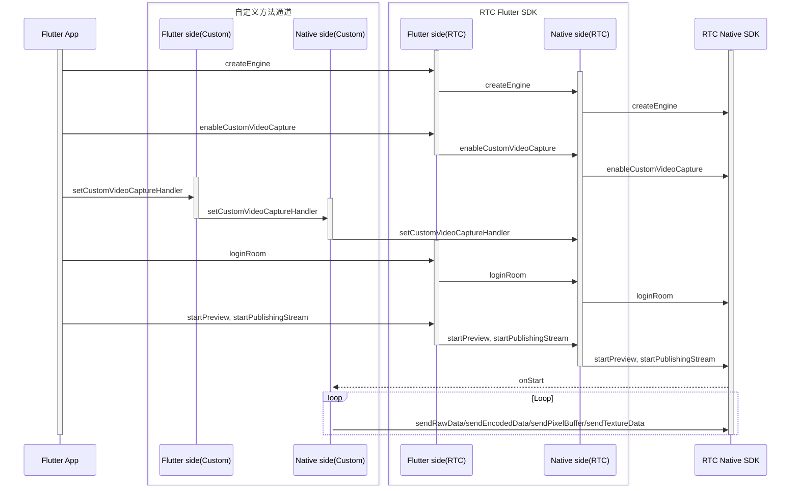

# 自定义视频采集

- - -

## 功能简介

自定义视频采集，是指由开发者自行采集视频，向 ZEGO Express SDK 提供视频数据，并由 ZEGO Express SDK 进行编码推流的功能。当用户开启自定义视频采集的功能后，默认情况下，ZEGO Express SDK 在推流端内部将对本端预览画面进行渲染，用户无需自行进行渲染。

当开发者业务中出现以下情况时，推荐使用 SDK 的自定义视频采集功能：

- 开发者的 App 使用了第三方美颜厂商的美颜 SDK，可以直接对接 ZEGO Express SDK 的自定义视频采集功能。即由第三方美颜厂商的美颜 SDK 负责视频数据的采集和前处理，由 ZEGO Express SDK 负责视频数据的编码以及将音视频流推到 ZEGO 音视频云端。
- 直播过程中，开发者需要使用摄像头完成的额外功能和 ZEGO Express SDK 的默认的视频采集逻辑有冲突，导致摄像头无法正常使用。例如，直播到一半，需要录制短视频。
- 直播非摄像头采集的数据。例如本地视频文件播放、屏幕分享、游戏直播等。


## 前提条件

在进行自定义视频采集前，请参考 [撰写双端平台代码（插件编写实现）](https://docs.flutter.cn/platform-integration/platform-channels) 文档，创建平台通道。


## 使用步骤

自定义视频采集的使用流程如下：

1. 创建 ZegoExpressEngine 引擎。
2. 调用 `enableCustomVideoCapture` 接口，开启自定义视频采集功能。
3. 设置自定义视频采集回调对象并实现对应方法 `setCustomVideoCaptureHandler`。
4. 登录房间并推流，将收到自定义视频采集回调通知开始采集。
5. 在 Native 端（iOS 端及 Android 端）调用发送视频帧方法向 SDK 提供视频帧数据。
6. 结束推流，将收到自定义视频采集回调通知停止采集。

API 接口调用的时序图如下，其中 Native 为 iOS 端及 Android 端：



<Warning title="注意">


- 请勿在 Native 端（iOS 端或 Android 端）调用 `destroyEngine` 接口，否则会引起功能异常。
- 本文仅说明如何在 Flutter 端开启自定义视频采集功能，进阶功能请参考 [iOS 自定义视频采集](/real-time-video-ios-oc/video/custom-video-capture) 及 [Android 自定义视频采集](/real-time-video-android-java/video/custom-video-capture) 文档。


</Warning>


### 1 开启自定义视频采集功能

调用 [ZegoCustomVideoCaptureConfig](https://doc-zh.zego.im/unique-api/express-video-sdk/zh/dart_flutter/zego_express_engine/ZegoCustomVideoCaptureConfig-class.html) 接口创建自定义视频采集对象，设置属性 [bufferType](https://doc-zh.zego.im/unique-api/express-video-sdk/zh/dart_flutter/zego_express_engine/ZegoCustomVideoCaptureConfig/bufferType.html)，向 SDK 提供视频帧数据类型；调用接口 [enableCustomVideoCapture](https://doc-zh.zego.im/unique-api/express-video-sdk/zh/dart_flutter/zego_express_engine/ZegoExpressEngineCustomVideoIO/enableCustomVideoCapture.html) 开启自定义视频采集功能。


```dart
// 选择 RawData 类型视频帧数据
ZegoCustomVideoCaptureConfig config =
    ZegoCustomVideoCaptureConfig(ZegoVideoBufferType.RawData);
ZegoExpressEngine.instance.enableCustomVideoCapture(
    true,
    config: config,
    channel: ZegoPublishChannel.Main);
```

### 2 设置自定义视频采集回调

1. 在 Flutter 层新增 `setCustomVideoCaptureHandler` 接口，并通过 `MethodChannel` 调用 Native 层。

    ```dart
    // 需开发者自行实现
    class ExpressTestImpl {
      final MethodChannel _channel =
          MethodChannel('plugins.zego.im/zego_express_test_demo');

      // 实现 Flutter 调用 Native 接口
      Future<void> setCustomVideoCaptureHandler() async {
        await _channel.invokeMethod('setCustomVideoCaptureHandler');
      }
    }
    ```

2. 在 Native 层实现 `setCustomVideoCaptureHandler` 接口能力。

<Accordion title="Android 示例" defaultOpen="false">
```java
    // CustomVideoCapture.java
    // 实现 IZegoFlutterCustomVideoCaptureHandler
    public class CustomVideoCapture implements IZegoFlutterCustomVideoCaptureHandler {
        @SuppressLint("StaticFieldLeak") private static CustomVideoCapture instance;

        public static CustomVideoCapture getInstance() {
            if (instance == null) {
                synchronized (CustomVideoCapture.class) {
                    if (instance == null) {
                        instance = new CustomVideoCapture();
                    }
                }
            }
            return instance;
        }

        @Override
        public void onStart(ZGFlutterPublishChannel channel) {

        }

        @Override
        public void onStop(ZGFlutterPublishChannel channel) {

        }

        @Override
        public void onEncodedDataTrafficControl(ZGFlutterTrafficControlInfo trafficControlInfo,
                                                ZGFlutterPublishChannel channel) {

        }
    }
    ```

    ```java
    // ExpressTestPlugin.java
    // methodChannel 示例
    public class ExpressTestPlugin implements FlutterPlugin, MethodChannel.MethodCallHandler {

        private MethodChannel methodChannel;

        @Override
        public void onAttachedToEngine(@NonNull FlutterPluginBinding binding) {
            methodChannel = new MethodChannel(binding.getBinaryMessenger(), "plugins.zego.im/zego_express_test_demo");
            methodChannel.setMethodCallHandler(this);
        }

        @Override
        public void onDetachedFromEngine(@NonNull FlutterPluginBinding binding) {
            methodChannel.setMethodCallHandler(null);
        }

        @Override
        public void onMethodCall(@NonNull MethodCall call, @NonNull MethodChannel.Result result) {
            switch (call.method) {
                case "setCustomVideoCaptureHandler": {
                    ZegoCustomVideoCaptureManager.getInstance().setCustomVideoCaptureHandler(CustomVideoCapture.getInstance());
                    result.success(true);
                    break;
                }
            }
        }
    }
    ```
</Accordion>

    <Accordion title="iOS 示例" defaultOpen="false">
```objc
    // CustomVideoCapture.h
    @interface CustomVideoCapture : NSObject <ZegoFlutterCustomVideoCaptureHandler>

    /// Get the custom video capture manager instance
    + (instancetype)sharedInstance;

    @end
    ```

    ```objc
    // CustomVideoCapture.m
    @interface CustomVideoCapture()

    @end

    @implementation CustomVideoCapture

    + (instancetype)sharedInstance {
        static CustomVideoCapture *instance = nil;
        static dispatch_once_t onceToken;
        dispatch_once(&onceToken, ^{
            instance = [[CustomVideoCapture alloc] init];
        });
        return instance;
    }

    #pragma mark ZegoFlutterCustomVideoCaptureHandler
    - (void)onStart:(ZGFlutterPublishChannel)channel {
    }

    - (void)onStop:(ZGFlutterPublishChannel)channel {
    }

    - (void)onEncodedDataTrafficControl:(ZGFlutterTrafficControlInfo *)trafficControlInfo channel:(ZGFlutterPublishChannel)channel {
    }

    @end
    ```

    ```objc
    // ZegoExpressTestPlugin.h
    // methodChannel 示例
    @interface ZegoExpressTestPlugin : NSObject<FlutterPlugin>

    @end
    ```

    ```objc
    // ZegoExpressTestPlugin.m
    // methodChannel 示例
    @interface ZegoExpressTestPlugin ()

    @property (nonatomic, weak) id<FlutterPluginRegistrar> registrar;

    @property (nonatomic, strong) FlutterMethodChannel *methodChannel;

    @end

    @implementation ZegoExpressTestPlugin

    + (void)registerWithRegistrar:(NSObject<FlutterPluginRegistrar>*)registrar {
        ZegoExpressTestPlugin *instance = [[ZegoExpressTestPlugin alloc] init];

        instance.registrar = registrar;

        FlutterMethodChannel *methodChannel = [FlutterMethodChannel
          methodChannelWithName:@"plugins.zego.im/zego_express_test_demo"
                binaryMessenger:[registrar messenger]];
        [registrar addMethodCallDelegate:instance channel:methodChannel];
        instance.methodChannel = methodChannel;
    }

    - (void)detachFromEngineForRegistrar:(NSObject<FlutterPluginRegistrar>*)registrar {
        [_methodChannel setMethodCallHandler:nil];
        _methodChannel = nil;
        _registrar = nil;
    }

    #pragma mark - Handle Method Call

    - (void)handleMethodCall:(FlutterMethodCall*)call result:(FlutterResult)result {
        SEL selector = NSSelectorFromString([NSString stringWithFormat:@"%@:result:", call.method]);

        // Handle unrecognized method
        if (![self respondsToSelector:selector]) {
            result(@(false));
            return;
        }

        NSMethodSignature *signature = [self methodSignatureForSelector:selector];
        NSInvocation* invocation = [NSInvocation invocationWithMethodSignature:signature];

        invocation.target = self;
        invocation.selector = selector;
        [invocation setArgument:&call atIndex:2];
        [invocation setArgument:&result atIndex:3];
        [invocation invoke];
    }

    - (void)setCustomVideoCaptureHandler:(FlutterMethodCall*)call result:(FlutterResult)result {
        [[ZegoCustomVideoCaptureManager sharedInstance] setCustomVideoCaptureHandler:[CustomVideoCapture sharedInstance]];
        result(@(true));
    }

    @end
    ```
</Accordion>


3. 调用 `ExpressTestImpl.setCustomVideoCaptureHandler` 设置自定义视频采集回调。

    ```dart
    ExpressTestImpl.instance.setCustomVideoCaptureHandler();
    ```

### 3 后续操作

本文仅说明如何在 Flutter 端开启自定义视频采集功能，进阶功能请参考 [iOS 自定义视频采集](/real-time-video-ios-oc/video/custom-video-capture) 及 [Android 自定义视频采集](/real-time-video-android-java/video/custom-video-capture) 文档。

<Content />
