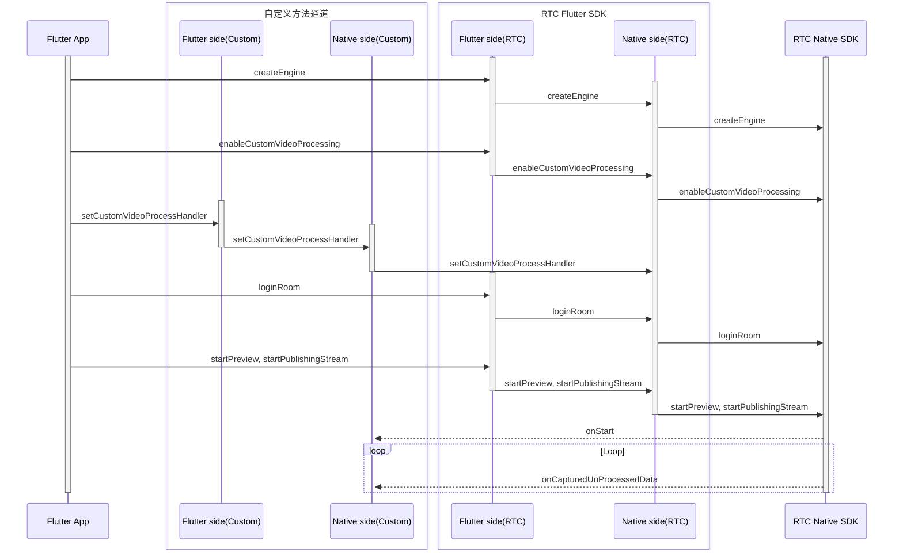

# 自定义视频前处理

- - -

## 功能简介

视频前处理是介于采集和编码之间的一个流程，开发者自行采集视频数据，获取到 SDK 采集的视频数据后，可以通过 SDK 自带的基础美颜和水印功能，进行视频前处理。如果 SDK 无法满足开发者需求（例如美颜效果无法达到预期），还可以搭配 ZEGO Effects SDK 对视频进行一些特殊处理，例如美颜、添加挂件等，该过程即为自定义视频前处理。

<Frame width="512" height="auto" caption=""></Frame>

自定义视频前处理与自定义视频采集相比，优势在于无需开发者管理设备输入源，仅需对 ZEGO Express SDK 抛出来的原始数据进行操作，然后发回 ZEGO Express SDK 即可。

<Note title="说明">
对于比较复杂的场景，例如想通过摄像头画面做图层混合，建议开发者使用 [自定义视频采集](https://doc-zh.zego.im/article/21494) 功能实现，该方式性能优化的空间更大。
</Note>


## 前提条件

在进行自定义视频前处理前，请参考 [撰写双端平台代码（插件编写实现）](https://docs.flutter.cn/platform-integration/platform-channels) 文档，创建平台通道。

## 使用步骤

自定义视频前处理的流程与接口调用，如下所示：



<Warning title="注意">


- 请勿在 Native 端（iOS 端或 Android 端）调用 `destroyEngine` 接口，否则会引起功能异常。
- 本文仅说明如何在 Flutter 端开启自定义视频前处理功能，进阶功能详见 [iOS 自定义视频前处理](/real-time-video-ios-oc/video/custom-video-preprocessing) 及 [Android 自定义视频前处理](/real-time-video-android-java/video/custom-video-preprocessing) 文档。

</Warning>


### 设置自定义视频前处理配置

创建自定义视频前处理 [ZegoCustomVideoProcessConfig](https://doc-zh.zego.im/unique-api/express-video-sdk/zh/dart_flutter/zego_express_engine/ZegoCustomVideoProcessConfig-class.html) 对象，设置 [bufferType ](https://doc-zh.zego.im/unique-api/express-video-sdk/zh/dart_flutter/zego_express_engine/ZegoCustomVideoCaptureConfig/bufferType.html) 属性，用于向 Express SDK 提供视频帧数据类型。
在开始预览和开始推流前，调用 [enableCustomVideoProcessing ](https://doc-zh.zego.im/unique-api/express-video-sdk/zh/dart_flutter/zego_express_engine/ZegoExpressEngineCustomVideoIO/enableCustomVideoProcessing.html) 接口，开启自定义视频前处理功能。

```dart
ZegoCustomVideoProcessConfig config =
    ZegoCustomVideoProcessConfig(ZegoVideoBufferType.RawData);
ZegoExpressEngine.instance.enableCustomVideoProcessing(
    true, config,
    channel: ZegoPublishChannel.Main);
```

### 设置自定义视频前处理回调

1. 在 Flutter 层新增 `setCustomVideoProcessHandler` 接口，并通过 `MethodChannel` 调用 Native 层。

```dart
// 开发者自行实现
class ExpressTestImpl {
  final MethodChannel _channel =
      MethodChannel('plugins.zego.im/zego_express_test_demo');

  // 实现 Flutter 调用 Native 接口
  Future<void> setCustomVideoProcessHandler() async {
    await _channel.invokeMethod('setCustomVideoProcessHandler');
  }
}
```

2. 在 Native 层实现 `setCustomVideoProcessHandler` 接口能力。

<Accordion title="Android 示例" defaultOpen="false">
```java
    // CustomVideoProcess.java
    // 实现 IZegoFlutterCustomVideoProcessHandler
    public class CustomVideoProcess implements IZegoFlutterCustomVideoProcessHandler {
        @SuppressLint("StaticFieldLeak")
        private static CustomVideoProcess instance;

        public static CustomVideoProcess getInstance() {
            if (instance == null) {
                synchronized (CustomVideoProcess.class) {
                    if (instance == null) {
                        instance = new CustomVideoProcess();
                    }
                }
            }
            return instance;
        }

        @Override
        public void onStart(ZGFlutterPublishChannel channel) {
        }

        @Override
        public void onStop(ZGFlutterPublishChannel channel) {
        }

        @Override
        public void onCapturedUnprocessedTextureData(int textureID, int width, int height, long referenceTimeMillisecond, ZGFlutterPublishChannel channel) {
        }

        @Override
        public void onCapturedUnprocessedRawData(ByteBuffer data, int[] dataLength, ZGFlutterVideoFrameParam param, long referenceTimeMillisecond, ZGFlutterPublishChannel channel) {
        }

        @Override
        public SurfaceTexture getCustomVideoProcessInputSurfaceTexture(int width, int height, ZGFlutterPublishChannel channel) {
        }
    }
    ```

    ```java
    // ExpressTestPlugin.java
    // methodChannel 示例
    public class ExpressTestPlugin implements FlutterPlugin, MethodChannel.MethodCallHandler {

        private MethodChannel methodChannel;

        @Override
        public void onAttachedToEngine(@NonNull FlutterPluginBinding binding) {
            methodChannel = new MethodChannel(binding.getBinaryMessenger(), "plugins.zego.im/zego_express_test_demo");
            methodChannel.setMethodCallHandler(this);
        }

        @Override
        public void onDetachedFromEngine(@NonNull FlutterPluginBinding binding) {
            methodChannel.setMethodCallHandler(null);
        }

        @Override
        public void onMethodCall(@NonNull MethodCall call, @NonNull MethodChannel.Result result) {
            switch (call.method) {
                case "setCustomVideoProcessHandler": {
                    ZegoCustomVideoProcessManager.getInstance().setCustomVideoProcessHandler(CustomVideoProcess.getInstance());
                    result.success(true);
                    break;
                }
            }
        }
    }
    ```
</Accordion>

    <Accordion title="iOS 示例" defaultOpen="false">
```objc
    // CustomVideoProcess.h
    @interface CustomVideoProcess : NSObject <ZegoFlutterCustomVideoProcessHandler>

    /// Get the custom video capture manager instance
    + (instancetype)sharedInstance;

    @end
    ```

    ```objc
    // CustomVideoProcess.m
    @interface CustomVideoProcess()

    @end

    @implementation CustomVideoProcess

    + (instancetype)sharedInstance {
        static CustomVideoProcess *instance = nil;
        static dispatch_once_t onceToken;
        dispatch_once(&onceToken, ^{
            instance = [[CustomVideoProcess alloc] init];
        });
        return instance;
    }

    - (void)onStart:(ZGFlutterPublishChannel)channel {
    }

    - (void)onStop:(ZGFlutterPublishChannel)channel {
    }

    - (void)onCapturedUnprocessedCVPixelBuffer:(CVPixelBufferRef)buffer
                                     timestamp:(CMTime)timestamp
                                       channel:(ZGFlutterPublishChannel)channel {
    }

    @end
    ```

    ```objc
    // ZegoExpressTestPlugin.h
    // methodChannel 示例
    @interface ZegoExpressTestPlugin : NSObject<FlutterPlugin>

    @end
    ```

    ```objc
    // ZegoExpressTestPlugin.m
    // methodChannel 示例
    @interface ZegoExpressTestPlugin ()

    @property (nonatomic, weak) id<FlutterPluginRegistrar> registrar;

    @property (nonatomic, strong) FlutterMethodChannel *methodChannel;

    @end

    @implementation ZegoExpressTestPlugin

    + (void)registerWithRegistrar:(NSObject<FlutterPluginRegistrar>*)registrar {
        ZegoExpressTestPlugin *instance = [[ZegoExpressTestPlugin alloc] init];

        instance.registrar = registrar;

        FlutterMethodChannel *methodChannel = [FlutterMethodChannel
          methodChannelWithName:@"plugins.zego.im/zego_express_test_demo"
                binaryMessenger:[registrar messenger]];
        [registrar addMethodCallDelegate:instance channel:methodChannel];
        instance.methodChannel = methodChannel;
    }

    - (void)detachFromEngineForRegistrar:(NSObject<FlutterPluginRegistrar>*)registrar {
        [_methodChannel setMethodCallHandler:nil];
        _methodChannel = nil;
        _registrar = nil;
    }

    #pragma mark - Handle Method Call

    - (void)handleMethodCall:(FlutterMethodCall*)call result:(FlutterResult)result {
        SEL selector = NSSelectorFromString([NSString stringWithFormat:@"%@:result:", call.method]);

        // Handle unrecognized method
        if (![self respondsToSelector:selector]) {
            result(@(false));
            return;
        }

        NSMethodSignature *signature = [self methodSignatureForSelector:selector];
        NSInvocation* invocation = [NSInvocation invocationWithMethodSignature:signature];

        invocation.target = self;
        invocation.selector = selector;
        [invocation setArgument:&call atIndex:2];
        [invocation setArgument:&result atIndex:3];
        [invocation invoke];
    }

    - (void)setCustomVideoProcessHandler:(FlutterMethodCall*)call result:(FlutterResult)result {
        [[ZegoCustomVideoProcessManager sharedInstance] setCustomVideoProcessHandler:[CustomVideoProcess sharedInstance]];
        result(@(true));
    }

    @end
    ```
</Accordion>


3. 调用 `ExpressTestImpl.setCustomVideoProcessHandler` 设置自定义视频前处理回调。
    ```dart
    ExpressTestImpl.instance.setCustomVideoProcessHandler();
    ```

### 后续操作

本文仅说明如何在 Flutter 端开启自定义视频前处理功能，进阶功能详见 [iOS 自定义视频前处理](/real-time-video-ios-oc/video/custom-video-preprocessing) 及 [Android 自定义视频前处理](/real-time-video-android-java/video/custom-video-preprocessing) 文档。

<Content />

