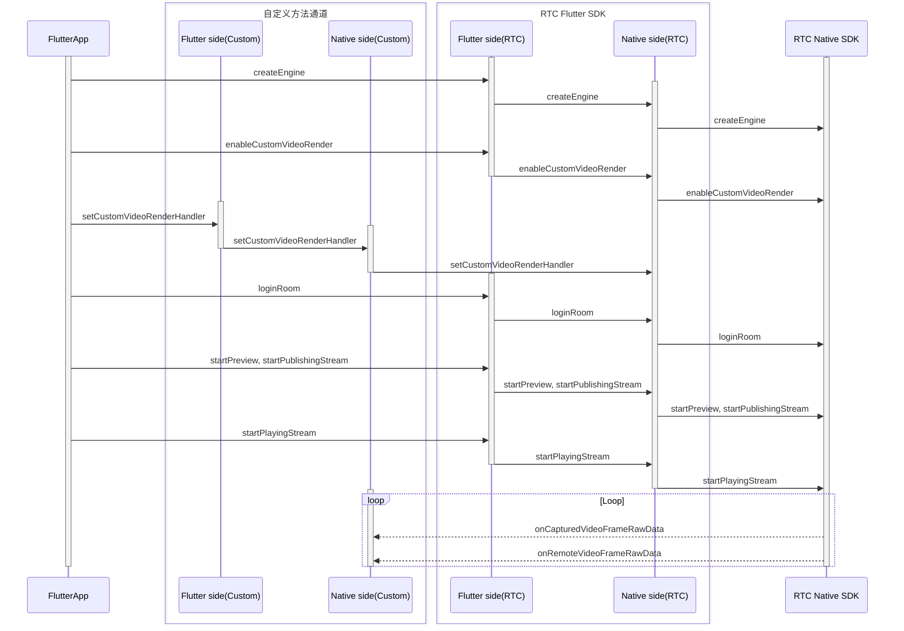

# 自定义视频渲染

- - -

## 功能简介

自定义视频渲染指的是 SDK 向外部提供本地预览及远端拉流的视频帧数据，供用户自行渲染。

当开发者业务中出现以下情况时，推荐使用 SDK 的自定义视频渲染功能：

- App 使用了跨平台界面框架（例如 Qt 需要有复杂层级关系的界面以实现高体验的交互）或游戏引擎（例如 Unity、Unreal Engine、Cocos 等）。
- App 需要获取 SDK 采集或拉流的视频帧数据进行特殊处理。

## 前提条件

在实现自定义视频渲染功能之前，请参考 [撰写双端平台代码（插件编写实现）](https://docs.flutter.cn/platform-integration/platform-channels) 文档，创建平台通道。

## 使用步骤

API 接口调用的时序图如下，其中 Native 为 iOS 端及 Android 端：



<Warning title="注意">
- 请勿在 Native 端（iOS 端或 Android 端）调用 `destroyEngine` 接口，否则会引起功能异常。
- 本文仅说明如何在 Flutter 端开启自定义视频渲染功能，进阶功能请参考 [iOS 自定义视频渲染](/real-time-video-ios-oc/video/custom-video-rendering) 及 [Android 自定义视频渲染](/real-time-video-android-java/video/custom-video-rendering) 文档。
</Warning>


### 1 设置自定义视频渲染配置

创建 [ZegoCustomVideoRenderConfig](https://doc-zh.zego.im/unique-api/express-video-sdk/zh/dart_flutter/zego_express_engine/ZegoCustomVideoRenderConfig-class.html) 对象，配置自定义视频渲染参数。调用 [enableCustomVideoRender](https://doc-zh.zego.im/unique-api/express-video-sdk/zh/dart_flutter/zego_express_engine/ZegoExpressEngineCustomVideoIO/enableCustomVideoRender.html) 接口，开启自定义视频渲染功能。


```dart
ZegoCustomVideoRenderConfig config = ZegoCustomVideoRenderConfig(
    ZegoVideoBufferType.RawData,
    ZegoVideoFrameFormatSeries.RGB,
    false);
await ZegoExpressEngine.instance
    .enableCustomVideoRender(true, config);
```

### 2 设置自定义视频渲染回调

1. 在 Flutter 层新增 `setCustomVideoRenderHandler` 接口，并通过 `MethodChannel` 调用 Native 层。

    ```dart
    // 需开发者自行实现
    class ExpressTestImpl {
      final MethodChannel _channel =
          MethodChannel('plugins.zego.im/zego_express_test_demo');

      // 实现 Flutter 调用 Native 接口
      Future<void> setCustomVideoRenderHandler() async {
        await _channel.invokeMethod('setCustomVideoRenderHandler');
      }
    }
    ```

2. 在 Native 层实现 `setCustomVideoRenderHandler` 接口能力。

<Accordion title="Android 示例" defaultOpen="false">
```java
    // CustomVideoRender.java
    // 实现 IZegoFlutterCustomVideoRenderHandler
    public class CustomVideoRender implements IZegoFlutterCustomVideoRenderHandler {
        @SuppressLint("StaticFieldLeak")
        private static volatile CustomVideoRender instance;

        private CustomVideoRender() {}

        public static CustomVideoRender getInstance() {
            if (instance == null) {
                synchronized (CustomVideoRender.class) {
                    if (instance == null) {
                        instance = new CustomVideoRender();
                    }
                }
            }
            return instance;
        }

        @Override
        public void onCapturedVideoFrameRawData(ByteBuffer[] data, int[] dataLength, ZGFlutterVideoFrameParam param, ZGFlutterVideoFlipMode flipMode, ZGFlutterPublishChannel channel) {
        }

        @Override
        public void onRemoteVideoFrameRawData(ByteBuffer[] data, int[] dataLength, ZGFlutterVideoFrameParam param, String streamID) {
        }

        @Override
        public void onRemoteVideoFrameEncodedData(ByteBuffer data, int dataLength, ZGFlutterVideoEncodedFrameParam param, long referenceTimeMillisecond, String streamID) {
        }
    }
    ```

    ```java
    // ExpressTestPlugin.java
    // methodChannel 示例
    public class ExpressTestPlugin implements FlutterPlugin, MethodChannel.MethodCallHandler {

        private MethodChannel methodChannel;

        @Override
        public void onAttachedToEngine(@NonNull FlutterPluginBinding binding) {
            methodChannel = new MethodChannel(binding.getBinaryMessenger(), "plugins.zego.im/zego_express_test_demo");
            methodChannel.setMethodCallHandler(this);
        }

        @Override
        public void onDetachedFromEngine(@NonNull FlutterPluginBinding binding) {
            methodChannel.setMethodCallHandler(null);
        }

        @Override
        public void onMethodCall(@NonNull MethodCall call, @NonNull MethodChannel.Result result) {
            switch (call.method) {
                case "setCustomVideoRenderHandler": {
                    ZegoCustomVideoRenderManager.getInstance().setCustomVideoRenderHandler(CustomVideoRender.getInstance());
                    result.success(true);
                    break;
                }
            }
        }
    }
    ```
</Accordion>

    <Accordion title="iOS 示例" defaultOpen="false">
```objc
    // CustomVideoRender.h
    @interface CustomVideoRender : NSObject <ZegoFlutterCustomVideoRenderHandler>

    /// Get the custom video render manager instance
    + (instancetype)sharedInstance;

    @end
    ```

    ```objc
    // CustomVideoRender.m
    @interface CustomVideoRender()

    @end

    @implementation CustomVideoRender

    + (instancetype)sharedInstance {
        static CustomVideoRender *instance = nil;
        static dispatch_once_t onceToken;
        dispatch_once(&onceToken, ^{
            instance = [[CustomVideoRender alloc] init];
        });
        return instance;
    }

    #pragma mark ZegoFlutterCustomVideoRenderHandler
    - (void)onCapturedVideoFrameRawData:(unsigned char *_Nonnull *_Nonnull)data
                             dataLength:(unsigned int *)dataLength
                                  param:(ZGFlutterVideoFrameParam *)param
                               flipMode:(ZGFlutterVideoFlipMode)flipMode
                                channel:(ZGFlutterPublishChannel)channel {
    }

    - (void)onRemoteVideoFrameRawData:(unsigned char *_Nonnull *_Nonnull)data
                           dataLength:(unsigned int *)dataLength
                                param:(ZGFlutterVideoFrameParam *)param
                             streamID:(NSString *)streamID {
    }

    - (void)onCapturedVideoFrameCVPixelBuffer:(CVPixelBufferRef)buffer
                                        param:(ZGFlutterVideoFrameParam *)param
                                     flipMode:(ZGFlutterVideoFlipMode)flipMode
                                      channel:(ZGFlutterPublishChannel)channel {
    }

    - (void)onRemoteVideoFrameCVPixelBuffer:(CVPixelBufferRef)buffer
                                      param:(ZGFlutterVideoFrameParam *)param
                                   streamID:(NSString *)streamID {
    }

    - (void)onRemoteVideoFrameEncodedData:(unsigned char *_Nonnull)data
                               dataLength:(unsigned int)dataLength
                                    param:(ZGFlutterVideoEncodedFrameParam *)param
                 referenceTimeMillisecond:(unsigned long long)referenceTimeMillisecond
                                 streamID:(NSString *)streamID {
    }

    @end
    ```

    ```objc
    // ZegoExpressTestPlugin.h
    // methodChannel 示例
    @interface ZegoExpressTestPlugin : NSObject<FlutterPlugin>

    @end
    ```

    ```objc
    // ZegoExpressTestPlugin.m
    // methodChannel 示例
    @interface ZegoExpressTestPlugin ()

    @property (nonatomic, weak) id<FlutterPluginRegistrar> registrar;

    @property (nonatomic, strong) FlutterMethodChannel *methodChannel;

    @end

    @implementation ZegoExpressTestPlugin

    + (void)registerWithRegistrar:(NSObject<FlutterPluginRegistrar>*)registrar {
        ZegoExpressTestPlugin *instance = [[ZegoExpressTestPlugin alloc] init];

        instance.registrar = registrar;

        FlutterMethodChannel *methodChannel = [FlutterMethodChannel
          methodChannelWithName:@"plugins.zego.im/zego_express_test_demo"
                binaryMessenger:[registrar messenger]];
        [registrar addMethodCallDelegate:instance channel:methodChannel];
        instance.methodChannel = methodChannel;
    }

    - (void)detachFromEngineForRegistrar:(NSObject<FlutterPluginRegistrar>*)registrar {
        [_methodChannel setMethodCallHandler:nil];
        _methodChannel = nil;
        _registrar = nil;
    }

    #pragma mark - Handle Method Call

    - (void)handleMethodCall:(FlutterMethodCall*)call result:(FlutterResult)result {
        SEL selector = NSSelectorFromString([NSString stringWithFormat:@"%@:result:", call.method]);

        // Handle unrecognized method
        if (![self respondsToSelector:selector]) {
            result(@(false));
            return;
        }

        NSMethodSignature *signature = [self methodSignatureForSelector:selector];
        NSInvocation* invocation = [NSInvocation invocationWithMethodSignature:signature];

        invocation.target = self;
        invocation.selector = selector;
        [invocation setArgument:&call atIndex:2];
        [invocation setArgument:&result atIndex:3];
        [invocation invoke];
    }

    - (void)setCustomVideoRenderHandler:(FlutterMethodCall*)call result:(FlutterResult)result {
        [[ZegoCustomVideoRenderManager sharedInstance] setCustomVideoRenderHandler:[CustomVideoRender sharedInstance]];
        result(@(true));
    }

    @end
    ```
</Accordion>


3. 调用 `ExpressTestImpl.setCustomVideoRenderHandler` 设置自定义视频渲染回调。
    ```dart
    ExpressTestImpl.instance.setCustomVideoRenderHandler();
    ```

### 3 后续操作

本文仅说明如何在 Flutter 端开启自定义视频渲染功能，进阶功能请参考 [iOS 自定义视频渲染](/real-time-video-ios-oc/video/custom-video-rendering) 及 [Android 自定义视频渲染](/real-time-video-android-java/video/custom-video-rendering) 文档。

<Content />

