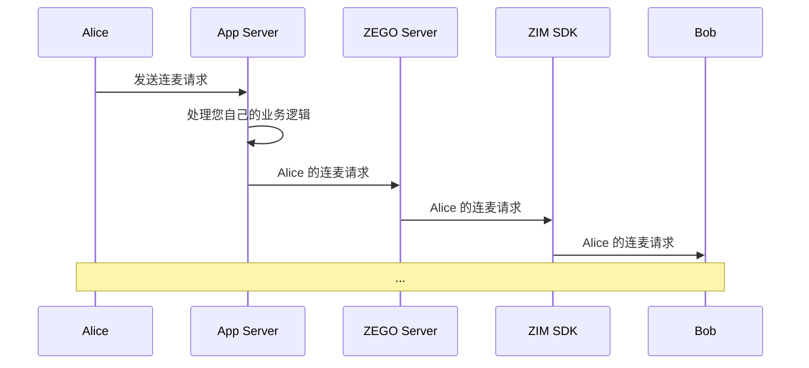

# 实现连麦

- - -

本文档介绍如何在使用实时音视频产品（ZEGO Express SDK）实现基本直播功能的基础上，结合即时通讯产品（ZIM SDK）实现连麦功能。

<Warning title="注意">


本文基于[示例代码](https://github.com/ZEGOCLOUD/zegocloud_sdk_demo_android/tree/master/best_practice) 来介绍的如何实现连麦功能，因此文档中的部分方法为示例代码封装方法。
</Warning>

## 前提条件

在开始之前，请确保您已完成以下步骤：

- 已集成 SDK，详情请参考 [CDN 直播快速开始](https://doc-zh.zego.im/article/20720) 或 [超低延迟直播快速开始](https://doc-zh.zego.im/article/20741) 文档。
- 下载与本文档配套的 [示例代码](https://github.com/ZEGOCLOUD/zegocloud_sdk_demo_android/tree/master/best_practice)。
- 在 [管理控制台](https://console.zego.im/ProjectManage) 中注册并创建项目，同时开通 “即时通讯” 服务。
  <Frame width="512" height="auto" caption=""></Frame>

## 预览效果

通过本文档提供的 [示例代码](https://github.com/ZEGOCLOUD/zegocloud_sdk_demo_android/tree/master/best_practice)，您可以实现以下效果：

|首页|直播间页面|接收连麦请求|开始连麦|
|--- |--- |--- |--- |
|<Frame width="512" height="auto" caption=""></Frame>|<Frame width="512" height="auto" caption=""></Frame>|<Frame width="512" height="auto" caption=""></Frame>|<Frame width="512" height="auto" caption=""></Frame>|

## 技术原理

### 什么是房间信令

基于房间信令实现的连麦流程，房间信令是一种协议或消息，用于管理网络中的通信和连接。ZEGO 将所有房间信令功能打包到 ZIM SDK 中，为您提供了一个现成的实时房间信令 API。


### 如何通过 ZIM SDK 接口发送和接收房间信令消息

ZIM SDK 提供了丰富的发送和接收消息的功能，详情请参考 [收发消息](https://doc-zh.zego.im/article/14063)。此处需要您使用可自定义的房间信令消息：`ZIMCommandMessage`，完整示例代码，可以在 [ZIMService.java](https://github.com/ZEGOCLOUD/zegocloud_sdk_demo_android/tree/master/best_practice/app/src/main/java/com/zegocloud/demo/bestpractice/internal/sdk/zim/ZIMService.java) 中查看。


1. 在房间中通过调用 [sendMessage](https://doc-zh.zego.im/article/api?doc=zim_API~java_android~class~ZIM#send-message) 发送房间信令消息 (`ZIMCommandMessage`)：

```java
zim.sendMessage(commandMessage, mRoomID, ZIMConversationType.ROOM, config, new ZIMMessageSentCallback() {
    // ...
    @Override
    public void onMessageSent(ZIMMessage message, ZIMError errorInfo) {
        // ...
    }
});
```

2. 发送消息后，房间中的其他用户将通过 [onReceiveRoomMessage](https://doc-zh.zego.im/article/api?doc=zim_API~java_android~class~ZIMEventHandler#on-receive-room-message) 回调接收到房间信令消息。您可以通过以下方式监听此回调：

```java
zim.setEventHandler(new ZIMEventHandler() {
    @Override
    public void onReceiveRoomMessage(ZIM zim, ArrayList<ZIMMessage> messageList, String fromRoomID) {
        super.onReceiveRoomMessage(zim, messageList, fromRoomID);

        // ...
    }
});
```

### 如何自定义业务房间信令

<Note title="说明">


此处完整示例代码，可以在 [ZIMService.java](https://github.com/ZEGOCLOUD/zegocloud_sdk_demo_android/tree/master/best_practice/app/src/main/java/com/zegocloud/demo/bestpractice/internal/sdk/zim/ZIMService.java) 和 [RoomRequest.java](https://github.com/ZEGOCLOUD/zegocloud_sdk_demo_android/tree/master/best_practice/app/src/main/java/com/zegocloud/demo/bestpractice/internal/sdk/zim/RoomRequest.java) 中查看。
</Note>


**房间信令 JSON 编码**

由于简单的 `String` 本身难以表达复杂信息，房间信令可以封装在 `JSON` 格式中，使您更方便地编写房间信令的协议内容。

以最简单的房间信令的 JSON 格式为例：`{"action_type": 10000}`，在这样一份 JSON 房间信令中，您可以使用 `action_type` 字段来表达不同的房间信令类型，例如：

- 发送连麦请求：`{"action_type": RoomRequestAction.ACTION_REQUEST}`
- 取消连麦请求：`{"action_type": RoomRequestAction.ACTION_CANCEL}`
- 接受连麦请求：`{"action_type": RoomRequestAction.ACTION_ACCEPT}`
- 拒绝连麦请求：`{"action_type": RoomRequestAction.ACTION_REJECT}`

此外，您还可以为房间信令扩展其他常见字段，例如 `senderID`、`receiverID`、`extended_data`：

```java
public class RoomRequest {

    // ...
    public String toString() {
        JSONObject jsonObject = new JSONObject();
        try {
            jsonObject.put("action_type", actionType);
            jsonObject.put("sender_id", sender);
            jsonObject.put("receiver_id", receiver);
            jsonObject.put("extended_data", extendedData);
            jsonObject.put("request_id", requestID);
        } catch (JSONException e) {
            throw new RuntimeException(e);
        }
        return jsonObject.toString();
    }

    // ...
}

public @interface RoomRequestAction {
    int ACTION_REQUEST = 0;
    int ACTION_ACCEPT = 1;
    int ACTION_REJECT = 2;
    int ACTION_CANCEL = 3;
}
```

**房间信令 JSON 解码**

接收房间信令的用户，可以解码 JSON 房间信令，并根据其中的字段了解和处理具体的业务逻辑，例如：

```java
zim.setEventHandler(new ZIMEventHandler() {
    @Override
    public void onReceiveRoomMessage(ZIM zim, ArrayList<ZIMMessage> messageList, String fromRoomID) {
        super.onReceiveRoomMessage(zim, messageList, fromRoomID);

        for (ZIMMessage zimMessage : messageList) {
            if (zimMessage instanceof ZIMCommandMessage) {
                ZIMCommandMessage commandMessage = (ZIMCommandMessage) zimMessage;
                String message = new String(commandMessage.message, StandardCharsets.UTF_8);
                try {
                    JSONObject jsonObject = new JSONObject(message);
                    if (jsonObject.has("action_type")) {
                        jsonObject.put("message_id", String.valueOf(commandMessage.getMessageID()));
                        if (currentUser != null) {
                            onReceiveRoomRequestMessage(jsonObject);
                        }
                    } else {
                        // ...
                    }
                } catch (JSONException e) {
                    // ...
                }
            }
        }
    }
    // ...
)

// ...
private void onReceiveRoomRequestMessage(JSONObject jsonObject) throws JSONException {
    String sender = jsonObject.getString("sender_id");
    String receiver = jsonObject.getString("receiver_id");
    int actionType = jsonObject.getInt("action_type");
    String extendedData = jsonObject.getString("extended_data");
    String messageID = jsonObject.getString("message_id");
    if (currentUser.userID.equals(receiver)) {
        if (actionType == RoomRequestAction.ACTION_REQUEST) {
            // ...
        } else if (actionType == RoomRequestAction.ACTION_ACCEPT) {
            // ...
        } else if (actionType == RoomRequestAction.ACTION_CANCEL) {
            // ...
        } else if (actionType == RoomRequestAction.ACTION_REJECT) {
            // ...
        }
    }
}
```

**扩展房间信令**

基于这种模式，当您需要进行任何业务协议扩展时，只需扩展房间信令的 `extended_data` 字段，就可以轻松实现新的业务逻辑，例如：

- 禁言观众：接收到相应的房间信令后，可阻止用户发送直播间弹幕。
- 发送虚拟礼物：接收到房间信令后，展示礼物特效。
- 移除观众：接收到房间信令后，提示观众已被移除并退出房间。

**其他扩展信息**：

通过以下内容，可进一步了解连麦房间信令的实现，您将能够轻松扩展您的直播业务房间信令。

本文档中的示例代码是纯客户端 API + ZEGO 解决方案。如果您有自己的业务服务端，并希望进行更多的逻辑扩展，您可以使用我们的 [服务端 API](https://doc-zh.zego.im/article/12197) 来传递房间信令，并结合您服务端的房间业务逻辑，以提高您的应用的可靠性。




## 实现流程

### 集成并使用 ZIM SDK

如果您之前没有使用过 ZIM SDK，您可以阅读以下部分：

<Accordion title="1. 导入 ZIM SDK" defaultOpen="false">
要导入 ZIM SDK，请执行以下操作：

1. 配置 repositories 源

    - 当您的 Android Gradle Plugin 为 v7.1.0 或以上版本：进入项目根目录，打开 “settings.gradle” 文件，在 “dependencyResolutionManagement” 中加入如下代码。

        ```groovy
        ...
        dependencyResolutionManagement {
            repositoriesMode.set(RepositoriesMode.FAIL_ON_PROJECT_REPOS)
            repositories {
                maven { url 'https://maven.zego.im' }
                mavenCentral()
                google()
            }
        }
        ```

        <Warning title="注意">
        如果您在 “settings.gradle” 中找不到上述字段，可能是因为您的 Android Gradle Plugin 版本低于 v7.1.0。

        相关信息请参考 [Android Gradle Plugin Release Note v7.1.0](https://developer.android.google.cn/build/releases/past-releases/agp-7-1-0-release-notes#settings-gradle)。
        </Warning>

    - 若您的 Android Gradle Plugin 为 v7.1.0 以下版本：进入项目根目录，打开 “build.gradle” 文件，在 “allprojects” 中加入如下代码。

        ```groovy
        ...
        allprojects {
            repositories {
                maven { url 'https://maven.zego.im' }
                mavenCentral()
                google()
            }
        }
        ```

2. 声明依赖

    进入 “app” 目录，打开 “build.gradle” 文件，在 “dependencies” 中添加 `implementation 'im.zego:zim:x.y.z'`，请从 [发布日志](https://doc-zh.zego.im/article/11594) 查询 SDK 最新版本，并将 `x.y.z` 修改为具体的版本号。

    ```groovy
    ...
    dependencies {
        ...
        implementation 'im.zego:zim:x.y.z'
    }
    ```
</Accordion>

<Accordion title="2. 创建并管理 SDK 实例" defaultOpen="false">
1. 导入 ZIM SDK：
    ```java
    import im.zego.zim.ZIM
    ```

2. 在 SDK 中创建 ZIM 实例，一个实例对应的是一个用户，表示一个用户以客户端的身份登录系统。
    ```java
    ZIMAppConfig appConfig = new ZIMAppConfig();
    appConfig.appID = yourAppID;
    appConfig.appSign = yourAppSign;
    ZIM.create(appConfig, application);
    ```
</Accordion>


稍后，我们将为您提供如何使用 ZIM SDK 实现连麦功能的详细指南。


### （必选）管理多个 SDK

在本文档描述的直播场景中，您需要使用 `ZIM SDK` 来实现连麦功能，然后使用 `Express SDK` 实现直播功能。

为了使您的应用代码更加有条理，我们建议您通过使用以下方式来管理这些 SDK：

<Warning title="注意">


我们将在后续文档中使用 ZIMService 和 ExpressService 进行示例说明。
</Warning>

<Accordion title="1. 为每个 SDK 创建一个包装层，以便您尽可能多地重用代码。" defaultOpen="false">
为 `ZIM SDK` 创建一个 `ZIMService` 类，它管理与 SDK 的交互并存储所需数据，完整代码请参考 [ZIMService.java](https://github.com/ZEGOCLOUD/zegocloud_sdk_demo_android/tree/master/best_practice/app/src/main/java/com/zegocloud/demo/bestpractice/internal/sdk/zim/ZIMService.java)。
```java
public class ZIMService {

    // ...

    public void initSDK(Application application, long appID, String appSign) {
        zimProxy.create(application, appID, appSign);
        // ...
    }
}

class ZIMProxy {

    private SimpleZIMEventHandler zimEventHandler;

    public void create(Application application, long appID, String appSign) {
        ZIMAppConfig zimAppConfig = new ZIMAppConfig();
        zimAppConfig.appID = appID;
        zimAppConfig.appSign = appSign;
        ZIM.create(zimAppConfig, application);

        zimEventHandler = new SimpleZIMEventHandler();
        if (getZIM() != null) {
            ZIM.getInstance().setEventHandler(zimEventHandler);
        }
    }

}
```

同样，为 `Express SDK` 创建一个 `ExpressService` 类，它管理与 SDK 的交互并存储所需数据，完整代码请参考 [ExpressService.java](https://github.com/ZEGOCLOUD/zegocloud_sdk_demo_android/tree/master/best_practice/app/src/main/java/com/zegocloud/demo/bestpractice/internal/sdk/express/ExpressService.java)。

```java
public class ExpressService {

    // ...
    public void initSDK(Application application, long appID, String appSign, ZegoScenario scenario) {
        ZegoEngineConfig config = new ZegoEngineConfig();
        config.advancedConfig.put("notify_remote_device_unknown_status", "true");
        config.advancedConfig.put("notify_remote_device_init_status", "true");
        ZegoExpressEngine.setEngineConfig(config);
        engineProxy.createEngine(application, appID, appSign, scenario);
        // ...
    }
}

class ExpressEngineProxy {

    private SimpleExpressEventHandler expressEventHandler;

    public void createEngine(Application application, long appID, String appSign, ZegoScenario scenario) {
        ZegoEngineProfile profile = new ZegoEngineProfile();
        profile.appID = appID;
        profile.appSign = appSign;
        profile.scenario = scenario;
        profile.application = application;
        expressEventHandler = new SimpleExpressEventHandler();
        ZegoExpressEngine.createEngine(profile, expressEventHandler);
    }
}
```

您可以根据需求，向服务中添加相关 SDK 接口的方法。

例如，当您需要登录时，可以向 `ZIMService` 添加 `connectUser` 方法。

```java
public class ZIMService {
    // ...
    public void connectUser(String userID, String userName, ZIMLoggedInCallback callback) {
        ZIMUserInfo zimUserInfo = new ZIMUserInfo();
        zimUserInfo.userID = userID;
        zimUserInfo.userName = userName;
        zim.login(zimUserInfo, new ZIMLoggedInCallback() {
            @Override
            public void onLoggedIn(ZIMError errorInfo) {
                // ...
            }
        });
    }
}
```
</Accordion>

<Accordion title="2. 完成服务封装后，您可以通过创建 ZEGOSDKManager 来进一步简化代码，管理这些服务。" defaultOpen="false">
完整代码，请参考 [ZEGOSDKManager.java](https://github.com/ZEGOCLOUD/zegocloud_sdk_demo_android/tree/master/best_practice/app/src/main/java/com/zegocloud/demo/bestpractice/internal/sdk/ZEGOSDKManager.java)。

```java
public class ZEGOSDKManager {
    public ExpressService expressService = new ExpressService();
    public ZIMService zimService = new ZIMService();

    private static final class Holder {
        private static final ZEGOSDKManager INSTANCE = new ZEGOSDKManager();
    }

    public static ZEGOSDKManager getInstance() {
        return Holder.INSTANCE;
    }

    public void initSDK(Application application, long appID, String appSign,ZegoScenario scenario) {
        expressService.initSDK(application, appID, appSign,scenario);
        zimService.initSDK(application, appID, appSign);
    }
}
```

通过此方式，您已实现了一个单例类，来管理您需要的 SDK 服务。因此，您可以在项目的任何地方获取此类的实例，并使用它来执行与 SDK 相关的逻辑，例如：

- 当应用启动时：调用 `ZEGOSDKManager.getInstance().initSDK(application,appID,appSign);`
- 当需要登录时：调用 `ZEGOSDKManager.getInstance().connectUser(userID,userName,callback);`

稍后，我们将介绍如何基于此配置连麦功能。
</Accordion>

稍后，我们将介绍如何基于此配置添加连麦功能。


### 发送或取消连麦请求

发送和取消连麦请求的实现相似，只是房间信令的类型不同。此处以发送为例，来说明示例代码的实现。

在示例代码中，直播页面（观众视角）的右下角放置了一个申请连麦按钮。当按钮被点击时，将执行以下操作。

1. 房间信令的 JSON 编码，其中 `action_type` 在示例代码中定义为 [RoomRequestAction.ACTION_REQUEST](https://github.com/ZEGOCLOUD/zegocloud_sdk_demo_android/blob/38cc405f591e42412cfb0542bfe4682b9a311b76/best_practice/app/src/main/java/com/zegocloud/demo/bestpractice/internal/sdk/zim/ZIMService.java#L963C13-L963C22)。
2. 调用 [sendRoomRequest](https://github.com/ZEGOCLOUD/zegocloud_sdk_demo_android/blob/38cc405f591e42412cfb0542bfe4682b9a311b76/best_practice/app/src/main/java/com/zegocloud/demo/bestpractice/internal/sdk/zim/ZIMService.java#L714) 发送房间信令。（`sendRoomRequest` 简化了 `ZIM SDK` 的 [sendMessage](https://doc-zh.zego.im/article/api?doc=zim_API~java_android~class~ZIM#send-message) 接口。）
   - 如果方法调用成功：本地端（即观众端）的申请状态将切换为申请连麦，申请连麦按钮将切换为取消连麦按钮。
   - 如果方法调用失败：将提示错误信息。在实际应用开发中，建议您使用更用户友好的 UI 来提示连麦申请失败。

```java
@Override
protected void afterClick() {
    super.afterClick();
    // ...
    RoomRequestExtendedData extendedData = new RoomRequestExtendedData();
    extendedData.roomRequestType = RoomRequestType.REQUEST_COHOST;
    //getInstance 为示例代码封装方法 https://github.com/ZEGOCLOUD/zegocloud_sdk_demo_android/blob/master/best_practice/app/src/main/java/com/zegocloud/demo/bestpractice/internal/sdk/ZEGOSDKManager.java#L37
    //sendRoomRequest 为示例代码封装方法 https://github.com/ZEGOCLOUD/zegocloud_sdk_demo_android/blob/38cc405f591e42412cfb0542bfe4682b9a311b76/best_practice/app/src/main/java/com/zegocloud/demo/bestpractice/internal/sdk/zim/ZIMService.java#L714
    ZEGOSDKManager.getInstance().zimService.sendRoomRequest(hostUser.userID, jsonObject.toString(),
        new RoomRequestCallback() {
            @Override
            public void onRoomRequestSend(int errorCode, String requestID) {
                if (errorCode == 0) {
                    mRoomRequestID = requestID;
                }
            }
        });
// ...
}

 public void sendRoomRequest(String receiverID, String extendedData, RoomRequestCallback callback) {
        if (zimProxy.getZIM() == null || currentRoom == null || currentUser == null) {
            return;
        }
        RoomRequest roomRequest = new RoomRequest();
        roomRequest.receiver = receiverID;
        roomRequest.sender = currentUser.userID;
        roomRequest.extendedData = extendedData;
        roomRequest.actionType = RoomRequestAction.ACTION_REQUEST;

        byte[] bytes = roomRequest.toString().getBytes(StandardCharsets.UTF_8);
        ZIMCommandMessage commandMessage = new ZIMCommandMessage(bytes);
        zimProxy.sendMessage(commandMessage, currentRoom.roomID, ZIMConversationType.ROOM, new ZIMMessageSendConfig(),
            new ZIMMessageSentCallback() {
                @Override
                public void onMessageAttached(ZIMMessage message) {

                }

                @Override
                public void onMessageSent(ZIMMessage message, ZIMError errorInfo) {
                    if (errorInfo.code == ZIMErrorCode.SUCCESS) {
                        roomRequest.requestID = String.valueOf(message.getMessageID());
                        roomRequestMap.put(roomRequest.requestID, roomRequest);
                    }
                  // ...
                }
            });
    }
//updateUI 为示例代码封装方法 https://github.com/ZEGOCLOUD/zegocloud_sdk_demo_android/blob/38cc405f591e42412cfb0542bfe4682b9a311b76/best_practice/app/src/main/java/com/zegocloud/demo/bestpractice/components/cohost/CoHostButton.java#L137
public void updateUI() {
    ZEGOSDKUser localUser = ZEGOSDKManager.getInstance().expressService.getCurrentUser();
    ZIMService zimService = ZEGOSDKManager.getInstance().zimService;
    if (ZEGOLiveStreamingManager.getInstance().isCoHost(localUser.userID)) {
        coHostUI();
    } else if (ZEGOLiveStreamingManager.getInstance().isAudience(localUser.userID)) {
        RoomRequest roomRequest = zimService.getRoomRequestByRequestID(mRoomRequestID);
        if (roomRequest == null) {
            audienceUI();
        } else {
            requestCoHostUI();
        }
    }
}
```

3. 本地端（观众端）将等待主播的响应。
   - 如果主播拒绝了连麦请求：本地端的申请状态将切换为不申请。
   - 如果主播接受了连麦请求：将开始连麦（有关开始和结束连麦的详细信息，请参考 [开始或结束连麦部分](#开始连麦)）。

### 接受或拒绝连麦请求

1. 在示例代码中，当主播收到连麦请求的房间信令时，用户列表中的按钮上会出现一个红点，主播可以在点击用户列表后，选择接受或拒绝用户的连麦请求。
2. 主播响应后，会发送接受或拒绝的房间信令。此处不再进一步描述发送房间信令的相关逻辑。完整代码可以在 [RoomRequestButton.java](https://github.com/ZEGOCLOUD/zegocloud_sdk_demo_android/tree/master/best_practice/app/src/main/java/com/zegocloud/demo/bestpractice/components/cohost/RoomRequestButton.java) 和 [RoomRequestListAdapter](https://github.com/ZEGOCLOUD/zegocloud_sdk_demo_android/tree/master/best_practice/app/src/main/java/com/zegocloud/demo/bestpractice/components/RoomRequestListAdapter.java) 中查看。

<Accordion title="关键代码片段" defaultOpen="false">
1. 收到连麦请求时，在用户列表上，显示红点的相关代码如下：

```java
// ...
@Override
public void onInComingRoomRequestReceived(RoomRequest request) {
    checkRedPoint();
}

private void showRedPoint() {
    redPoint.setVisibility(View.VISIBLE);
}

private void hideRedPoint() {
    redPoint.setVisibility(View.GONE);
}

public void checkRedPoint() {
    ZEGOSDKUser localUser = ZEGOSDKManager.getInstance().expressService.getCurrentUser();
    if (ZEGOLiveStreamingManager.getInstance().isHost(localUser.userID)) {
        List<RoomRequest> myReceivedRoomRequests = ZEGOSDKManager.getInstance().zimService.getMyReceivedRoomRequests();
        boolean showRedPoint = false;
        for (RoomRequest roomRequest : myReceivedRoomRequests) {
            String extendedData = roomRequest.extendedData;
            RoomRequestExtendedData data = RoomRequestExtendedData.parse(extendedData);
            if (data != null && data.roomRequestType == roomRequestType) {
                showRedPoint = true;
                break;
            }
        }
        if (showRedPoint) {
            showRedPoint();
        } else {
            hideRedPoint();
        }
    }
}
```

2. 在房间请求列表中，主播可以选择点击接受或拒绝。

```java
@Override
public void onBindViewHolder(@NonNull ViewHolder holder, int position) {
    // ...

    agree.setOnClickListener(v -> {
        ZEGOSDKManager.getInstance().zimService.acceptRoomRequest(roomRequest.requestID, new RoomRequestCallback() {
            @Override
            public void onRoomRequestSend(int errorCode, String requestID) {

            }
        });
    });

    disagree.setOnClickListener(v -> {
        ZEGOSDKManager.getInstance().zimService.rejectRoomRequest(roomRequest.requestID, new RoomRequestCallback() {
            @Override
            public void onRoomRequestSend(int errorCode, String requestID) {

            }
        });
    });
}
```
</Accordion>

### 开始连麦

<Note title="说明">


开始连麦后的逻辑与 [快速开始](https://doc-zh.zego.im/article/20720) 相同。如果您不熟悉如何推流和拉流以及如何渲染它们，请参考 [快速开始](https://doc-zh.zego.im/article/20720)。
</Note>


当观众接收到主播同意连麦的房间信令时，他们可以通过调用 `Express SDK` 的相关方法来预览和推流，从而成为连麦主播。完整代码可以在 [LiveStreamingActivity.java](https://github.com/ZEGOCLOUD/zegocloud_sdk_demo_android/tree/master/best_practice/app/src/main/java/com/zegocloud/demo/bestpractice/activity/LiveStreamingActivity.java) 和 [ExpressService.java](https://github.com/ZEGOCLOUD/zegocloud_sdk_demo_android/tree/master/best_practice/app/src/main/java/com/zegocloud/demo/bestpractice/internal/sdk/express/ExpressService.java) 中查看。

<Accordion title="关键代码片段" defaultOpen="false">
```java
public class LiveStreamingActivity extends AppCompatActivity {
    // ...
    @Override
    public void onOutgoingRoomRequestAccepted(RoomRequest request) {
        RoomRequestExtendedData data = RoomRequestExtendedData.parse(extendedData);
        if (data != null && data.roomRequestType == RoomRequestType.REQUEST_COHOST) {
            ExpressService expressService = ZEGOSDKManager.getInstance().expressService;
            ZEGOSDKUser currentUser = expressService.getCurrentUser();
            if (ZEGOLiveStreamingManager.getInstance().isAudience(currentUser.userID)) {
                List<String> permissions = Arrays.asList(permission.CAMERA, permission.RECORD_AUDIO);
                requestPermissionIfNeeded(permissions, new RequestCallback() {

                    @Override
                    public void onResult(boolean allGranted, @NonNull List<String> grantedList,
                        @NonNull List<String> deniedList) {
                        ZEGOLiveStreamingManager.getInstance().startCoHost();
                    }
                });
            }
        }
    }
    // ...
}
```
</Accordion>


### 结束连麦

当观众结束连麦后，他们需要调用 `Express SDK` 的相关方法停止预览和推流，完整代码可在 [CoHostService.java](https://github.com/ZEGOCLOUD/zegocloud_sdk_demo_android/blob/38cc405f591e42412cfb0542bfe4682b9a311b76/best_practice/app/src/main/java/com/zegocloud/demo/bestpractice/internal/business/cohost/CoHostService.java#L180) 中查看，以下是关键代码：

```java
public void endCoHost() {
    // 移除连麦用户
    removeCoHost(ZEGOSDKManager.getInstance().expressService.getCurrentUser());
    // 关闭麦克风
    ZEGOSDKManager.getInstance().expressService.openMicrophone(false);
    // 关闭摄像头
    ZEGOSDKManager.getInstance().expressService.openCamera(false);
    // 停止预览
    ZEGOSDKManager.getInstance().expressService.stopPreview();
    // 停止推流
    ZEGOSDKManager.getInstance().expressService.stopPublishingStream();
}
```

<Warning title="注意">
在实现视频通话、直播等视频场景时，请注意**视频分辨率与价格**之间的关系。

在同一房间内播放多个视频流时，将基于分辨率总和进行计费，并且不同分辨率将对应不同的计费档次。

计算最终分辨率时，包括以下视频流：

1. 直播视频画面（例如主播画面、连麦画面、PK 对战画面等）
2. 视频通话中，每个人的视频画面
3. 屏幕共享画面
4. 云录制服务的分辨率
5. 直播创作分辨率

在您的应用上线前，请**确保您已检查所有配置并确认**适用于您业务场景的**计费档次**，以避免不必要的损失。更多详情请参见 [定价](https://www.zego.im/price)。
</Warning>


## 完成连麦功能

恭喜您，完成上述步骤后，您已经实现了连麦功能。
