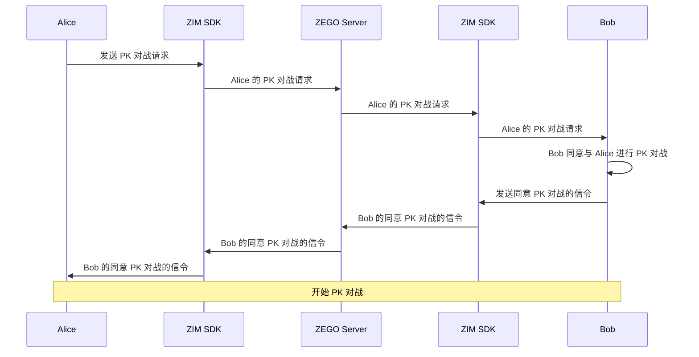

# 实现 PK

- - -


PK 对战是两个主播之间的友好竞争，展示给观众的是主播之间的互动。
本文档介绍如何在使用实时音视频产品（ZEGO Express SDK）实现基本直播功能的基础上，结合即时通讯产品（ZIM SDK）实现 PK 对战功能。

通常有两种玩法：

1. **通过主播之间主动发起的 PK 对战**：主播在自己的直播开始后，可以向他们想要连接的主播发送 PK 对战请求。一旦 PK 对战请求被接受，两个主播将会连接在一起。
2. **由业务服务器协调的 PK 对战**：主播在申请 PK 匹配后，业务服务器将协调主播开始 PK 对战，主播将会自动连接到彼此。

本文档将介绍如何在直播场景中实现 PK 对战。

<Warning title="注意">


- 本文是基于 [示例代码](https://github.com/ZEGOCLOUD/zegocloud_sdk_demo_android/tree/master/best_practice) 来介绍的如何实现PK功能，因此文档中的部分方法为示例代码封装方法。
- 示例代码把多个SDK进行了封装以方便管理，请参考：[管理多个 SDK](/solution-live-streaming-android/implement-cohosting#必选管理多个-sdk)
</Warning>

## 前提条件

在开始之前，请确保您已完成以下步骤：

- 已集成 SDK，详情请参考 [CDN 直播快速开始](https://doc-zh.zego.im/article/20720) 或 [超低延迟直播快速开始](https://doc-zh.zego.im/article/20741) 文档。
- 下载与本文档配套的 [示例代码](https://github.com/ZEGOCLOUD/zegocloud_sdk_demo_android/tree/master/best_practice)。
- 请联系 ZEGO 技术支持开通混流服务。
- 在 [管理控制台](https://console.zego.im/ProjectManage) 中注册并创建项目，同时开通 “即时通讯” 服务。
  <Frame width="512" height="auto" caption=""></Frame>


## 预览效果

您可以使用本文档提供的 [示例代码](https://github.com/ZEGOCLOUD/zegocloud_sdk_demo_android/tree/master/best_practice) 实现以下效果：


|主页|直播页面|接收 PK 对战请求|PK 对战|
|--- | --- | --- |--- |
|<Frame width="512" height="auto" caption=""></Frame>|<Frame width="512" height="auto" caption=""></Frame>|<Frame width="512" height="auto" caption=""></Frame>|<Frame width="512" height="auto" caption=""></Frame>|


## 技术原理

以下是本文档内容的结构和概述：

1. [如何发送 PK 对战邀请](#如何发送-pk-对战邀请)：解释如何利用 [呼叫邀请](/zim-android/guides/call-invitation-signaling) 发送 PK 邀请的过程。
2. [PK 拉流和推流的介绍](#pk-对战的推流与拉流)：基于流的概念，介绍 PK 对战的推流和拉流解决方案的框架。
3. [实现主播端逻辑](#开始-pk-对战--主播逻辑)：提供主播端 PK 的解决方案的详细信息，包括如何与其他主播互动，为观众开启混流，以及在 PK 对战开始时通知观众。
4. [实现观众端逻辑](#开始-pk-对战---观众逻辑)：提供观众端 PK 的解决方案的细节，包括如何观看主播之间的互动及如何处理单流场景。
5. [如何结束 PK 对战](#结束-pk-对战或退出-pk-对战)：描述结束 PK 会话，并恢复正常的单主播直播的步骤。
6. [如何检测 PK 对战中的异常情况](#如何检测-pk-对战中的异常情况)：描述如何通过 SEI 检测 PK 主机的异常情况。
7. [其他功能介绍](#其他功能)：包括使用 SEI 检测主机设备和流的状态，处理客户端断开连接或崩溃等异常情况。
8. [常见问题解答](#常见问题解答)：解答与 PK 对战相关的常见问题，如渲染主播声音或暂时静音其他主播。


## 如何发送 PK 对战邀请

<Note title="说明">


如果您计划实现“由业务服务器协调的 PK 对战”，请忽略本节。

此外，如果您的服务器没有信令通道向客户端发送通知，我们建议使用 ZIM 服务端 API 的`Command message (signaling message)` 实现，详情请参考 [ZIM 服务端 API-发送房间消息](https://doc-zh.zego.im/article/12226)。
</Note>

此处使用类似呼叫邀请的方法，实现 PK 对战邀请：

基于 ZIM SDK 提供的 [呼叫邀请](https://doc-zh.zego.im/article/13931) 功能。该功能提供了呼叫邀请的能力，允许您发送、取消、接受和拒绝邀请，您可以实现 PK 对战邀请、房间邀请。您可以使用 [ZIMCallInviteConfig](https://doc-zh.zego.im/article/api?doc=zim_API~java_android~struct~ZIMCallInviteConfig) 提供的`extendedData`字段，该字段允许您自定义此邀请的类型，从而实现不同的功能。

例如，您可以将业务协议编码为 JSON 并附加到`extendedData`中：

```json
{
    "room_id": "Room10001",
    "user_name": "Alice",
    "type": "start_pkbattles" // 或者 "video_call" , "voice_call"
}
```

这样，接收方在收到邀请后，可以根据`type`字段判断并执行不同的业务逻辑。

基于此实现呼叫邀请的过程如下（以“Alice 邀请 Bob 进行 PK 对战， Bob 接受并连接 PK 对战”为例）：




有关这些接口的具体用法，请参考 [呼叫邀请](https://doc-zh.zego.im/article/13931)。

1. 在实现 PK 对战邀请时，需要注意在邀请接口的 `extendedData` 字段中，需要传递双方的信息：
    A **在发起 PK 对战邀请时**，除了上述的 `type` 之外，还需要将自己的 `roomID` 和 `userName` 传递给对方，以便对方知道开始 PK 对战的相关信息。
    B **在接受 PK 对战邀请时**，同样需要在 `type` 之外，传递自己的 `roomID` 和 `userName`。

2. 在第一次邀请时，请调用 `callInvite` 并将其设置为高级模式。在此模式下，您需要使用 `callEnd` 或 `callQuit` 结束或退出 PK 对战，并且您可以使用 `callingInvite` 继续邀请其他人加入 PK 对战。

```java
/** 向用户发送呼叫邀请 - 高级模式 */
// 发送呼叫邀请
List<String> invitees;  // 邀请对象列表
invitees.add("421234");       // 邀请对象的 ID
ZIMCallInviteConfig config = new ZIMCallInviteConfig();
config.timeout = 200; // 邀请的超时时间，单位为秒，范围为 1-600
// mode 表示呼叫邀请模式，ADVANCED 表示设置为高级模式。
config.mode = ADVANCED;

zim.callInvite(invitees, config, new ZIMCallInvitationSentCallback() {
    @Override
    public void onCallInvitationSent(String callID, ZIMCallInvitationSentInfo info, ZIMError errorInfo) {
        // 这里的 callID 是由 SDK 内部生成的，用于在用户发起呼叫后，唯一标识呼叫邀请；
        // 后续，当发起者取消呼叫或被邀请者接受或拒绝呼叫时，将使用该 callID。
    }
 });
```


## PK 对战的推流与拉流

开始之前，请确保您熟悉以下概念：

<Accordion title="什么是房间、流及混流？" defaultOpen="false">
1. 什么是房间和流？

    - ZEGO Express SDK：由 ZEGO 提供的实时音视频通话 SDK。它可以帮助您提供具有便捷访问、高清流畅、跨平台通信、低延迟和高并发性的音视频服务。
    - 推流：将捕获并打包的音视频数据流推送到 ZEGO 实时音视频云的过程。
    - 拉流：从 ZEGO 实时音视频云接收并播放音视频数据流的过程。
    - 房间：ZEGO 提供的服务，用于组织用户群体，并允许同一房间内的用户相互接收和发送实时音视频和消息。
         - 用户只有在登录到房间后才能推流或拉流。
         - 用户可以接收房间内的变化通知（例如用户加入或离开房间，以及音视频流的变化）。


2. 什么是混流服务？
    通过混流服务，多路媒体流可以组合成一个单一的流，这样观众只需播放一个流，即可提高质量并降低性能成本。
    更多详细信息，请参考 [混流](https://doc-zh.zego.im/article/1058)。
</Accordion>

PK 解决方案需要使用 [混流](https://doc-zh.zego.im/article/1058)：混流指将多个流合并为一个流，这样观众只需播放该流，即可观看多个主播的画面。使用混流的必要性和重要优势如下：
   - 必要性：在观众观看多个主播时，它确保音视频的相对实时同步，避免两个主播延迟不一致，导致互动体验差。
   - 优势：客户端无需解码和拉多个流，可以节省观众端的带宽，并防止低端设备过热，可进一步提升观看体验。


在 PK 开始之前，每个主播都会推流，观众可以直接拉主播的流。然而，在 PK 开始后，拉流的方法将发生变化：

- 除了推自己的流，每个主播还需要拉对方的流，以实现主播间的实时音视频互动。
- 观众暂时静音主播的单流：使用静音可以节省带宽，并在 PK 结束后快速恢复主播的单流画面。
- 开始混合两个主播的流：客户端或服务器可以管理混流，稍后将详细解释。
- 观众播放混流：观看两位主播的互动。

以上是 PK 场景中推流和拉流的基本框架。在接下来的章节中，我们将根据主播和观众的逻辑提供详细操作流程。


## 开始 PK 对战- 主播逻辑

当主播准备开始 PK 对战时，需要执行以下操作：

### 1 播放每个主播的单流

通常，流 ID 与房间 ID 和用户 ID 相关。例如，在本文档的附带示例代码中，流 ID 规则为 `"${roomID}_${userID}_main_host"`。因此，您可以使用此规则，连接每个主播的流 ID，然后调用 `startPlayingStream` 来拉对方的流。双方的信息可以从邀请接口的回调和双方之间传递的 `extendedData` 中获取。

<Warning title="注意">


如果您的 PK 对战是由服务端安排和匹配的，并且服务端发送了开始 PK 信号，您需要在向主播发送 PK 开始通知时，包含对手主播的 `userID`、`roomID`、`userName` 等信息。
</Warning>


### 2 开始混流任务

混流可以由客户端或服务端发起，您可以根据需要选择：

- 如果从客户端发起混流，架构更简单，但需要处理客户端的复杂网络环境和可能的异常应用退出等问题（下文将详细解释）。
- 如果从服务端发起混流，则受客户端异常情况的影响较小。但是，客户端和服务端之间的交互更复杂，需要一定水平的服务器端开发能力。

本文档的附带示例代码使用了 **“由主播客户端手动发起混流”** 的方法。

#### 从客户端发起混流

混流参数相关注意事项：

- **混流布局**：通常，在 PK 对战中，每个观众在界面左侧看到自己房间的画面。因此，在 PK 开始后，需要发起混流任务，即每个房间中的每个主播都需要发起一个混流任务。在混合流时，每个主播需要将自己的视频放在流混流布局的左侧。`layout` 参数可以参考下方代码，或者您可以参考 [混流](https://doc-zh.zego.im/article/1058) 文档，了解更多关于混流布局的详细信息。

- **混流分辨率**：以主播的默认 540p 分辨率为例，每个单一流的分辨率为 `width=540, height=960`。将两个流并排组合后，混合流的分辨率应为 `width=540*2, height=960`。如果要降低混合流的分辨率，可以保持此宽高比，并减小混流分辨率，例如，使用 `540*480` 分辨率和 `width=540*2/2, height=960/2`。请注意，如果需要降低流混流分辨率，还需要相应调整 `layout` 参数。我们的示例代码使用了混合流分辨率为 `width=810` 和 `height=720`。

- **混流任务 ID 和流 ID**：通常，每个流混流任务只有一个输出流，PK 场景也是如此。因此，可以将混流任务 ID 和流 ID 使用相同的 ID，例如 `'${roomID}__mix'`，这样可以更容易地管理未来的流混流任务。

以下是一个完整的混流参数示例代码片段：
```java

public static final int MIX_VIDEO_WIDTH = 720;
public static final int MIX_VIDEO_HEIGHT = 810;
public static final int MIX_VIDEO_BITRATE = 1500;
public static final int MIX_VIDEO_FPS = 15;

private void updatePKMixTask(IZegoMixerStartCallback callback) {
    if (pkBattleInfo != null) {
        List<String> pkUserStreamList = new ArrayList<>();
        for (PKUser pkUser : pkBattleInfo.pkUserList) {
            if (pkUser.getCallUserState() == ZIMCallUserState.ACCEPTED) {
                pkUserStreamList.add(pkUser.getPKUserStream());
            }
        }

        ZegoMixerVideoConfig videoConfig = new ZegoMixerVideoConfig();
        videoConfig.width = MIX_VIDEO_WIDTH;
        videoConfig.height = MIX_VIDEO_HEIGHT;
        videoConfig.bitrate = MIX_VIDEO_BITRATE;
        videoConfig.fps = MIX_VIDEO_FPS;

        MixLayoutProvider mixLayoutProvider = ZEGOLiveStreamingManager.getInstance().getMixLayoutProvider();
        ArrayList<ZegoMixerInput> mixVideoInputs;
        if (mixLayoutProvider == null) {
            mixVideoInputs = getMixVideoInputs(pkUserStreamList, videoConfig);
        } else {
            mixVideoInputs = mixLayoutProvider.getMixVideoInputs(pkUserStreamList, videoConfig);
        }

        if (task == null) {
            //getInstance 为示例代码封装方法 https://github.com/ZEGOCLOUD/zegocloud_sdk_demo_android/blob/38cc405f591e42412cfb0542bfe4682b9a311b76/best_practice/app/src/main/java/com/zegocloud/demo/bestpractice/internal/sdk/ZEGOSDKManager.java#L37
            //getCurrentRoomID 为示例代码封装方法 https://github.com/ZEGOCLOUD/zegocloud_sdk_demo_android/blob/38cc405f591e42412cfb0542bfe4682b9a311b76/best_practice/app/src/main/java/com/zegocloud/demo/bestpractice/internal/sdk/express/ExpressService.java#L791
            String mixStreamID = ZEGOSDKManager.getInstance().expressService.getCurrentRoomID() + "_mix";

            task = new ZegoMixerTask(mixStreamID);
            task.videoConfig = videoConfig;

            task.setInputList(mixVideoInputs);

            ZegoMixerOutput mixerOutput = new ZegoMixerOutput(mixStreamID);
            ArrayList<ZegoMixerOutput> mixerOutputList = new ArrayList<>();
            mixerOutputList.add(mixerOutput);
            task.setOutputList(mixerOutputList);

            task.enableSoundLevel(true);
        } else {
            task.inputList = mixVideoInputs;
        }

        ZEGOSDKManager.getInstance().expressService.startMixerTask(task, new IZegoMixerStartCallback() {
            @Override
            public void onMixerStartResult(int errorCode, JSONObject data) {
                // 1005026 non_exists_stream_list
                if (errorCode == 0) {
                    updatePKRoomAttributes();
                }
                if (callback != null) {
                    callback.onMixerStartResult(errorCode, data);
                }

            }
        });
    }
}
```

在客户端发起的流混流方法中，重要的是要检查调用混流接口时返回的错误码。如果错误码不为 0，则表示流混流失败。在这种情况下，客户端应采取适当的操作，例如重试混流任务，以确保 PK 对战的正常进行。

#### 自定义混流布局

如果您想设置混流的布局，可以使用 `ZegoMixerTask` 的 [setInputList](https://doc-zh.zego.im/article/api?doc=Express_Video_SDK_API~Java~class~im-zego-zegoexpress-entity-zego-mixer-task#set-input-list) 方法自定义布局。此处我们展示一些简单的设置规则。

例如，如果有两个人，您可以将布局设置为每个人占据屏幕的一半。您可以按如下方式进行设置：

```java
private ArrayList<ZegoMixerInput> getMixVideoInputs(List<String> streamList, ZegoMixerVideoConfig videoConfig) {
    ArrayList<ZegoMixerInput> inputList = new ArrayList<>();
    if (streamList.size() == 2) {
        for (int i = 0; i < streamList.size(); i++) {
            int left = (videoConfig.width / streamList.size()) * i;
            int top = 0;
            int right = (videoConfig.width / streamList.size()) * (i + 1);
            int bottom = videoConfig.height;
            ZegoMixerInput input = new ZegoMixerInput(streamList.get(i), ZegoMixerInputContentType.VIDEO,
                new Rect(left, top, right, bottom));
            input.renderMode = ZegoMixRenderMode.FILL;
            inputList.add(input);
        }
    } else {
        //...
    }

    return inputList;
}
```

如果有超过两个人，您可以根据需要设置布局。

```java
private ArrayList<ZegoMixerInput> getMixVideoInputs(List<String> streamList, ZegoMixerVideoConfig videoConfig) {
    ArrayList<ZegoMixerInput> inputList = new ArrayList<>();
    //...
    if (streamList.size() == 2) {
        for (int i = 0; i < streamList.size(); i++) {
            int left = (videoConfig.width / streamList.size()) * i;
            int top = 0;
            int right = (videoConfig.width / streamList.size()) * (i + 1);
            int bottom = videoConfig.height;
            ZegoMixerInput input = new ZegoMixerInput(streamList.get(i), ZegoMixerInputContentType.VIDEO,
                new Rect(left, top, right, bottom));
            input.renderMode = ZegoMixRenderMode.FILL;
            inputList.add(input);
        }
    } else if (streamList.size() == 3) {
        for (int i = 0; i < streamList.size(); i++) {
            int left, top, right, bottom;
            if (i == 0) {
                left = 0;
                top = 0;
                right = videoConfig.width / 2;
                bottom = videoConfig.height;
            } else if (i == 1) {
                left = videoConfig.width / 2;
                top = 0;
                right = left + videoConfig.width / 2;
                bottom = top + videoConfig.height / 2;
            } else {
                left = videoConfig.width / 2;
                top = videoConfig.height / 2;
                right = left + videoConfig.width / 2;
                bottom = top + videoConfig.height / 2;
            }
            ZegoMixerInput input = new ZegoMixerInput(streamList.get(i), ZegoMixerInputContentType.VIDEO,
                new Rect(left, top, right, bottom));
            input.renderMode = ZegoMixRenderMode.FILL;
            inputList.add(input);
        }
    } else if (streamList.size() == 4 || streamList.size() == 6) {
        int row = 2;
        int maxCellCount = streamList.size() % 2 == 0 ? streamList.size() : (streamList.size() + 1);
        int column = maxCellCount / row;
        int cellWidth = videoConfig.width / column;
        int cellHeight = videoConfig.height / row;
        int left, top, right, bottom;
        for (int i = 0; i < streamList.size(); i++) {
            left = cellWidth * (i % column);
            top = cellHeight * (i < column ? 0 : 1);
            right = left + cellWidth;
            bottom = top + cellHeight;
            ZegoMixerInput input = new ZegoMixerInput(streamList.get(i), ZegoMixerInputContentType.VIDEO,
                new Rect(left, top, right, bottom));
            input.renderMode = ZegoMixRenderMode.FILL;
            inputList.add(input);
        }
    } else if (streamList.size() == 5) {
        for (int i = 0; i < streamList.size(); i++) {
            int left, top, right, bottom;
            if (i == 0) {
                left = 0;
                top = 0;
                right = videoConfig.width / 2;
                bottom = videoConfig.height / 2;
            } else if (i == 1) {
                left = videoConfig.width / 2;
                top = 0;
                right = left + videoConfig.width / 2;
                bottom = top + videoConfig.height / 2;
            } else if (i == 2) {
                left = 0;
                top = videoConfig.height / 2;
                right = left + videoConfig.width / 3;
                bottom = top + videoConfig.height / 2;
            } else if (i == 3) {
                left = videoConfig.width / 3;
                top = videoConfig.height / 2;
                right = left + videoConfig.width / 3;
                bottom = top + videoConfig.height / 2;
            } else {
                left = (videoConfig.width / 3) * 2;
                top = videoConfig.height / 2;
                right = left + videoConfig.width / 3;
                bottom = top + videoConfig.height / 2;
            }
            ZegoMixerInput input = new ZegoMixerInput(streamList.get(i), ZegoMixerInputContentType.VIDEO,
                new Rect(left, top, right, bottom));
            input.renderMode = ZegoMixRenderMode.FILL;
            inputList.add(input);
        }
    } else {
        int row = 3;
        int column = 3;
        int cellWidth = videoConfig.width / column;
        int cellHeight = videoConfig.height / row;
        int left, top, right, bottom;
        for (int i = 0; i < streamList.size(); i++) {
            left = cellWidth * (i % column);
            top = cellHeight * (i < column ? 0 : 1);
            right = left + cellWidth;
            bottom = top + cellHeight;
            ZegoMixerInput input = new ZegoMixerInput(streamList.get(i), ZegoMixerInputContentType.VIDEO,
                new Rect(left, top, right, bottom));
            input.renderMode = ZegoMixRenderMode.FILL;
            inputList.add(input);
        }
    }

    return inputList;
}
```

因此，示例代码已实现了混流的默认布局，当 PK 中有 2 个人时，是并排布局。当有超过 2 个人时，屏幕将被分为两行或三行。

如果您需要更复杂的自定义布局，请参考 [混流布局文档](https://doc-zh.zego.im/article/1058)，了解混流布局的方式，并在示例代码中使用 [ZEGOLiveStreamingManager.setMixLayoutProvider](https://github.com/ZEGOCLOUD/zegocloud_sdk_demo_android/blob/38cc405f591e42412cfb0542bfe4682b9a311b76/best_practice/app/src/main/java/com/zegocloud/demo/bestpractice/internal/ZEGOLiveStreamingManager.java#L283) 来修改布局：

```java
ZEGOLiveStreamingManager.getInstance().setMixLayoutProvider(new MixLayoutProvider() {
    @Override
    public ArrayList<ZegoMixerInput> getMixVideoInputs(List<String> streamList,
        ZegoMixerVideoConfig videoConfig) {
        ArrayList<ZegoMixerInput> inputList = new ArrayList<>();
        // ... 您的逻辑
        return inputList;
    }
});
```
#### 从服务端发起混流

如果您想要从服务端管理混流，需要在 PK 对战开始时，在服务端启动这两个混流任务。有关从客户端发起时设置混流参数的说明，请参考上述说明。

有关如何从服务端管理混流任务的详细信息，请参考服务端 API：

- 启动混流：[开始混流](/real-time-video-server/api-reference/stream-mixing/start-mix)，[混流开始回调](/real-time-video-server/callback/stream-mixing/started)
- 停止混流：[停止混流](/real-time-video-server/api-reference/stream-mixing/stop-mix)，[混流结束回调](/real-time-video-server/callback/stream-mixing/stopped)

<Note title="说明">

- 在服务端发起的混流方法中，服务端需要使用 [用户退出房间回调](/real-time-video-server/callback/room/logged-out) 监控主播的客户端状态。如果服务端检测到主播异常退出，需要及时停止相应的混流任务，并向主播发送通知以结束 PK 对战。

- 如果您的服务器没有信令通道用于向客户端发送通知，我们建议使用 ZIM 的 [发送房间消息](https://doc-zh.zego.im/article/12226) 实现。
</Note>

### 3 通知观众 PK 对战开始

当 PK 对战开始时，需要通知观众 PK 对战已经开始。观众在收到通知后，可以处理观看 PK 的逻辑。我们建议使用 ZIM SDK 的 [房间属性](https://doc-zh.zego.im/article/12880) 功能通知观众。

<Accordion title="如果您之前没有使用过该功能，可以点击这里查看详细介绍" defaultOpen="false">
此功能允许应用客户端在房间中设置和同步自定义房间属性。房间属性以键值对的方式存储在 ZEGO 服务器上，ZEGO 服务器处理写冲突调解和其他问题，以确保数据一致性。

同时，应用客户端对房间属性的修改会通过 ZEGO 服务器实时同步到房间中的所有其他观众。

<Warning title="注意">


每个房间最多允许设置 20 个属性，`key` 的长度限制为 16 字节，`value` 的长度限制为 1024 字节。
</Warning>
</Accordion>

当 PK 开始时，主播需要调用 [setRoomAttributes](https://doc-zh.zego.im/article/api?doc=zim_API~java_android~class~ZIM#set-room-attributes) 来设置房间的附加属性，表示房间已进入 PK 状态。建议在房间的附加属性中包含以下信息：

- `host_user_id`：该房间的主播的 userID。
- `request_id`：该 PK 的 requestID。
- `pk_users`：参与 PK 的主播。

在设置房间属性时，为了防止在主播异常退出房间时删除房间的附加属性，导致无法恢复 PK 对战，请确保将 `isDeleteAfterOwnerLeft` 参数设置为 `false`。

生成房间属性的示例代码片段：

```java
private void updatePKRoomAttributes() {
   HashMap<String, String> hashMap = new HashMap<>();
   if (ZEGOLiveStreamingManager.getInstance().getHostUser() != null) {
       hashMap.put("host_user_id", ZEGOLiveStreamingManager.getInstance().getHostUser().userID);
    }
    hashMap.put("request_id", pkBattleInfo.requestID);
    List<PKUser> acceptedUsers = new ArrayList<>();
    for (PKUser pkUser : pkBattleInfo.pkUserList) {
        if (pkUser.hasAccepted()) {
            acceptedUsers.add(pkUser);
         }
     }
    for (PKUser pkUser : acceptedUsers) {
        for (ZegoMixerInput zegoMixerInput : task.inputList) {
           if (Objects.equals(pkUser.getPKUserStream(), zegoMixerInput.streamID)) {
             pkUser.rect = zegoMixerInput.layout;
            }
        }
    }
    hashMap.put("pk_users", acceptedUsers.toString());

    ZIMRoomAttributesSetConfig config = new ZIMRoomAttributesSetConfig();
    config.isDeleteAfterOwnerLeft = false;
    ZEGOSDKManager.getInstance().zimService.setRoomAttributes(hashMap, config,
        new ZIMRoomAttributesOperatedCallback() {
          @Override
          ublic void onRoomAttributesOperated(String roomID, ArrayList<String> errorKeys, ZIMError errorInfo) {

        }
    });
}
```


设置完成后，观众将收到 [onRoomAttributesUpdated](https://doc-zh.zego.im/article/api?doc=zim_API~java_android~class~ZIMEventHandler#on-room-attributes-updated) 回调。

## 开始 PK 对战 - 观众逻辑

在收到 [onRoomAttributesUpdated](https://doc-zh.zego.im/article/api?doc=zim_API~java_android~class~ZIMEventHandler#on-room-attributes-updated) 回调后，如果观众发现有与 PK 对战相关的新添加字段，可以开始处理观看 PK 的逻辑。

### 1 观众需要根据流 ID 规则拉混流

在本文档的附带示例代码中，混流的流 ID 规则为 `${currentRoomID}__mix`，建议您也设计并使用与房间 ID 相关的这种规则。

拉普通流和混流的方法是相同的。观众可以调用 `startPlayingStream` 来开始播放混流。

需要处理以下两个细节：
- 需要监听 [onPlayerStateUpdate](https://doc-zh.zego.im/article/api?doc=Express_Video_SDK_API~java_android~class~IZegoEventHandler#on-player-state-update) 回调来判断拉流是否成功。如果拉混流失败，需要向用户提示加载消息，并实现相应的重试逻辑。
- 由于生成混流需要一定的时间，观众可能无法立即拉混流。为了优化用户体验，避免黑屏，拉混流后，需要监听 [onPlayerRecvVideoFirstFrame](https://doc-zh.zego.im/article/api?doc=Express_Video_SDK_API~java_android~class~IZegoEventHandler#on-player-recv-audio-first-frame) 和 [onPlayerRecvAudioFirstFrame](https://doc-zh.zego.im/article/api?doc=Express_Video_SDK_API~java_android~class~IZegoEventHandler#on-player-media-event) 回调。在收到这两个回调中的任意一个后，可以渲染混流。这样可以避免黑屏。

### 2 在 PK 过程中，观众需要静音主播的单流

一旦观众成功拉混流，就可以开始观看 PK 对战。由于混流已经包含了两个主播的音视频，观众不需要再渲染主播的单流。

因此，观众可以使用 [mutePlayStreamAudio](https://doc-zh.zego.im/article/api?doc=Express_Video_SDK_API~java_android~class~ZegoExpressEngine#mute-play-stream-audio) 和 [mutePlayStreamVideo](https://doc-zh.zego.im/article/api?doc=Express_Video_SDK_API~java_android~class~ZegoExpressEngine#mute-play-stream-video) 来暂停播放主播的单流的音频和视频。这样可以进一步降低成本，避免观众端不必要的流量消耗和性能损失。

<Warning title="注意">


不建议此时使用 [stopPlayingStream](https://doc-zh.zego.im/article/api?doc=Express_Video_SDK_API~java_android~class~ZegoExpressEngine#stop-playing-stream) 来停止拉主播的单流。如果这样做，观众在 PK 结束后需要重新拉流，而流切换的速度比使用 `mute` 要慢得多，这会导致用户体验较差。
</Warning>


## 结束 PK 对战或退出 PK 对战

在示例代码中，主播可以手动点击结束按钮来终止 PK 对战。

当主播点击结束按钮时，还需要通知另一个主播 PK 已经结束，可以通过 `ZEGOLivesSreamingManager` 的 [endPKBattle](https://github.com/ZEGOCLOUD/zegocloud_sdk_demo_android/blob/38cc405f591e42412cfb0542bfe4682b9a311b76/best_practice/app/src/main/java/com/zegocloud/demo/bestpractice/internal/ZEGOLiveStreamingManager.java#L267) 方法来实现。当另一个主播收到此通知时，也需要处理结束 PK 的逻辑。

[quitPKBattle](https://github.com/ZEGOCLOUD/zegocloud_sdk_demo_android/blob/38cc405f591e42412cfb0542bfe4682b9a311b76/best_practice/app/src/main/java/com/zegocloud/demo/bestpractice/internal/ZEGOLiveStreamingManager.java#L275) 和 [endPKBattle](https://github.com/ZEGOCLOUD/zegocloud_sdk_demo_android/blob/38cc405f591e42412cfb0542bfe4682b9a311b76/best_practice/app/src/main/java/com/zegocloud/demo/bestpractice/internal/ZEGOLiveStreamingManager.java#L267) 的区别在于，前者只允许玩家退出 PK，而后者会让所有人停止 PK。结束 PK 对战需要执行以下操作：

**主播：**

1. 停止播放另一个主播的单流。
2. 结束混流任务。
3. 从 [房间属性](https://doc-zh.zego.im/article/12880) 中删除与 PK 相关的属性。
4. 调整 UI，返回到单个主播的直播流状态。

**观众：**

当观众收到 [onRoomAttributesUpdated](https://doc-zh.zego.im/article/api?doc=zim_API~java_android~class~ZIMEventHandler#on-room-attributes-updated) 回调，表示与 PK 相关的属性已被删除时，可以开始处理以下逻辑：

1. 调用 [stopPlayingStream](https://doc-zh.zego.im/article/api?doc=Express_Video_SDK_API~java_android~class~ZegoExpressEngine#stop-playing-stream) 停止播放混流，返回到单个主播的直播流状态。
2. 由于观众在 PK 开始时静音了主播的单流，现在需要再次调用 [mutePlayStreamAudio](https://doc-zh.zego.im/article/api?doc=Express_Video_SDK_API~java_android~class~ZegoExpressEngine#mute-play-stream-audio) 和 [mutePlayStreamVideo](https://doc-zh.zego.im/article/api?doc=Express_Video_SDK_API~java_android~class~ZegoExpressEngine#mute-play-stream-video) 来取消静音。
3. 调整 UI，返回到单个主播的直播流状态。

## 如何检测 PK 对战中的异常情况

通过利用定期发送 SEI 消息，可以将其视为客户端之间的“心跳”，并可以用于检测 PK 对战中的异常情况。当一段时间内，未收到主播的 SEI 消息时，可以认为主播的直播流出现异常。逻辑如下：

- 在开始 PK 对战后，记录 PK 的开始时间，并启动一个 2 秒的定时器（可以根据需要调整检测间隔）。
- 在接收到 SEI 消息时，记录每个主播最后发送 SEI 消息的时间。
- 每次定时器触发时，检查最后接收到 SEI 消息的时间。如果最后接收时间与当前时间的时间差大于一定的持续时间，比如 5 秒，就认为主播的直播流异常。

当检测到主播异常时，将在主播的视频画面上出现“主播重新连接”的提示。详情请参考 [PKBattleView.java](https://github.com/ZEGOCLOUD/zegocloud_sdk_demo_android/blob/master/best_practice/app/src/main/java/com/zegocloud/demo/bestpractice/components/cohost/PKBattleView.java)

```java
public void onTimeOut(boolean timeout) {
    if (timeout) {
        connectTipsView.setVisibility(VISIBLE);
    } else {
        connectTipsView.setVisibility(GONE);
    }
}
```

此外，您还需要定义一个最大超时时间。例如，在示例代码中，如果一个 PK 主播的 SEI 消息超过 60 秒没有收到，所有参与 PK 的用户将把该异常主播从 PK 中移除。

```java
//addLiveStreamingListener 为示例代码封装方法 https://github.com/ZEGOCLOUD/zegocloud_sdk_demo_android/blob/38cc405f591e42412cfb0542bfe4682b9a311b76/best_practice/app/src/main/java/com/zegocloud/demo/bestpractice/internal/ZEGOLiveStreamingManager.java#L218
ZEGOLiveStreamingManager.getInstance().addLiveStreamingListener(new LiveStreamingListener() {
    // ...
    @Override
    //onPKUserConnecting 为示例代码封装方法 https://github.com/ZEGOCLOUD/zegocloud_sdk_demo_android/blob/38cc405f591e42412cfb0542bfe4682b9a311b76/best_practice/app/src/main/java/com/zegocloud/demo/bestpractice/components/cohost/LiveStreamingView.java#L295
    public void onPKUserConnecting(String userID, long duration) {
        if (duration >= 60_000) {
            ZEGOSDKUser currentUser = ZEGOSDKManager.getInstance().expressService.getCurrentUser();
            if (!Objects.equals(currentUser.userID, userID)) {
                ZEGOLiveStreamingManager.getInstance().removeUserFromPKBattle(userID);
            } else {
                ZEGOLiveStreamingManager.getInstance().quitPKBattle();
            }
        }
    }
});
```
## 其他功能

### 如何实现服务端匹配

如果您想向随机主播发起 PK 挑战，您可能需要使用服务端进行匹配。例如，客户端可以向服务端发送请求，服务端将响应目标主播的用户 ID。客户端收到该用户 ID 后，可以使用该用户 ID 调用 `startPKBattle` 函数，向目标主播发送自动 PK 请求。在使用此接口时，接收到 PK 请求的主播将默认自动同意开始 PK。

### 如何获取主播的设备状态

根据具体的流媒体场景，可以使用不同的方法来获取主播的设备状态。

**场景 1：在 PK 过程中，主播如何获取彼此的设备状态？**

在这种实时流媒体互动场景中，主播可以使用 [onRemoteCameraStateUpdate](https://doc-zh.zego.im/article/api?doc=Express_Video_SDK_API~java_android~class~IZegoEventHandler#on-remote-camera-state-update) 和 [onRemoteMicStateUpdate](https://doc-zh.zego.im/article/api?doc=Express_Video_SDK_API~java_android~class~IZegoEventHandler#on-remote-mic-state-update) 来获取对方的摄像头和麦克风状态。

需要注意的是，需要在调用 [createEngine](https://doc-zh.zego.im/article/api?doc=express_video_sdk_API~java_android~class~ZegoExpressEngine#create-engine) 后调用 [setEngineConfig](https://doc-zh.zego.im/article/api?doc=express_video_sdk_API~java_android~class~ZegoExpressEngine#set-engine-config-1) 来启用此功能。以下是示例代码：


```java
ZegoEngineConfig config = new ZegoEngineConfig();
config.advancedConfig.put("notify_remote_device_unknown_status", "true");
config.advancedConfig.put("notify_remote_device_init_status", "true");
ZegoExpressEngine.setEngineConfig(config);
```


**场景 2：观众获取主播的设备状态**

在播放`直播`或`混流`的流时，建议使用 SEI（Supplemental Enhancement Information）方案来获取主播的设备状态。这包括 PK 对战场景中的以下两种情况：

- 在 PK 模式下，观众播放混流。
- 在非 PK 模式下，观众播放主播的单路流。

在这种情况下，观众无法接收到“场景 1”中提到的回调。因此，当主播推流时，他们需要使用 [sendSEI](https://doc-zh.zego.im/article/api?doc=express_video_sdk_API~java_android~class~ZegoExpressEngine#send-sei) 更新自己的设备状态，而拉流端将通过回调 [onPlayerRecvSEI](https://doc-zh.zego.im/article/api?doc=Express_Video_SDK_API~java_android~class~IZegoEventHandler#on-player-video-size-changed) 接收。

<Accordion title="什么是 SEI？" defaultOpen="false">
- 有关 SEI 功能的详细说明，请参考 [媒体补充增强信息（SEI）](https://doc-zh.zego.im/article/6064)。
- 关于 SEI 和混流的其他信息：混流服务端将重新编码所有输入流的 SEI 到输出混流中。因此，主播发送的 SEI 信息可以被房间内的观众和其他主播接收到。
</Accordion>

如需要发送 SEI，您需要创建一个定时器来定期发送 SEI 消息。建议每 200ms 发送一次。在定时器中，定期发送以下信息以同步设备状态：

```json
{
  'type': 0, // 设备状态
  'senderID': myUserID, // 由于将多个流的 SEI 混合到混流中，需要在 SEI 中添加 senderID 标识符。
  'cam': false, // true: 打开，false: 关闭
  'mic': true, // true: 打开，false: 关闭
}
```

您可以参考示例代码中的 [相关代码](https://github.com/ZEGOCLOUD/zegocloud_sdk_demo_android/blob/master/best_practice/app/src/main/java/com/zegocloud/demo/bestpractice/internal/ZEGOLiveStreamingManager.java) 来具体实现此部分。


<Warning title="注意">
在实现视频通话、直播等视频场景时，请注意**视频分辨率与价格**之间的关系。

在同一房间内播放多个视频流时，将基于分辨率总和进行计费，并且不同分辨率将对应不同的计费档次。

计算最终分辨率时，包括以下视频流：

1. 直播视频画面（例如主播画面、连麦画面、PK 对战画面等）
2. 视频通话中，每个人的视频画面
3. 屏幕共享画面
4. 云录制服务的分辨率
5. 直播创作分辨率

在您的应用上线前，请**确保您已检查所有配置并确认**适用于您业务场景的**计费档次**，以避免不必要的损失。更多详情请参见 [定价](https://www.zego.im/price)。
</Warning>


## 常见问题解答

<Accordion title="如何在 PK 对战期间处理共同主持功能？" defaultOpen="false">
在大多数情况下，PK 对战期间不支持共同主持功能。因此，如果您已经实现了共同主持功能，需要考虑以下事项：
一旦房间进入 PK 对战状态，所有客户端角色都需要临时禁用与共同主持人相关的所有功能。

以下是一些建议：

1. 主播开始 PK 后，拒绝所有共同主持请求。
2. 如果共同主持人正在共同主持过程中，收到 PK 已开始的通知，则自动终止共同主持会话，并向观众显示弹出消息，指示房间已开始 PK，共同主持会话已结束。
3. 在 PK 过程中，隐藏与共同主持人相关的任何入口点。
</Accordion>


<Accordion title="如何渲染主播的音量级别？" defaultOpen="false">
通常，可以使用 [音量变化与音频频谱](https://doc-zh.zego.im/article/4301) 来渲染音量级别。

然而，当观众端拉混流时，方法略有不同：

1. 在开始混流任务时，将 `enableSoundLevel` 设置为 `true`，以便混流包含输入流的音量级别信息。
2. 在开始混流任务时，为每个输入流分配一个 `soundLevelID`，以便拉流端可以确定其属于哪个音量级别数据。
3. 拉流端可以监听 [onMixerSoundLevelUpdate](https://doc-zh.zego.im/article/api?doc=express_video_sdk_API~java_android~class~IZegoEventHandler#on-mixer-sound-level-update) 来接收音量级别数据，可以使用 `soundLevelID` 来确定其属于哪个音量级别。
</Accordion>

<Accordion title="如何在 PK 期间暂时静音另一个主播？" defaultOpen="false">
在 PK 期间，可能需要暂时静音另一个主播的音频。静音后，房间中的主播和观众都无法听到另一个主播的音频。

1. 主播可以使用 [mutePlayStreamAudio](https://doc-zh.zego.im/article/api?doc=express_video_sdk_API~java_android~class~ZegoExpressEngine#mute-play-stream-audio) 静音另一个主播的音频流。
2. 为确保房间中的观众也无法听到另一个主播的音频，可以通过再次调用 [startMixerTask](https://doc-zh.zego.im/article/api?doc=Express_Video_SDK_API~java_android~class~ZegoExpressEngine#update-playing-canvas) 来更新混流任务，将另一个主播的 [inputstream](https://doc-zh.zego.im/article/api?doc=express_video_sdk_API~java_android~class~ZegoMixerInput) 的 `contentType` 设置为 `ZegoMixerInputContentTypeVideoOnly`（无需调用`StopMixerTask`，直接调用`startMixerTask`）。
</Accordion>


<Accordion title="业务服务端如何了解房间状态？" defaultOpen="false">
在客户端成功发起混流后，客户端可以向业务服务端报告房间已进入 PK 状态。
</Accordion>


<Accordion title="迁移指南：我已经集成了仅支持 1v1 PK 版本的演示，如何升级到最新版本？" defaultOpen="false">
您可以使用 [git diff](https://github.com/ZEGOCLOUD/zegocloud_sdk_demo_android/compare/master..pk_1v1) 查看这些更改，并按照我们的文档逐项检查更改并将其添加到您的项目中。

<Frame width="512" height="auto" caption=""></Frame>

1. 首先，您需要在 build.gradle 中升级 SDK 版本，请使用以下或更高版本的 SDK。

    ```xml
    implementation 'im.zego:zim:2.12.0'
    implementation 'im.zego:express-video:3.10.0'
    ```

2. 示例代码的 `internal` 部分已经完全升级以适应多人 PK 功能。这部分发生了重大变化。我们建议您直接删除旧的 `internal` 文件夹，并将新的 `internal` 复制到您的项目中。

    <Warning title="注意">
    - 我们不建议对 `internal` 进行任何修改。
    - 如果由于某种原因必须修改 `internal` 中的代码，在将新的 `internal` 复制到您的项目后，您需要将您对旧的 `internal` 进行的更改应用到新的 `internal` 中，这是一个必要的步骤。
    </Warning>


3. 示例代码中的 `components` 和 `activity`，以及 `res` 中的布局文件，也已经升级以适应多人 PK，这部分的更改相对较小：
    - 新文件可以直接复制到您的项目中。
    - 旧文件中有一些更改，您可以参考 git diff 逐步升级。

完成升级后，请对新旧功能进行全面测试。如果在测试过程中遇到任何疑似的错误，请以相同的方式直接测试我们的示例代码，以确定是示例代码的问题还是其他原因引入的问题。
</Accordion>
