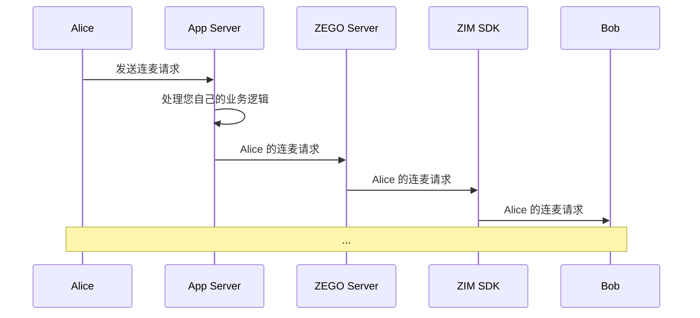

# 实现连麦

- - -
本文档介绍如何在使用实时音视频产品（ZEGO Express SDK）实现基本直播功能的基础上，结合即时通讯产品（ZIM SDK）实现连麦功能。

<Warning title="注意">
本文是基于 [示例代码](https://github.com/ZEGOCLOUD/zegocloud_sdk_demo_ios/tree/master/best_practice) 来介绍的如何实现连麦功能，因此文档中的部分方法为示例代码封装方法。
</Warning>

## 前提条件

在开始之前，请确保您已完成以下步骤：

- 已集成 SDK，详情请参考 [CDN 直播快速开始](https://doc-zh.zego.im/article/20724) 或 [超低延迟直播快速开始](https://doc-zh.zego.im/article/20759) 文档。
- 下载与本文档配套的 [示例代码](https://github.com/ZEGOCLOUD/zegocloud_sdk_demo_ios/tree/master/best_practice)。
- 在 [管理控制台](https://console.zego.im/ProjectManage) 中注册并创建项目，同时开通 “即时通讯” 服务。
  <Frame width="512" height="auto" caption=""></Frame>


## 预览效果

您可以通过本文档提供的 [示例代码](https://github.com/ZEGOCLOUD/zegocloud_sdk_demo_ios/tree/master/best_practice) 实现以下效果：


|主页|直播页面|接收连麦请求|开始连麦|
|--- | --- | --- |--- |
|<Frame width="512" height="auto" caption=""></Frame>|<Frame width="512" height="auto" caption=""></Frame>|<Frame width="512" height="auto" caption=""></Frame>|<Frame width="512" height="auto" caption=""></Frame>|


## 技术原理

### 什么是信令

基于信令实现的连麦流程，信令是一种协议或消息，用于管理网络中的通信和连接。ZEGO 将所有信令功能打包到一个 SDK 中，为您提供了一个现成的实时信令 API。


### 如何通过 ZIM SDK 接口发送和接收信令消息

ZIM SDK 提供了丰富的发送和接收消息的功能，详情请参考 [收发消息](https://doc-zh.zego.im/article/14062)。此处需要您使用可自定义的信令消息：`ZIMCommandMessage`，完整示例代码在 [ZIMService.swift](https://github.com/ZEGOCLOUD/zegocloud_sdk_demo_ios/blob/master/best_practice/ZegoCloudSDKDemo/Internal/SDK/ZIM/ZIMService.swift) 中找到。

1. 在房间中通过调用 [sendMessage](https://doc-zh.zego.im/article/api?doc=zim_API~objectivec_ios~protocol~ZIM#send-message-message-to-conversation-id-conversation-type-config-notification-callback) 发送信令消息 (`ZIMCommandMessage`)：
    ```objc
    NSData *bytes = [protocolStr dataUsingEncoding:NSUTF8StringEncoding];
    if (!bytes) {
        // 处理转换失败的情况
    return;
    }
    ZIMCommandMessage *commandMessage = [[ZIMCommandMessage alloc] initWithMessage:bytes];

    [self.zim sendMessage:commandMessage
     toConversationID:self.roomID
       conversationType:ZIMConversationTypeRoom // 假设有ZIMConversationType枚举定义
             configuration:[ZIMMessageSendConfig new] // 假设ZIMMessageSendConfig有一个无参构造方法
             notification:nil
               completion:^(id msg, NSError *error) {
                   // ...
                   if (self.callback) {
                       // 假设callback是一个接受两个参数的Block
                       self.callback((long long)error.code, error.localizedDescription);
                   }
               }];
    ```
2. 发送消息后，房间中的其他用户将通过 [onReceiveRoomMessage](https://doc-zh.zego.im/article/api?doc=zim_API~objective-c_ios~protocol~ZIMEventHandler#zim-receive-room-message-from-room-id) 回调接收到信令消息。您可以通过以下方式监听此回调：

    ```objc
    @interface ZIMService () <ZIMEventHandler>

    @end

    @implementation ZIMService

    // 实现协议方法，接收房间消息
    - (void)zim:(ZIM *)zim receiveRoomMessage:(NSArray<ZIMMessage *> *)messageList fromRoomID:(NSString *)roomID {
        for (ZIMMessage *message in messageList) {
            if (message.type == ZIMMessageTypeCommand) {
                ZIMCommandMessage *commandMessage = (ZIMCommandMessage *)message;
                NSData *messageData = commandMessage.message;
                NSString *customSignalingJson = [NSString stringWithUTF8String:[messageData bytes]];
            // ...
            } else {
                // 处理非命令类型的消息
            }
        }
    }

    @end
    ```

### 如何自定义业务信令

<Note title="说明">

此处完整示例代码，可以在 [ZIMService+RoomRequest.swift](https://github.com/ZEGOCLOUD/zegocloud_sdk_demo_ios/blob/master/best_practice/ZegoCloudSDKDemo/Internal/SDK/ZIM/ZIMService%2BRoomRequest.swift) 中查看。
</Note>


**JSON 信令编码**

由于简单的 `String` 本身难以表达复杂信息，信令可以封装在 `JSON` 格式中，使您更方便地编写信令的协议内容。

以最简单的信令的 JSON 格式为例：`{"room_request_type": 10000}`，在这样一份 JSON 信令中，您可以使用 `room_request_type` 字段表达不同的信令类型，例如：

- 发送连麦请求：`{"room_request_type": 10000}`
- 取消连麦请求：`{"room_request_type": 10001}`
- 接受连麦请求：`{"room_request_type": 10002}`
- 拒绝连麦请求：`{"room_request_type": 10003}`

此外，您还可以为信令扩展其他常见字段，例如 `senderID`、`receiverID`：

```objc
@interface ZIMService (RoomRequest)

- (void)sendRoomRequestWithReceiverID:(NSString *)receiverID extendedData:(NSString *)extendedData callback:(RoomRequestCallback)callback;

@end

@interface RoomRequest : NSObject <NSCoding>

@property (nonatomic, copy) NSString *requestID;
@property (nonatomic, assign) RoomRequestAction actionType;
@property (nonatomic, copy) NSString *senderID;
@property (nonatomic, copy) NSString *receiverID;
@property (nonatomic, copy) NSString *extendedData;

- (instancetype)initWithRequestID:(NSString *)requestID actionType:(RoomRequestAction)actionType senderID:(NSString *)senderID receiverID:(NSString *)receiverID extendedData:(NSString *)extendedData;

- (NSString *)jsonString;

@end
```

**JSON 信令解码**

接收信令的用户，可以解码 JSON 信令，并根据其中的字段了解和处理具体的业务逻辑，例如：

```objc
@interface LiveStreamingViewController () <ZIMServiceDelegate>

@end

@implementation LiveStreamingViewController

- (void)onInComingRoomRequestReceived:(RoomRequest *)request {
    [self showReaDot];
}

- (void)onInComingRoomRequestCancelled:(RoomRequest *)request {
    [self showReaDot];
}

- (void)onOutgoingRoomRequestAccepted:(RoomRequest *)request {
    [self onReceiveAcceptCoHostApply];
}

- (void)onOutgoingRoomRequestRejected:(RoomRequest *)request {
    [self onReceiveRefuseCoHostApply];
}

@end
```

**扩展信令**

基于这种模式，当您需要进行任何业务协议扩展时，只需扩展信令的 `type` 字段，就可以轻松实现新的业务逻辑，例如：

- 禁言观众：接收到相应的信令后，可阻止用户发送直播间弹幕。
- 发送虚拟礼物：接收到信令后，展示礼物特效。
- 移除观众：接收到信令后，提示观众已被移除并退出房间。

**其他扩展信息**：

通过以下内容，可进一步了解连麦信令的实现，您将能够轻松扩展您的直播业务信令。


本文档中的示例代码是纯客户端 API + ZEGO 解决方案。如果您有自己的业务服务端，并希望进行更多的逻辑扩展，您可以使用我们的 [服务端 API](https://doc-zh.zego.im/article/12196) 来传递信令，并结合您服务端的房间业务逻辑，以提高您的应用的可靠性。




## 实现流程

### 集成并使用 ZIM SDK

如果您之前没有使用过 ZIM SDK，您可以阅读以下部分：

<Accordion title="1. 导入 ZIM SDK" defaultOpen="false">
使用 Swift Package Manager 自动集成 SDK

1. 打开 Xcode 并点击菜单栏 “File > Add Packages...”，在 “Apple Swift Packages” 弹窗的 “Search or Enter Package URL” 输入框中填写如下 URL 并敲击回车键确认：

    ```markdown
    https://github.com/zegolibrary/zim-ios
    ```

2. 在 “Dependency Rule” 中指定你想要集成的 SDK 版本（建议使用默认的 “Up to Next Major Version”），然后点击 “Add Package“ 导入 SDK。你也可以参考 [Apple 官方文档](https://developer.apple.com/documentation/xcode/adding-package-dependencies-to-your-app) 进行设置。
</Accordion>

<Accordion title="2. 创建和管理 SDK 实例" defaultOpen="false">
1. 导入 ZIM SDK。
    ```objc
    #import <ZIM/ZIM.h>
    ```

2. 在 SDK 中创建 ZIM 实例，一个实例对应的是一个用户，表示一个用户以客户端的身份登录系统。
    ```objc
    - (void)initWithAppID:(UInt32)appID appSign:(NSString *)appSign {
        ZIMAppConfig *zimConfig = [[ZIMAppConfig alloc] init];
        zimConfig.appID = appID;
        zimConfig.appSign = appSign;

        self.zim = [ZIM shared];
        if (self.zim == nil) {
           self.zim = [ZIM createWithConfig:zimConfig];
        }
        [self.zim setEventHandler:self];
    }
    ```
</Accordion>

稍后，我们将为您提供如何使用 ZIM SDK 实现连麦功能的详细指南。

### （必选）管理多个 SDK

在本文档描述的直播场景中，您需要使用 `ZIM SDK` 来实现连麦功能，然后使用 `Express SDK` 实现直播功能。

为了使您的应用代码更加有条理，我们建议您通过使用以下方式来管理这些 SDK：
<Warning title="注意">


我们将在后续文档中使用 ZIMService 和 ExpressService 进行示例说明。
</Warning>


<Accordion title="1. 为每个 SDK 创建一个包装层，以便您尽可能多地重用代码。" defaultOpen="false">
为 `ZIM SDK` 创建一个 `ZIMService` 类，它管理与 SDK 的交互并存储所需数据，详情请参考 [ZIMService.swift](https://github.com/ZEGOCLOUD/zegocloud_sdk_demo_ios/tree/master/best_practice/ZegoCloudSDKDemo/Internal/SDK/ZIM/ZIMService.swift) 中的完整代码。

```objc
@interface ZIMService : NSObject

// ...

- (void)initWithAppID:(UInt32)appID appSign:(NSString *)appSign {
    ZIMAppConfig *zimConfig = [[ZIMAppConfig alloc] init];
    zimConfig.appID = appID;
    zimConfig.appSign = appSign ?: @"";
    self.zim = [ZIM shared];
    if (self.zim == nil) {
        self.zim = [ZIM createWithConfig:zimConfig];
    }
    [self.zim setEventHandler:self];
}

// ...
@end
```


同样，为 `Express SDK` 创建一个 `ExpressService` 类，它管理与 SDK 的交互并存储所需数据，详情请参考 [ExpressService.swift](https://github.com/ZEGOCLOUD/zegocloud_sdk_demo_ios/tree/master/best_practice/ZegoCloudSDKDemo/Internal/SDK/Express/ExpressService.swift) 中的完整代码。

```objc
@interface ExpressService : NSObject

// ...
- (void)initWithAppID:(UInt32)appID appSign:(NSString *)appSign {
    ZegoEngineProfile *profile = [[ZegoEngineProfile alloc] init];
    profile.appID = appID;
    profile.appSign = appSign;
    profile.scenario = ZegoScenarioBroadcast;
    [ZegoExpressEngine createEngineWith:profile eventHandler:self];
}
// ...

@end
```

您可以根据需求，向服务中添加相关 SDK 接口的方法。

例如，当您需要登录时，可以向 `ZIMService` 添加 `connectUser` 方法。

```objc
@interface ZIMService : NSObject

// ...

- (void)connectUserWithUserID:(NSString *)userID
                     userName:(NSString *)userName
                        token:(NSString *)token
                     callback:(CommonCallback)callback {
    ZIMUserInfo *user = [[ZIMUserInfo alloc] init];
    user.userID = userID;
    user.userName = userName;
    self.userInfo = user;
    [self.zim loginWithUser:user token:token ?: @"" completion:^(NSError *error) {
        if (callback) {
            callback((int64_t)error.code, error.localizedDescription);
        }
    }];
}

@end
```
</Accordion>

<Accordion title="2. 完成服务封装后，您可以通过创建 ZEGOSDKManager 来进一步简化代码，管理这些服务。" defaultOpen="false">
完整代码，请参考 [ZegoSDKManager.swift](https://github.com/ZEGOCLOUD/zegocloud_sdk_demo_ios/tree/master/best_practice/ZegoCloudSDKDemo/Internal/ZegoSDKManager.swift)。

```objectivec
@interface ZegoSDKManager : NSObject

@property (class, nonatomic, readonly) ZegoSDKManager *shared;

- (void)initWithAppID:(UInt32)appID appSign:(NSString *)appSign;

@end

@implementation ZegoSDKManager

+ (instancetype)shared {
    static ZegoSDKManager *sharedInstance = nil;
    static dispatch_once_t onceToken;
    dispatch_once(&onceToken, ^{
        sharedInstance = [[ZegoSDKManager alloc] init];
    });
    return sharedInstance;
}

- (void)initWithAppID:(UInt32)appID appSign:(NSString *)appSign {
    [self.expressService initWithAppID:appID appSign:appSign];
    [self.zimService initWithAppID:appID appSign:appSign];
}

@end
```

通过此方式，您已实现了一个单例类，来管理您需要的 SDK 服务。因此，您可以在项目的任何地方获取此类的实例，并使用它来执行与 SDK 相关的逻辑，例如：

- 当应用启动时：调用 `ZegoSDKManager.shared.initWithAppID(appID,appSign);`。
- 当需要登录时：调用 `ZegoSDKManager.shared.loginRoom(roomID,scenario,callback);`。
- 当结束直播时：调用 `ZegoSDKManager.shared.logoutRoom();。`
</Accordion>

稍后，我们将介绍如何基于此添加连麦功能。

### 发送或取消连麦请求

发送和取消连麦请求的实现相似，只是信令的类型不同。此处以发送为例，来说明示例代码的实现。

在示例代码中，直播页面（观众视角）的右下角放置了一个申请连麦按钮。当按钮被点击时，将执行以下操作。

1. 信令的 JSON 编码，其中 `room_request_type` 在示例代码中定义为 `applyCoHost`。
2. 调用示例代码中封装的 [sendRoomRequest](https://github.com/ZEGOCLOUD/zegocloud_sdk_demo_ios/blob/44169b0962cf1a08fbb6e798eb452de6c66554f6/best_practice/ZegoCloudSDKDemo/Internal/SDK/ZIM/ZIMService%2BRoomRequest.swift#L9) 发送信令。（`sendRoomRequest` 简化了 `ZIM SDK` 的 [sendMessage](https://doc-zh.zego.im/article/api?doc=zim_API~objectivec_ios~protocol~ZIM#send-message-message-to-conversation-id-conversation-type-config-notification-callback) 接口。）
   - 如果方法调用成功：本地端（即观众端）的申请状态将切换为申请连麦，请求连麦按钮将切换为取消连麦。
   - 如果方法调用失败：将提示错误信息。在实际应用开发中，建议您使用更用户友好的 UI 来提示连麦申请失败。

```objc
- (IBAction)coHostAction:(UIButton *)sender {
     //...
   RoomRequestType requestType = sender.isSelected ? RoomRequestTypeApplyCoHost : RoomRequestTypeCancelCoHostApply;
   NSDictionary *commandDict = @{@"room_request_type": @(requestType)};
   if (requestType == RoomRequestTypeApplyCoHost) {
        // sendRoomRequest 为示例代码封装方法：https://github.com/ZEGOCLOUD/zegocloud_sdk_demo_ios/blob/master/best_practice/ZegoCloudSDKDemo/Internal/SDK/ZIM/ZIMService%2BRoomRequest.swift#L9
       [[ZegoSDKManager sharedManager].zimService sendRoomRequest:receiverID extendedData:[commandDict jsonString] completion:^(int code, NSString *message, NSString *messageID) {
            //...
         }];
     } else {
     RoomRequest *roomRequest = [ZegoSDKManager sharedManager].zimService.roomRequestDict[mRoomRequest.requestID ?: @""];
       if (!roomRequest) { return; }
       //cancelRoomRequest 为示例代码封装方法：https://github.com/ZEGOCLOUD/zegocloud_sdk_demo_ios/blob/master/best_practice/ZegoCloudSDKDemo/Internal/SDK/ZIM/ZIMService%2BRoomRequest.swift#L67
       [[ZegoSDKManager sharedManager].zimService cancelRoomRequest:roomRequest completion:^(int code, NSString *message, NSString *messageID) {
            //...
       }];
   }
}
```

3. 本地端（观众端）将等待主播的响应。
   - 如果主播拒绝了连麦请求：本地端的申请状态将切换为不申请。
   - 如果主播接受了连麦请求：将开始连麦（有关开始和结束连麦的详细信息，请参考 [开始或结束连麦部分](#开始连麦)）。

### 接受或拒绝连麦请求

1. 在示例代码中，当主播收到连麦请求的信令时，将弹出确认对话框，等待主播选择接受或拒绝。
2. 主播响应后，会发送接受或拒绝的信令。此处不再进一步描述发送信令的相关逻辑。完整代码可以在 [ApplyCoHostListViewController.swift](https://github.com/ZEGOCLOUD/zegocloud_sdk_demo_ios/tree/master/best_practice/ZegoCloudSDKDemo/ViewControllers/ApplyCoHostListViewController.swift) 中查看。

相关代码片段如下，完整代码可在 [ApplyCoHostListViewController.swift](https://github.com/ZEGOCLOUD/zegocloud_sdk_demo_ios/tree/master/best_practice/ZegoCloudSDKDemo/ViewControllers/ApplyCoHostListViewController.swift) 中找到。

<Accordion title="关键代码片段" defaultOpen="false">
```objc
- (void)onInComingRoomRequestReceived:(RoomRequest *)request {
    [self.tableView reloadData];
}

- (void)onInComingRoomRequestCancelled:(RoomRequest *)request {
    [self.tableView reloadData];
}

- (void)agreeCoHostApply:(RoomRequest *)request {
    RoomRequest *roomRequest = ZegoSDKManager.shared.zimService.roomRequestDict[request.requestID];
    if (!roomRequest) {
        return;
    }
    //acceptRoomRequest 为示例代码封装方法 https://github.com/ZEGOCLOUD/zegocloud_sdk_demo_ios/blob/master/best_practice/ZegoCloudSDKDemo/Internal/SDK/ZIM/ZIMService%2BRoomRequest.swift#L27
    [ZegoSDKManager.shared.zimService acceptRoomRequest:roomRequest completion:^(NSInteger code, NSString *message, NSString *messageID) {
        //...
        [self.tableView reloadData];
    }];
}

- (void)disAgreeCoHostApply:(RoomRequest *)request {
    RoomRequest *roomRequest = ZegoSDKManager.shared.zimService.roomRequestDict[request.requestID];
    if (!roomRequest) {
        return;
    }
    //rejectRoomRequest 为示例代码封装方法：https://github.com/ZEGOCLOUD/zegocloud_sdk_demo_ios/blob/master/best_practice/ZegoCloudSDKDemo/Internal/SDK/ZIM/ZIMService%2BRoomRequest.swift#L47
    [ZegoSDKManager.shared.zimService rejectRoomRequest:roomRequest completion:^(NSInteger code, NSString *message, NSString *messageID) {
        //...
        [self.tableView reloadData];
    }];
}
```
</Accordion>

### 开始连麦

<Note title="说明">


开始连麦后的逻辑与 [快速开始](https://doc-zh.zego.im/article/20724) 相同。如果您不熟悉如何推流和拉流以及如何渲染它们，请参考 [快速开始](https://doc-zh.zego.im/article/20724)。
</Note>

当观众接收到主播同意连麦的信令时，他们可以通过调用 `Express SDK` 的相关方法来预览和推流，从而成为连麦主播。完整代码可以在  [LiveStreamingViewController.swift](https://github.com/ZEGOCLOUD/zegocloud_sdk_demo_ios/tree/master/best_practice/ZegoCloudSDKDemo/ViewControllers/LiveStreamingViewController.swift) and [ExpressService+Stream.swift](https://github.com/ZEGOCLOUD/zegocloud_sdk_demo_ios/tree/master/best_practice/ZegoCloudSDKDemo/Internal/SDK/Express/ExpressService%2BStream.swift) 中查看。


```objectivec
- (void)addCoHost:(NSString *)streamID userID:(NSString *)userID userName:(NSString *)userName isMySelf:(BOOL)isMySelf {
    BOOL isHost = [streamID hasSuffix:@"_host"];
    if (isHost) {
        //startPublishingStream 为示例代码封装方法：https://github.com/ZEGOCLOUD/zegocloud_sdk_demo_ios/blob/master/best_practice/ZegoCloudSDKDemo/Internal/SDK/Express/ExpressService%2BStream.swift#L24
        [[ZegoSDKManager shared].expressService startPlayingStream:mainVideoView.renderView streamID:streamID];
        [self updateUserNameLabel:userName];
        [mainVideoView updateWithUserID:userID userName:userName];
    } else {
        if (isMySelf) {
            [[ZegoSDKManager shared].expressService startPublishingStream:streamID];
        }
        CoHostViewModel *coHostViewModel = [[CoHostViewModel alloc] init];
        coHostViewModel.user = [[ZegoSDKUser alloc] initWithId:userID name:userName];
        coHostViewModel.streamID = streamID;
        [coHostVideoViews insertObject:coHostViewModel atIndex:0];
        coHostVideoContainerView.coHostModels = coHostVideoViews;
        [self updateCoHostContainerFrame];
    }
}
```


### 结束连麦

当观众结束连麦后，他们需要调用 `Express SDK` 的相关方法停止预览和推流，完整的代码可以在 [LiveStreamingViewController.swift](https://github.com/ZEGOCLOUD/zegocloud_sdk_demo_ios/blob/master/best_practice/ZegoCloudSDKDemo/ViewControllers/LiveStreamingViewController.swift#L223) 中查看。以下是关键代码：

```objectivec
- (IBAction)endCoHostAction:(UIButton *)sender {
    NSString *localUserID = ZegoSDKManager.shared.expressService.currentUser.id;
    //stopPublishingStream 为示例代码封装方法：https://github.com/ZEGOCLOUD/zegocloud_sdk_demo_ios/blob/master/best_practice/ZegoCloudSDKDemo/Internal/SDK/Express/ExpressService%2BStream.swift#L35
    [ZegoSDKManager.shared.expressService stopPublishingStream];
    //stopPreview 为示例代码封装方法：https://github.com/ZEGOCLOUD/zegocloud_sdk_demo_ios/blob/44169b0962cf1a08fbb6e798eb452de6c66554f6/best_practice/ZegoCloudSDKDemo/Internal/SDK/Express/ExpressService%2BStream.swift#L20
    [ZegoSDKManager.shared.expressService stopPreview];
    self.coHostVideoViews = [self.coHostVideoViews filteredArrayUsingPredicate:[NSPredicate predicateWithBlock:^BOOL(ZegoUserView * _Nullable userView, NSDictionary<NSString *,id> * _Nullable bindings) {
        return ![userView.user.id isEqualToString:localUserID];
    }]];
    self.coHostVideoContainerView.coHostModels = self.coHostVideoViews;
    [self updateCoHostContainerFrame];
    self.coHostButton.hidden = liveManager.isPKStarted;
    self.endCoHostButton.hidden = YES;

    self.flipButton.hidden = YES;
    self.micButton.hidden = YES;
    self.cameraButton.hidden = YES;
    self.flipButtonConstraint.constant = 16;
}
```

<Warning title="注意">
在实现视频通话、直播等视频场景时，请注意**视频分辨率与价格**之间的关系。

在同一房间内播放多个视频流时，将基于分辨率总和进行计费，并且不同分辨率将对应不同的计费档次。

计算最终分辨率时，包括以下视频流：

1. 直播视频画面（例如主播画面、连麦画面、PK 对战画面等）
2. 视频通话中，每个人的视频画面
3. 屏幕共享画面
4. 云录制服务的分辨率
5. 直播创作分辨率

在您的应用上线前，请**确保您已检查所有配置并确认**适用于您业务场景的**计费档次**，以避免不必要的损失。更多详情请参见 [定价](https://www.zego.im/price)。
</Warning>


## 完成连麦功能

恭喜您，完成上述步骤后，您已经实现了连麦功能。
