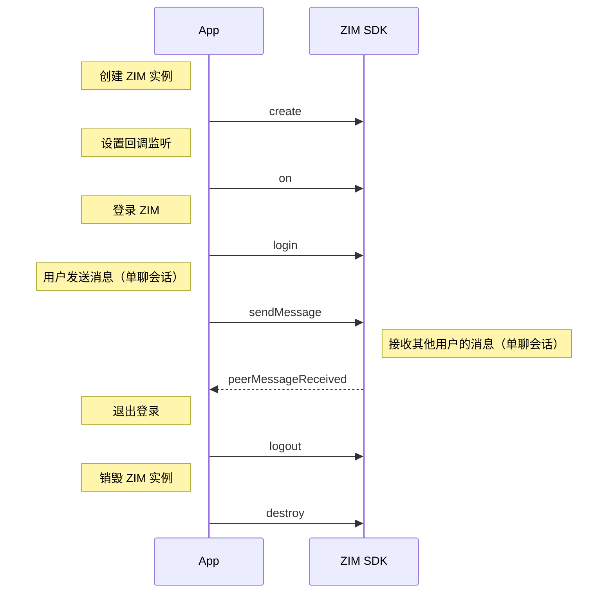

export const getPlatformData = (props, data) => {
    const platform = (props.platform ?? "Android").toLowerCase();
    for (const [key, value] of Object.entries(data)) {
        const pList = key.split(",").map((v) => v.toLowerCase());
        if (pList.includes(platform)) {
            return value;
        }
    }
    return data["Android"] || data["android"] || data["default"];
};

export const getPlatformData2 = (props, data) => {
    const platform = (props.platform ?? "default").toLowerCase();
    for (const [key, value] of Object.entries(data)) {
        const pList = key.split(",").map((v) => v.toLowerCase());
        if (pList.includes(platform)) {
            return value;
        }
    }
    return data["default"];
};

export const ZIMMessageTypeMap = {
  'default': <a href="@-ZIMMessageType" target='_blank'>ZIMMessageType</a>,
  'flutter': <a href="https://pub.dev/documentation/zego_zim/latest/zego_zim/ZIMMessageType.html" target='_blank'>ZIMMessageType</a>,
}
export const ZIMMessageMentionedTypeMap = {
  'default': <a href="@-ZIMMessageMentionedType" target='_blank'>ZIMMessageMentionedType</a>,
  'flutter': <a href="https://pub.dev/documentation/zego_zim/latest/zego_zim/ZIMMessageMentionedType.html" target='_blank'>ZIMMessageMentionedType</a>,
}

export const ZIMConversationMap = {
  'default': <a href="@-ZIMConversation" target='_blank'>ZIMConversation</a>,
  'flutter': <a href="https://pub.dev/documentation/zego_zim/latest/zego_zim/ZIMConversation-class.html" target='_blank'>ZIMConversation</a>,
}
export const ZIMMessageMap = {
  'default': <a href="@-ZIMMessage" target='_blank'>ZIMMessage</a>,
  'flutter': <a href="https://pub.dev/documentation/zego_zim/latest/zego_zim/ZIMMessage-class.html" target='_blank'>ZIMMessage</a>,
}
export const ZIMTextMessageMap = {
  'default': <a href="@-ZIMTextMessage" target='_blank'>ZIMTextMessage</a>,
  'flutter': <a href="https://pub.dev/documentation/zego_zim/latest/zego_zim/ZIMTextMessage-class.html" target='_blank'>ZIMTextMessage</a>,
}
export const ZIMCommandMessageMap = {
  'default': <a href="@-ZIMCommandMessage" target='_blank'>ZIMCommandMessage</a>,
  'flutter': <a href="https://pub.dev/documentation/zego_zim/latest/zego_zim/ZIMCommandMessage-class.html" target='_blank'>ZIMCommandMessage</a>,
}
export const ZIMCustomMessageMap = {
  'default': <a href="@-ZIMCustomMessage" target='_blank'>ZIMCustomMessage</a>,
  'flutter': <a href="https://pub.dev/documentation/zego_zim/latest/zego_zim/ZIMCustomMessage-class.html" target='_blank'>ZIMCustomMessage</a>,
}
export const ZIMMultipleMessageMap = {
  'default': <a href="@-ZIMMultipleMessage" target='_blank'>ZIMMultipleMessage</a>,
  'flutter': <a href="https://pub.dev/documentation/zego_zim/latest/zego_zim/ZIMMultipleMessage-class.html" target='_blank'>ZIMMultipleMessage</a>,
}
export const isMentionAllMap = {
  'default': <a href="@isMentionAll-ZIMMessage" target='_blank'>isMentionAll</a>,
  'flutter': <a href="https://pub.dev/documentation/zego_zim/latest/zego_zim/ZIMMessage/isMentionAll.html"target='_blank'>isMentionAll</a>,
}
export const mentionedUserIDsMap = {
  'default': <a href="@mentionedUserIDs-ZIMMessage" target='_blank'>mentionedUserIDs</a>,
  'android': <a href="https://pub.dev/documentation/zego_zim/latest/zego_zim/ZIMMessage/mentionedUserIds.html" target='_blank'>mentionedUserIds</a>,
}
export const mentionedInfoListMap = {
  'default': <a href="@mentionedInfoList-ZIMConversation" target='_blank'>mentionedInfoList</a>,
  'flutter': <a href="https://pub.dev/documentation/zego_zim/latest/zego_zim/ZIMConversation/mentionedInfoList.html" target='_blank'>mentionedInfoList</a>,
}


export const onMediaUploadingProgressMap = {
  'default': <a href="@onMediaUploadingProgress" target='_blank'>onMediaUploadingProgress</a>,
  // 'android': <a href="@ZIMMediaUploadingProgress" target='_blank'>ZIMMediaUploadingProgress</a>,
  'flutter': <a href="https://pub.dev/documentation/zego_zim/latest/zego_zim/ZIMMediaUploadingProgress.html" target='_blank'>ZIMMediaUploadingProgress</a>,
}
export const onMediaDownloadingProgressMap = {
  'default': <a href="@ZIMMediaDownloadingProgress" target='_blank'>ZIMMediaDownloadingProgress</a>,
  'android': <a href="@onMediaDownloadingProgress" target='_blank'>onMediaDownloadingProgress</a>,
  'flutter': <a href="https://pub.dev/documentation/zego_zim/latest/zego_zim/ZIMMediaDownloadingProgress.html" target='_blank'>ZIMMediaDownloadingProgress</a>,
}
export const multipleMediaUploadingProgressMap = {
  'default': <a href="@multipleMediaUploadingProgress" target='_blank'>multipleMediaUploadingProgress</a>,
  'android,win,window,windows,ios,mac': <a href="@onMultipleMediaUploadingProgress" target='_blank'>onMultipleMediaUploadingProgress</a>,
  'flutter': <a href="https://pub.dev/documentation/zego_zim/latest/zego_zim/ZIMMessageSendNotification/onMultipleMediaUploadingProgress.html" target='_blank'>onMultipleMediaUploadingProgress</a>,
}


export const setEventHandlerMap = {
  'default': <a href="@setEventHandler" target='_blank'>setEventHandler</a>,
  'Web,miniprogram,rn,uniapp,uni-app,harmonyos,UTS': <a href="@on" target='_blank'>on</a>,
}
export const conversationChangedMap = {
  'default': <a href="@conversationChanged" target='_blank'>conversationChanged</a>,
  'UTS': <a href="@conversationChanged" target='_blank'>onConversationChanged</a>,
  'android,win,window,windows': <a href="@onConversationChanged" target='_blank'>onConversationChanged</a>,
  'ios': <a href="https://doc-zh.zego.im/article/api?doc=zim_API~objective-c_ios~protocol~ZIMEventHandler#zim-conversation-changed" target='_blank'>conversationChanged</a>,
  'mac': <a href="https://doc-zh.zego.im/article/api?doc=zim_API~objective-c_macos~protocol~ZIMEventHandler#zim-conversation-changed" target='_blank'>conversationChanged</a>,
  'flutter': <a href="https://pub.dev/documentation/zego_zim/latest/zego_zim/ZIMEventHandler/onConversationChanged.html" target='_blank'>onConversationChanged</a>,
}
export const peerMessageReceivedMap = {
  'default': <a href="@peerMessageReceived" target='_blank'>peerMessageReceived</a>,
  'UTS': <a href="@peerMessageReceived" target='_blank'>onPeerMessageReceived</a>,
  'android,win,window,windows': <a href="@onPeerMessageReceived" target='_blank'>onPeerMessageReceived</a>,
  'ios': <a href="https://doc-zh.zego.im/article/api?doc=zim_API~objective-c_ios~protocol~ZIMEventHandler#zim-peer-message-received-info-from-user-id" target='_blank'>peerMessageReceived</a>,
  'mac': <a href="https://doc-zh.zego.im/article/api?doc=zim_API~objective-c_macos~protocol~ZIMEventHandler#zim-peer-message-received-info-from-user-id" target='_blank'>peerMessageReceived</a>,
  'flutter': <a href="https://pub.dev/documentation/zego_zim/latest/zego_zim/ZIMEventHandler/onPeerMessageReceived.html" target='_blank'>onPeerMessageReceived</a>,
  'u3d': <a href="@OnPeerMessageReceived" target='_blank'>OnPeerMessageReceived</a>,
}
export const roomMessageReceivedMap = {
  'default': <a href="@roomMessageReceived" target='_blank'>roomMessageReceived</a>,
  'UTS': <a href="@roomMessageReceived" target='_blank'>onRoomMessageReceived</a>,
  'android,win,window,windows': <a href="@onRoomMessageReceived" target='_blank'>onRoomMessageReceived</a>,
  'ios': <a href="https://doc-zh.zego.im/article/api?doc=zim_API~objective-c_ios~protocol~ZIMEventHandler#zim-room-message-received-info-from-room-id" target='_blank'>roomMessageReceived</a>,
  'mac': <a href="https://doc-zh.zego.im/article/api?doc=zim_API~objective-c_macos~protocol~ZIMEventHandler#zim-room-message-received-info-from-room-id" target='_blank'>roomMessageReceived</a>,
  'flutter': <a href="https://pub.dev/documentation/zego_zim/latest/zego_zim/ZIMEventHandler/onRoomMessageReceived.html" target='_blank'>onRoomMessageReceived</a>,
  'u3d': <a href="@OnRoomMessageReceived" target='_blank'>OnRoomMessageReceived</a>,
}
export const groupMessageReceivedMap = {
  'default': <a href="@groupMessageReceived" target='_blank'>groupMessageReceived</a>,
  'UTS': <a href="@groupMessageReceived" target='_blank'>onGroupMessageReceived</a>,
  'android,win,window,windows': <a href="@onGroupMessageReceived" target='_blank'>onGroupMessageReceived</a>,
  'ios': <a href="https://doc-zh.zego.im/article/api?doc=zim_API~objective-c_ios~protocol~ZIMEventHandler#zim-group-message-received-info-from-group-id" target='_blank'>groupMessageReceived</a>,
  'mac': <a href="https://doc-zh.zego.im/article/api?doc=zim_API~objective-c_macos~protocol~ZIMEventHandler#zim-group-message-received-info-from-group-id" target='_blank'>groupMessageReceived</a>,
  'flutter': <a href="https://pub.dev/documentation/zego_zim/latest/zego_zim/ZIMEventHandler/onGroupMessageReceived.html" target='_blank'>onGroupMessageReceived</a>,
  'u3d': <a href="@OnGroupMessageReceived" target='_blank'>OnGroupMessageReceived</a>,
}
export const broadcastMessageReceivedMap = {
  'default': <a href="@broadcastMessageReceived" target='_blank'>broadcastMessageReceived</a>,
  'UTS': <a href="@broadcastMessageReceived" target='_blank'>onBroadcastMessageReceived</a>,
  'android,win,window,windows': <a href="@onBroadcastMessageReceived" target='_blank'>onBroadcastMessageReceived</a>,
  'ios': <a href="https://doc-zh.zego.im/article/api?doc=zim_API~objective-c_ios~protocol~ZIMEventHandler#zim-broadcast-message-received" target='_blank'>broadcastMessageReceived</a>,
  'mac': <a href="https://doc-zh.zego.im/article/api?doc=zim_API~objective-c_macos~protocol~ZIMEventHandler#zim-broadcast-message-received" target='_blank'>broadcastMessageReceived</a>,
  'flutter': <a href="https://pub.dev/documentation/zego_zim/latest/zego_zim/ZIMEventHandler/onBroadcastMessageReceived.html" target='_blank'>onBroadcastMessageReceived</a>,
}
export const messageSentStatusChangedMap = {
  'default': <a href="@messageSentStatusChanged" target='_blank'>messageSentStatusChanged</a>,
  'UTS': <a href="@messageSentStatusChanged" target='_blank'>onMessageSentStatusChanged</a>,
  'android,win,window,windows': <a href="@onMessageSentStatusChanged" target='_blank'>onMessageSentStatusChanged</a>,
  'ios': <a href="https://doc-zh.zego.im/article/api?doc=zim_API~objective-c_ios~protocol~ZIMEventHandler#zim-message-sent-status-changed" target='_blank'>messageSentStatusChanged</a>,
  'mac': <a href="https://doc-zh.zego.im/article/api?doc=zim_API~objective-c_macos~protocol~ZIMEventHandler#zim-message-sent-status-changed" target='_blank'>messageSentStatusChanged</a>,
  'flutter': <a href="https://pub.dev/documentation/zego_zim/latest/zego_zim/ZIMEventHandler/onMessageSentStatusChanged.html" target='_blank'>onMessageSentStatusChanged</a>,
}
export const messageEditedMap = {
  'default': <a href="@messageEdited" target='_blank'>messageEdited</a>,
  'UTS': <a href="@messageEdited" target='_blank'>onMessageEdited</a>,
  'android,win,window,windows': <a href="@onMessageEdited" target='_blank'>onMessageEdited</a>,
  'ios': <a href="https://doc-zh.zego.im/article/api?doc=zim_API~objective-c_ios~protocol~ZIMEventHandler#zim-message-edited" target='_blank'>messageEdited</a>,
  'mac': <a href="https://doc-zh.zego.im/article/api?doc=zim_API~objective-c_macos~protocol~ZIMEventHandler#zim-message-edited" target='_blank'>messageEdited</a>,
  'flutter': <a href="https://pub.dev/documentation/zego_zim/latest/zego_zim/ZIMEventHandler/onMessageEdited.html" target='_blank'>onMessageEdited</a>,
}
export const sendMessageMap = {
  'default': <a href="@sendMessage" target='_blank'>sendMessage</a>,
  'flutter': <a href="https://pub.dev/documentation/zego_zim/latest/zego_zim/ZIM/sendMessage.html" target='_blank'>sendMessage</a>,
  'u3d': <a href="@SendMessage" target='_blank'>SendMessage</a>,
}
export const replyMessageMap = {
  'default': <a href="@replyMessage" target='_blank'>replyMessage</a>,
  'flutter': <a href="https://pub.dev/documentation/zego_zim/latest/zego_zim/ZIM/replyMessage.html" target='_blank'>replyMessage</a>,
  'u3d': <a href="@ReplyMessage" target='_blank'>ReplyMessage</a>,
}
export const downloadMediaFileMap = {
  'default': <a href="@downloadMediaFile" target='_blank'>downloadMediaFile</a>,
  'ios,mac': <a href="@downloadMediaFileWithMessage" target='_blank'>downloadMediaFileWithMessage</a>,
  'flutter': <a href="https://pub.dev/documentation/zego_zim/latest/zego_zim/ZIM/downloadMediaFile.html" target='_blank'>downloadMediaFile</a>,
}
export const queryConversationListMap = {
  'default': <a href="@queryConversationList" target='_blank'>queryConversationList</a>,
  'ios,mac': <a href="@queryConversationListWithConfig" target='_blank'>queryConversationListWithConfig</a>,
  'flutter': <a href="https://pub.dev/documentation/zego_zim/latest/zego_zim/ZIM/queryConversationList.html" target='_blank'>queryConversationList</a>,
}
export const queryConversationMap = {
  'default': <a href="@queryConversation" target='_blank'>queryConversation</a>,
  'flutter': <a href="https://pub.dev/documentation/zego_zim/latest/zego_zim/ZIM/queryConversation.html" target='_blank'>queryConversation</a>,
}
export const clearConversationUnreadMessageCountMap = {
  'default': <a href="@clearConversationUnreadMessageCount" target='_blank'>clearConversationUnreadMessageCount</a>,
  'ios,mac': <a href="@clearConversationUnreadMessageCountWithConversationID" target='_blank'>clearConversationUnreadMessageCountWithConversationID</a>,
  'flutter': <a href="https://pub.dev/documentation/zego_zim/latest/zego_zim/ZIM/clearConversationUnreadMessageCount.html" target='_blank'>clearConversationUnreadMessageCount</a>,
}
export const clearConversationTotalUnreadMessageCountMap = {
  'default': <a href="@clearConversationTotalUnreadMessageCount" target='_blank'>clearConversationTotalUnreadMessageCount</a>,
  'flutter': <a href="https://pub.dev/documentation/zego_zim/latest/zego_zim/ZIM/clearConversationTotalUnreadMessageCount.html" target='_blank'>clearConversationTotalUnreadMessageCount</a>,
}
export const editMessageMap = {
  'default': <a href="@editMessage" target='_blank'>editMessage</a>,
  'flutter': <a href="https://pub.dev/documentation/zego_zim/latest/zego_zim/ZIM/editMessage.html" target='_blank'>editMessage</a>,
}
export const tokenWillExpireMap = {
  'default': <a href="@tokenWillExpire" target='_blank'>tokenWillExpire</a>,
  'UTS': <a href="@tokenWillExpire" target='_blank'>onTokenWillExpire</a>,
  'android,win,window,windows': <a href="@onTokenWillExpire" target='_blank'>onTokenWillExpire</a>,
  'ios': <a href="https://doc-zh.zego.im/article/api?doc=zim_API~objective-c_ios~protocol~ZIMEventHandler#zim-token-will-expire" target='_blank'>tokenWillExpire</a>,
  'mac': <a href="https://doc-zh.zego.im/article/api?doc=zim_API~objective-c_macos~protocol~ZIMEventHandler#zim-token-will-expire" target='_blank'>tokenWillExpire</a>,
  'flutter': <a href="https://pub.dev/documentation/zego_zim/latest/zego_zim/ZIMEventHandler/onTokenWillExpire.html" target='_blank'>onTokenWillExpire</a>,
}
export const connectionStateChangedMap = {
  'default': <a href="@connectionStateChanged" target='_blank'>connectionStateChanged</a>,
  'UTS': <a href="@connectionStateChanged" target='_blank'>onConnectionStateChanged</a>,
  'android,win,window,windows': <a href="@onConnectionStateChanged" target='_blank'>onConnectionStateChanged</a>,
  'ios': <a href="https://doc-zh.zego.im/article/api?doc=zim_API~objective-c_ios~protocol~ZIMEventHandler#zim-connection-state-changed-event-extended-data" target='_blank'>connectionStateChanged</a>,
  'mac': <a href="https://doc-zh.zego.im/article/api?doc=zim_API~objective-c_macos~protocol~ZIMEventHandler#zim-connection-state-changed-event-extended-data" target='_blank'>connectionStateChanged</a>,
  'flutter': <a href="https://pub.dev/documentation/zego_zim/latest/zego_zim/ZIMEventHandler/onConnectionStateChanged.html" target='_blank'>onConnectionStateChanged</a>,
}
<table>
<tbody>
<tr data-row-level="1">
<th>消息类型</th>
<th>说明</th>
<th>特性及适用场景</th>
</tr>

<tr data-row-level="2">
<td>ZIMCommandMessage(2)</td>
<td>开发者可自定义数据内容的信令消息。消息大小不超过 5 KB，单个客户端发送频率限制为 10 次/秒。</td>
<td>
<p>不可存储，一般适用于“语聊房”、“在线课堂”等房间内的信令传输，比如上下麦操作、送礼物，发送在线课堂课件等。</p>
<p>支持更高的并发，但不可靠，不保证消息送达和消息顺序。</p>

相关接口：{getPlatformData2(props, sendMessageMap)}
</td>
</tr>
<tr data-row-level="3">
<td>ZIMBarrageMessage(20)</td>
<td>房间内弹幕文本消息。消息大小不超过 5 KB，单个客户端发送频率无限制。</td>
<td>
<p>不可存储，专门用于房间内的高频、不可靠、允许丢掉的消息，一般适用于发送“弹幕消息”的场景中。</p><p>支持高并发，但不可靠，不保证消息送达。</p>

相关接口：{getPlatformData2(props, sendMessageMap)}

</td>
</tr>

<tr data-row-level="4">
<td>ZIMTextMessage(1)</td>
<td>文本消息。消息大小上限默认为 2 KB。如有需要，请联系 ZEGO 技术支持配置，最大可达 32 KB。单个客户端发送频率限制为 10 次/秒。</td>
<td rowspan="8">
消息可靠有序，可存储为历史消息（保存时间请参考 [计费说明 - 版本差异](/zim-miniprogram/introduction/pricing) 中“历史消息存储天数”）。<br />
可用于单聊、房间、群聊等即时聊天场景。房间解散后，“房间聊天”的消息不存储。

- 图片、文件、语音、视频：通常用于发送富媒体文件类型的消息。
- 自定义消息：通常用于发送投票类型、接龙类型、视频卡片类型等消息。
- 组合消息：常用于发送图文消息。

相关接口：{getPlatformData2(props, sendMessageMap)}、{getPlatformData2(props, replyMessageMap)}
</td>
</tr>
<tr data-row-level="5">
<td>ZIMMultipleMessage(10)</td>
<td>组合消息，即包含多个 item 的消息，可包括多条文本、至多 10 张图片、1 个文件、1 个音频、1 个视频和 1 条自定义消息。<Note title="说明"><ul><li>Item 总量不得超过 20。</li><li>图片、音频、文件和视频的大小和格式限制与对应的富媒体消息类型相同。</li></ul></Note></td>
</tr>
<tr data-row-level="6">
<td>ZIMImageMessage(11)</td>
<td>图片消息。支持主流图片格式，包括 JPG、PNG、BMP、TIFF、GIF、WebP，大小不超过 10 MB，单个客户端发送频率限制为 10 次/秒。</td>
</tr>
<tr data-row-level="7">
<td>ZIMFileMessage(12)</td>
<td>文件消息。消息内容为文件，格式不限，大小不超过 100 MB，单个客户端发送频率限制为 10 次/秒。</td>
</tr>
<tr data-row-level="8">
<td>ZIMAudioMessage(13)</td>
<td>语音消息。支持 MP3、M4A 格式的语音文件，时长不超过 300 秒，大小不超过 6 MB，单个客户端发送频率限制为 10 次/秒。</td>
</tr>
<tr data-row-level="9">
<td>ZIMVideoMessage(14)</td>
<td>视频消息。支持 MP4、MOV 格式的视频文件，大小不超过 100 MB，单个客户端发送频率限制为 10 次/秒。<Note title="说明">若要在消息发送成功后获取视频首帧的宽高信息，视频必须使用 H.264 或 H.265 编码格式。</Note></td>
</tr>
<tr data-row-level="10">
<td>ZIMCombineMessage(100)</td>
<td>合并消息，消息大小无限制，单个客户端发送频率限制为 10 次/秒。</td>
</tr>
<tr data-row-level="11">
<td>ZIMCustomMessage(200)</td>
<td>自定义消息。消息大小上限默认为 2 KB。如有需要，请联系 ZEGO 技术支持配置，最大可达 32 KB。开发者可自定义消息的类型，并自行完成消息的解析，ZIM SDK 不负责定义和解析自定义消息的具体内容。</td>
</tr>
</tbody>
</table>

export const getPlatformData = (props, data) => {
    const platform = (props.platform ?? "Android").toLowerCase();
    for (const [key, value] of Object.entries(data)) {
        const pList = key.split(",").map((v) => v.toLowerCase());
        if (pList.includes(platform)) {
            return value;
        }
    }
    return data["Android"] || data["android"] || data["default"];
};

export const getPlatformData2 = (props, data) => {
    const platform = (props.platform ?? "default").toLowerCase();
    for (const [key, value] of Object.entries(data)) {
        const pList = key.split(",").map((v) => v.toLowerCase());
        if (pList.includes(platform)) {
            return value;
        }
    }
    return data["default"];
};

export const ZIMMessageTypeMap = {
  'default': <a href="@-ZIMMessageType" target='_blank'>ZIMMessageType</a>,
  'flutter': <a href="https://pub.dev/documentation/zego_zim/latest/zego_zim/ZIMMessageType.html" target='_blank'>ZIMMessageType</a>,
}
export const ZIMMessageMentionedTypeMap = {
  'default': <a href="@-ZIMMessageMentionedType" target='_blank'>ZIMMessageMentionedType</a>,
  'flutter': <a href="https://pub.dev/documentation/zego_zim/latest/zego_zim/ZIMMessageMentionedType.html" target='_blank'>ZIMMessageMentionedType</a>,
}

export const ZIMConversationMap = {
  'default': <a href="@-ZIMConversation" target='_blank'>ZIMConversation</a>,
  'flutter': <a href="https://pub.dev/documentation/zego_zim/latest/zego_zim/ZIMConversation-class.html" target='_blank'>ZIMConversation</a>,
}
export const ZIMMessageMap = {
  'default': <a href="@-ZIMMessage" target='_blank'>ZIMMessage</a>,
  'flutter': <a href="https://pub.dev/documentation/zego_zim/latest/zego_zim/ZIMMessage-class.html" target='_blank'>ZIMMessage</a>,
}
export const ZIMTextMessageMap = {
  'default': <a href="@-ZIMTextMessage" target='_blank'>ZIMTextMessage</a>,
  'flutter': <a href="https://pub.dev/documentation/zego_zim/latest/zego_zim/ZIMTextMessage-class.html" target='_blank'>ZIMTextMessage</a>,
}
export const ZIMCommandMessageMap = {
  'default': <a href="@-ZIMCommandMessage" target='_blank'>ZIMCommandMessage</a>,
  'flutter': <a href="https://pub.dev/documentation/zego_zim/latest/zego_zim/ZIMCommandMessage-class.html" target='_blank'>ZIMCommandMessage</a>,
}
export const ZIMCustomMessageMap = {
  'default': <a href="@-ZIMCustomMessage" target='_blank'>ZIMCustomMessage</a>,
  'flutter': <a href="https://pub.dev/documentation/zego_zim/latest/zego_zim/ZIMCustomMessage-class.html" target='_blank'>ZIMCustomMessage</a>,
}
export const ZIMMultipleMessageMap = {
  'default': <a href="@-ZIMMultipleMessage" target='_blank'>ZIMMultipleMessage</a>,
  'flutter': <a href="https://pub.dev/documentation/zego_zim/latest/zego_zim/ZIMMultipleMessage-class.html" target='_blank'>ZIMMultipleMessage</a>,
}
export const isMentionAllMap = {
  'default': <a href="@isMentionAll-ZIMMessage" target='_blank'>isMentionAll</a>,
  'flutter': <a href="https://pub.dev/documentation/zego_zim/latest/zego_zim/ZIMMessage/isMentionAll.html"target='_blank'>isMentionAll</a>,
}
export const mentionedUserIDsMap = {
  'default': <a href="@mentionedUserIDs-ZIMMessage" target='_blank'>mentionedUserIDs</a>,
  'android': <a href="https://pub.dev/documentation/zego_zim/latest/zego_zim/ZIMMessage/mentionedUserIds.html" target='_blank'>mentionedUserIds</a>,
}
export const mentionedInfoListMap = {
  'default': <a href="@mentionedInfoList-ZIMConversation" target='_blank'>mentionedInfoList</a>,
  'flutter': <a href="https://pub.dev/documentation/zego_zim/latest/zego_zim/ZIMConversation/mentionedInfoList.html" target='_blank'>mentionedInfoList</a>,
}


export const onMediaUploadingProgressMap = {
  'default': <a href="@onMediaUploadingProgress" target='_blank'>onMediaUploadingProgress</a>,
  // 'android': <a href="@ZIMMediaUploadingProgress" target='_blank'>ZIMMediaUploadingProgress</a>,
  'flutter': <a href="https://pub.dev/documentation/zego_zim/latest/zego_zim/ZIMMediaUploadingProgress.html" target='_blank'>ZIMMediaUploadingProgress</a>,
}
export const onMediaDownloadingProgressMap = {
  'default': <a href="@ZIMMediaDownloadingProgress" target='_blank'>ZIMMediaDownloadingProgress</a>,
  'android': <a href="@onMediaDownloadingProgress" target='_blank'>onMediaDownloadingProgress</a>,
  'flutter': <a href="https://pub.dev/documentation/zego_zim/latest/zego_zim/ZIMMediaDownloadingProgress.html" target='_blank'>ZIMMediaDownloadingProgress</a>,
}
export const multipleMediaUploadingProgressMap = {
  'default': <a href="@multipleMediaUploadingProgress" target='_blank'>multipleMediaUploadingProgress</a>,
  'android,win,window,windows,ios,mac': <a href="@onMultipleMediaUploadingProgress" target='_blank'>onMultipleMediaUploadingProgress</a>,
  'flutter': <a href="https://pub.dev/documentation/zego_zim/latest/zego_zim/ZIMMessageSendNotification/onMultipleMediaUploadingProgress.html" target='_blank'>onMultipleMediaUploadingProgress</a>,
}


export const setEventHandlerMap = {
  'default': <a href="@setEventHandler" target='_blank'>setEventHandler</a>,
  'Web,miniprogram,rn,uniapp,uni-app,harmonyos,UTS': <a href="@on" target='_blank'>on</a>,
}
export const conversationChangedMap = {
  'default': <a href="@conversationChanged" target='_blank'>conversationChanged</a>,
  'UTS': <a href="@conversationChanged" target='_blank'>onConversationChanged</a>,
  'android,win,window,windows': <a href="@onConversationChanged" target='_blank'>onConversationChanged</a>,
  'ios': <a href="https://doc-zh.zego.im/article/api?doc=zim_API~objective-c_ios~protocol~ZIMEventHandler#zim-conversation-changed" target='_blank'>conversationChanged</a>,
  'mac': <a href="https://doc-zh.zego.im/article/api?doc=zim_API~objective-c_macos~protocol~ZIMEventHandler#zim-conversation-changed" target='_blank'>conversationChanged</a>,
  'flutter': <a href="https://pub.dev/documentation/zego_zim/latest/zego_zim/ZIMEventHandler/onConversationChanged.html" target='_blank'>onConversationChanged</a>,
}
export const peerMessageReceivedMap = {
  'default': <a href="@peerMessageReceived" target='_blank'>peerMessageReceived</a>,
  'UTS': <a href="@peerMessageReceived" target='_blank'>onPeerMessageReceived</a>,
  'android,win,window,windows': <a href="@onPeerMessageReceived" target='_blank'>onPeerMessageReceived</a>,
  'ios': <a href="https://doc-zh.zego.im/article/api?doc=zim_API~objective-c_ios~protocol~ZIMEventHandler#zim-peer-message-received-info-from-user-id" target='_blank'>peerMessageReceived</a>,
  'mac': <a href="https://doc-zh.zego.im/article/api?doc=zim_API~objective-c_macos~protocol~ZIMEventHandler#zim-peer-message-received-info-from-user-id" target='_blank'>peerMessageReceived</a>,
  'flutter': <a href="https://pub.dev/documentation/zego_zim/latest/zego_zim/ZIMEventHandler/onPeerMessageReceived.html" target='_blank'>onPeerMessageReceived</a>,
  'u3d': <a href="@OnPeerMessageReceived" target='_blank'>OnPeerMessageReceived</a>,
}
export const roomMessageReceivedMap = {
  'default': <a href="@roomMessageReceived" target='_blank'>roomMessageReceived</a>,
  'UTS': <a href="@roomMessageReceived" target='_blank'>onRoomMessageReceived</a>,
  'android,win,window,windows': <a href="@onRoomMessageReceived" target='_blank'>onRoomMessageReceived</a>,
  'ios': <a href="https://doc-zh.zego.im/article/api?doc=zim_API~objective-c_ios~protocol~ZIMEventHandler#zim-room-message-received-info-from-room-id" target='_blank'>roomMessageReceived</a>,
  'mac': <a href="https://doc-zh.zego.im/article/api?doc=zim_API~objective-c_macos~protocol~ZIMEventHandler#zim-room-message-received-info-from-room-id" target='_blank'>roomMessageReceived</a>,
  'flutter': <a href="https://pub.dev/documentation/zego_zim/latest/zego_zim/ZIMEventHandler/onRoomMessageReceived.html" target='_blank'>onRoomMessageReceived</a>,
  'u3d': <a href="@OnRoomMessageReceived" target='_blank'>OnRoomMessageReceived</a>,
}
export const groupMessageReceivedMap = {
  'default': <a href="@groupMessageReceived" target='_blank'>groupMessageReceived</a>,
  'UTS': <a href="@groupMessageReceived" target='_blank'>onGroupMessageReceived</a>,
  'android,win,window,windows': <a href="@onGroupMessageReceived" target='_blank'>onGroupMessageReceived</a>,
  'ios': <a href="https://doc-zh.zego.im/article/api?doc=zim_API~objective-c_ios~protocol~ZIMEventHandler#zim-group-message-received-info-from-group-id" target='_blank'>groupMessageReceived</a>,
  'mac': <a href="https://doc-zh.zego.im/article/api?doc=zim_API~objective-c_macos~protocol~ZIMEventHandler#zim-group-message-received-info-from-group-id" target='_blank'>groupMessageReceived</a>,
  'flutter': <a href="https://pub.dev/documentation/zego_zim/latest/zego_zim/ZIMEventHandler/onGroupMessageReceived.html" target='_blank'>onGroupMessageReceived</a>,
  'u3d': <a href="@OnGroupMessageReceived" target='_blank'>OnGroupMessageReceived</a>,
}
export const broadcastMessageReceivedMap = {
  'default': <a href="@broadcastMessageReceived" target='_blank'>broadcastMessageReceived</a>,
  'UTS': <a href="@broadcastMessageReceived" target='_blank'>onBroadcastMessageReceived</a>,
  'android,win,window,windows': <a href="@onBroadcastMessageReceived" target='_blank'>onBroadcastMessageReceived</a>,
  'ios': <a href="https://doc-zh.zego.im/article/api?doc=zim_API~objective-c_ios~protocol~ZIMEventHandler#zim-broadcast-message-received" target='_blank'>broadcastMessageReceived</a>,
  'mac': <a href="https://doc-zh.zego.im/article/api?doc=zim_API~objective-c_macos~protocol~ZIMEventHandler#zim-broadcast-message-received" target='_blank'>broadcastMessageReceived</a>,
  'flutter': <a href="https://pub.dev/documentation/zego_zim/latest/zego_zim/ZIMEventHandler/onBroadcastMessageReceived.html" target='_blank'>onBroadcastMessageReceived</a>,
}
export const messageSentStatusChangedMap = {
  'default': <a href="@messageSentStatusChanged" target='_blank'>messageSentStatusChanged</a>,
  'UTS': <a href="@messageSentStatusChanged" target='_blank'>onMessageSentStatusChanged</a>,
  'android,win,window,windows': <a href="@onMessageSentStatusChanged" target='_blank'>onMessageSentStatusChanged</a>,
  'ios': <a href="https://doc-zh.zego.im/article/api?doc=zim_API~objective-c_ios~protocol~ZIMEventHandler#zim-message-sent-status-changed" target='_blank'>messageSentStatusChanged</a>,
  'mac': <a href="https://doc-zh.zego.im/article/api?doc=zim_API~objective-c_macos~protocol~ZIMEventHandler#zim-message-sent-status-changed" target='_blank'>messageSentStatusChanged</a>,
  'flutter': <a href="https://pub.dev/documentation/zego_zim/latest/zego_zim/ZIMEventHandler/onMessageSentStatusChanged.html" target='_blank'>onMessageSentStatusChanged</a>,
}
export const messageEditedMap = {
  'default': <a href="@messageEdited" target='_blank'>messageEdited</a>,
  'UTS': <a href="@messageEdited" target='_blank'>onMessageEdited</a>,
  'android,win,window,windows': <a href="@onMessageEdited" target='_blank'>onMessageEdited</a>,
  'ios': <a href="https://doc-zh.zego.im/article/api?doc=zim_API~objective-c_ios~protocol~ZIMEventHandler#zim-message-edited" target='_blank'>messageEdited</a>,
  'mac': <a href="https://doc-zh.zego.im/article/api?doc=zim_API~objective-c_macos~protocol~ZIMEventHandler#zim-message-edited" target='_blank'>messageEdited</a>,
  'flutter': <a href="https://pub.dev/documentation/zego_zim/latest/zego_zim/ZIMEventHandler/onMessageEdited.html" target='_blank'>onMessageEdited</a>,
}
export const sendMessageMap = {
  'default': <a href="@sendMessage" target='_blank'>sendMessage</a>,
  'flutter': <a href="https://pub.dev/documentation/zego_zim/latest/zego_zim/ZIM/sendMessage.html" target='_blank'>sendMessage</a>,
  'u3d': <a href="@SendMessage" target='_blank'>SendMessage</a>,
}
export const replyMessageMap = {
  'default': <a href="@replyMessage" target='_blank'>replyMessage</a>,
  'flutter': <a href="https://pub.dev/documentation/zego_zim/latest/zego_zim/ZIM/replyMessage.html" target='_blank'>replyMessage</a>,
  'u3d': <a href="@ReplyMessage" target='_blank'>ReplyMessage</a>,
}
export const downloadMediaFileMap = {
  'default': <a href="@downloadMediaFile" target='_blank'>downloadMediaFile</a>,
  'ios,mac': <a href="@downloadMediaFileWithMessage" target='_blank'>downloadMediaFileWithMessage</a>,
  'flutter': <a href="https://pub.dev/documentation/zego_zim/latest/zego_zim/ZIM/downloadMediaFile.html" target='_blank'>downloadMediaFile</a>,
}
export const queryConversationListMap = {
  'default': <a href="@queryConversationList" target='_blank'>queryConversationList</a>,
  'ios,mac': <a href="@queryConversationListWithConfig" target='_blank'>queryConversationListWithConfig</a>,
  'flutter': <a href="https://pub.dev/documentation/zego_zim/latest/zego_zim/ZIM/queryConversationList.html" target='_blank'>queryConversationList</a>,
}
export const queryConversationMap = {
  'default': <a href="@queryConversation" target='_blank'>queryConversation</a>,
  'flutter': <a href="https://pub.dev/documentation/zego_zim/latest/zego_zim/ZIM/queryConversation.html" target='_blank'>queryConversation</a>,
}
export const clearConversationUnreadMessageCountMap = {
  'default': <a href="@clearConversationUnreadMessageCount" target='_blank'>clearConversationUnreadMessageCount</a>,
  'ios,mac': <a href="@clearConversationUnreadMessageCountWithConversationID" target='_blank'>clearConversationUnreadMessageCountWithConversationID</a>,
  'flutter': <a href="https://pub.dev/documentation/zego_zim/latest/zego_zim/ZIM/clearConversationUnreadMessageCount.html" target='_blank'>clearConversationUnreadMessageCount</a>,
}
export const clearConversationTotalUnreadMessageCountMap = {
  'default': <a href="@clearConversationTotalUnreadMessageCount" target='_blank'>clearConversationTotalUnreadMessageCount</a>,
  'flutter': <a href="https://pub.dev/documentation/zego_zim/latest/zego_zim/ZIM/clearConversationTotalUnreadMessageCount.html" target='_blank'>clearConversationTotalUnreadMessageCount</a>,
}
export const editMessageMap = {
  'default': <a href="@editMessage" target='_blank'>editMessage</a>,
  'flutter': <a href="https://pub.dev/documentation/zego_zim/latest/zego_zim/ZIM/editMessage.html" target='_blank'>editMessage</a>,
}
export const tokenWillExpireMap = {
  'default': <a href="@tokenWillExpire" target='_blank'>tokenWillExpire</a>,
  'UTS': <a href="@tokenWillExpire" target='_blank'>onTokenWillExpire</a>,
  'android,win,window,windows': <a href="@onTokenWillExpire" target='_blank'>onTokenWillExpire</a>,
  'ios': <a href="https://doc-zh.zego.im/article/api?doc=zim_API~objective-c_ios~protocol~ZIMEventHandler#zim-token-will-expire" target='_blank'>tokenWillExpire</a>,
  'mac': <a href="https://doc-zh.zego.im/article/api?doc=zim_API~objective-c_macos~protocol~ZIMEventHandler#zim-token-will-expire" target='_blank'>tokenWillExpire</a>,
  'flutter': <a href="https://pub.dev/documentation/zego_zim/latest/zego_zim/ZIMEventHandler/onTokenWillExpire.html" target='_blank'>onTokenWillExpire</a>,
}
export const connectionStateChangedMap = {
  'default': <a href="@connectionStateChanged" target='_blank'>connectionStateChanged</a>,
  'UTS': <a href="@connectionStateChanged" target='_blank'>onConnectionStateChanged</a>,
  'android,win,window,windows': <a href="@onConnectionStateChanged" target='_blank'>onConnectionStateChanged</a>,
  'ios': <a href="https://doc-zh.zego.im/article/api?doc=zim_API~objective-c_ios~protocol~ZIMEventHandler#zim-connection-state-changed-event-extended-data" target='_blank'>connectionStateChanged</a>,
  'mac': <a href="https://doc-zh.zego.im/article/api?doc=zim_API~objective-c_macos~protocol~ZIMEventHandler#zim-connection-state-changed-event-extended-data" target='_blank'>connectionStateChanged</a>,
  'flutter': <a href="https://pub.dev/documentation/zego_zim/latest/zego_zim/ZIMEventHandler/onConnectionStateChanged.html" target='_blank'>onConnectionStateChanged</a>,
}
<Note title="说明">
- 发送消息时，统一使用 {getPlatformData2(props, sendMessageMap)} 接口，并根据会话类型传入对应的 conversationType 取值。
- 接收消息时：
  + 单聊消息（Peer 类型），通过 {getPlatformData2(props, peerMessageReceivedMap)} 回调接收。
  + 房间消息（Room 类型），通过 {getPlatformData2(props, roomMessageReceivedMap)} 回调接收。
  + 群组消息（Group 类型），通过 {getPlatformData2(props, groupMessageReceivedMap)} 回调接收。
</Note>

# 实现基本消息收发

--- 

本文介绍如何使用 ZIM SDK 在**微信小程序平台**快速实现基本的单聊会话消息收发功能。

<Note title="说明">

若开发者需要开发其他平台（如百度、支付宝或字节跳动）的小程序，可参考本文档，唯一区别仅为服务器域名配置，详情请参考 [前提条件](#2-前提条件)。
</Note>

## 1 方案介绍

ZIM SDK 提供了如下接入方案：

<Frame width="512" height="auto" caption="">
  
</Frame>

在此方案中，您需要通过您自己的业务系统实现以下业务逻辑：

- 搭建客户端的用户管理逻辑，并下发用户 ID 用于客户端登录。
- 鉴权 Token，建议由您的业务后台自行实现，保证鉴权数据安全。


## 2 前提条件

在使用 ZIM SDK 前，请确保：

- 已在 [ZEGO 控制台](https://console.zego.im) 创建项目，获取到了接入 ZIM SDK 服务所需的 AppID 和 ServerSecret。ZIM 服务权限不是默认开启的，使用前，请先在 [ZEGO 控制台](https://console.zego.im) 自助开通 ZIM 服务（详情请参考 [项目管理 - 即时通讯](https://doc-zh.zego.im/article/14994)），若无法开通 ZIM 服务，请联系 ZEGO 技术支持开通。
- 已获取登录 SDK 所需的 Token，详情请参考 [使用 Token 鉴权](/zim-miniprogram/guides/users/authentication)。


## 3 集成 SDK  

### 3.1 （可选）新建项目

<Accordion title="此步骤以如何创建新项目为例，如果是集成到已有项目，可忽略此步。" defaultOpen="false">
请参考 [微信开放文档 - 开始](https://developers.weixin.qq.com/miniprogram/dev/framework/quickstart/getstart.html) 创建一个微信小程序。
</Accordion>


### 3.2 导入 SDK

使用 npm 集成 SDK。

1. 执行 `npm i zego-zim-miniprogram` 命令安装依赖。

    <Note title="说明">

    - npm 下载包支持 typescript 语言(推荐)。
    - 如果在 macOS 或 Linux 系统中执行 npm 命令失败，提示 “permission denied”，请在 npm 命令前加上 sudo 重新执行即可。 
    </Note>

2. 导入 SDK。

    ```typescript
    import {
        ZIM,
        ZIMError,
        ZIMAppConfig,
        ZIMLoginConfig,
        ZIMMessage,
        ZIMMessageSendConfig,
        ZIMMessageSendNotification,
        ZIMMessageSentResult,
        ZIMTextMessage,
        ZIMTokenRenewedResult,
    } from 'zego-zim-miniprogram';
    ```

## 4 实现基本收发消息

以下流程中，我们以客户端 A 和 B 的消息交互为例，实现 1v1 通信功能：

<Frame width="512" height="auto" caption="">
  
</Frame>

### 4.1 实现流程

请参考 [跑通示例源码](/zim-miniprogram/sample-code) 获取源码。


#### 1. 导入类文件

请参考 [3.2 导入 SDK](#32-导入-sdk)，选择 “方式二：从官网下载 SDK，手动集成”，导入 SDK 文件。

#### 2. 创建 ZIM 实例

首先我们需要在项目中创建 ZIM 实例，一个实例对应的是一个用户，表示一个用户以客户端的身份登录系统。

例如，客户端 A、B 分别调用 [create](https://doc-zh.zego.im/article/api?doc=zim_API~javascript_wxxcx~class~ZIM#create) 接口，传入在 [2 前提条件](#2-前提条件) 中获取到的 AppID，创建了 A、B 的实例：

```typescript
// 静态同步方法，创建 zim 实例，传入 AppID。
// create 方法仅第一次调用时会创建 ZIM 实例，后续调用会返回 null。
const config: ZIMAppConfig = { appID: 0 };
ZIM.create(config);
// 通过 getInstance 获取单实例，避免热更新导致 create 多次创建返回 null。
const zim = ZIM.getInstance();
```    

#### 3. 监听回调事件

在客户端登录前，开发者可以通过调用 [on](https://doc-zh.zego.im/article/api?doc=zim_API~javascript_wxxcx~class~ZIM#on) 接口，自定义 ZIM 中的事件回调，接收到 SDK 异常、消息通知回调等的通知。

```typescript
// 注册监听“运行时错误信息”的回调  
zim.on('error', (zim, errorInfo) => {
    console.log('error', errorInfo.code, errorInfo.message);
});

// 注册监听“网络连接状态变更”的回调
zim.on('connectionStateChanged', (zim, data) => {
    console.log('connectionStateChanged', data);
    // 当长时间网络连接断开导致SDK内部登出时，需要重新登录
    const state = data.state;
    const event = data.event;
    if (state == 0 && event != 0 && event != 4 && event != 5) {
        zim.login(userID, config)
    }
});

// 注册监听“收到单聊消息”的回调
zim.on('peerMessageReceived', (zim, data) => {
    console.log('peerMessageReceived', data);
});

// 注册监听“Token 即将过期”的回调
zim.on('tokenWillExpire', (zim, data) => {
    console.log('tokenWillExpire', data);
    // 可以在这里调用 renewToken 接口来更新 token
    // 新 token 生成可以参考上文
    zim.renewToken(token)
        .then((res: ZIMTokenRenewedResult) => {
            // 更新成功
        })
        .catch((err: ZIMError) => {
            // 更新失败
        });
});
```

详细的接口介绍，请参考 [connectionStateChanged](https://doc-zh.zego.im/article/api?doc=zim_API~javascript_wxxcx~interface~ZIMEventHandler#connection-state-changed)、[peerMessageReceived](https://doc-zh.zego.im/article/api?doc=zim_API~javascript_wxxcx~interface~ZIMEventHandler#peer-message-received)、[tokenWillExpire](https://doc-zh.zego.im/article/api?doc=zim_API~javascript_wxxcx~interface~ZIMEventHandler#token-will-expire)。

<a id="login"></a>

#### 4. 登录 ZIM

1. 申请 Token

登录 ZIM 需要用于验证身份的 Token，开发者可以直接 [ZEGO 控制台](https://console.zego.im/dashboard) 获取临时 Token（有效期为 24 小时）来使用，详情请参考 [控制台 - 开发辅助](https://doc-zh.zego.im/article/16309)。

<Warning title="注意">

临时 Token 仅供调试，正式上线前，请从开发者的业务服务器生成 Token，详情可参考 [使用 Token 鉴权](/zim-miniprogram/guides/users/authentication)。
</Warning>


2. 登录 ZIM

创建实例后，客户端 A 和 B 需要登录 ZIM，只有登录成功后才可以开始发送、接收消息、更新 Token 等。

客户端需要使用各自的用户信息和 Token 进行登录。调用 [login](https://doc-zh.zego.im/article/api?doc=zim_API~javascript_wxxcx~class~ZIM#login-2) 接口进行登录，传入 `userID` 和 [ZIMLoginConfig](https://doc-zh.zego.im/article/api?doc=zim_API~javascript_wxxcx~interface~ZIMLoginConfig) 对象（必须包含 `userName` 和 Token），等待 Token 鉴权通过后才能登录成功。

<Warning title="注意">

- “userID”、“userName” 支持开发者自定义规则生成。建议开发者将 “userID” 设置为一个有意义的值，可将其与自己的业务账号系统进行关联。
- 如果 Token 过期，需要在 [tokenWillExpire](https://doc-zh.zego.im/article/api?doc=zim_API~javascript_wxxcx~interface~ZIMEventHandler#token-will-expire) 即将过期回调接口中，调用 [renewToken](https://doc-zh.zego.im/article/api?doc=zim_API~javascript_wxxcx~class~ZIM#renew-token) 接口，更新 Token 后才能正常使用 SDK。
</Warning>

```typescript
// 登录时，需要开发者 按照 "使用 Token 鉴权" 文档生成 token 即可
// userID 最大 32 字节的字符串。仅支持数字，英文字符 和 '!', '#', '$', '%', '&', '(', ')', '+', '-', ':', ';', '<', '=', '.', '>', '?', '@', '[', ']', '^', '_', '{', '}', '|', '~'。
// userName 最大 256 字节的字符串，无特殊字符限制。
const userID = 'xxxx';
const config: ZIMLoginConfig = {
    userName: 'xxxx',
    token: '',
    customStatus: '',
    isOfflineLogin: false,
};

zim.login(userID, config)
    .then(() => {
        // 登录成功
    })
    .catch((err: ZIMError) => {
        // 登录失败
    });
```

#### 5. 发送消息

客户端 A 登录成功后，可以向客户端 B 发送消息。

目前 ZIM 支持的消息类型如下：

<MarkMessageType />

以下为发送`单聊文本消息`为例：客户端 A 可以调用 [sendMessage](https://doc-zh.zego.im/article/api?doc=zim_API~javascript_wxxcx~class~ZIM#send-message) 接口，传入客户端 B 的 userID、消息内容、消息类型 conversationType 等参数，即可发送一条`文本消息`到 B 的客户端。

- [ZIMMessageSentResult](https://doc-zh.zego.im/article/api?doc=zim_API~javascript_wxxcx~interface~ZIMMessageSentResult) 回调，判断消息是否发送成功。
- [onMessageAttached](https://doc-zh.zego.im/article/api?doc=zim_API~javascript_wxxcx~interface~ZIMMessageSendNotification#on-message-attached) 回调，在消息发送前，可以获得一个临时的 [ZIMMessage](https://doc-zh.zego.im/article/api?doc=zim_API~javascript_wxxcx~interface~ZIMMessage)，以便您添加一些业务处理逻辑。例如：在发送消息前，获取到该条消息的 ID 信息。开发者在发送“视频”等内容较大的消息时，可以在消息上传完成前，缓存该消息对象，直到收到 SDK 发送成功通知时，通过比较对象相同来实现发送前 Loading 的效果。

```typescript
// 发送单聊 `Text` 信息

const toConversationID = ''; // 对方 userID
const conversationType = 0; // 会话类型，取值为 单聊：0，房间：1，群组：2
const config: ZIMMessageSendConfig = { 
    priority: 1, // 设置消息优先级，取值为 低：1（默认），中：2，高：3
};
const notification: ZIMMessageSendNotification = {
    onMessageAttached: (message: ZIMMessage) => {
        // todo: Loading
    }
}

const messageTextObj: ZIMTextMessage = { type: 1, message: 'xxxx' };

zim.sendMessage(messageTextObj, toConversationID, conversationType, config, notification)
    .then((res: ZIMMessageSentResult) => {
        // 发送成功
    })
    .catch((err: ZIMError) => {
        // 发送失败
    });
```

#### 6. 接收消息

客户端 B 登录 ZIM 后，将会收到在 [on](https://doc-zh.zego.im/article/api?doc=zim_API~javascript_wxxcx~class~ZIM#on) 回调中设置的 [peerMessageReceived](https://doc-zh.zego.im/article/api?doc=zim_API~javascript_wxxcx~interface~ZIMEventHandler#peer-message-received) 监听接口，收到客户端 A 发送过来的消息。


```typescript 
// 注册监听“收到单聊消息”的回调
zim.on('peerMessageReceived', (zim, data) => {
    console.log('peerMessageReceived', data);
});
```

#### 7. 退出登录

如果客户端需要退出登录，直接调用 [logout](https://doc-zh.zego.im/article/api?doc=zim_API~javascript_wxxcx~class~ZIM#logout) 接口即可。

```java
zim.logout();
```

#### 8. 销毁 ZIM 实例

如果不需要 ZIM 实例，可直接调用 [destroy](https://doc-zh.zego.im/article/api?doc=zim_API~javascript_wxxcx~class~ZIM#destroy) 接口，销毁实例。

<Warning title="注意">

调用 [destroy](https://doc-zh.zego.im/article/api?doc=zim_API~javascript_wxxcx~class~ZIM#destroy) 后会关闭 web socket 长链接，随后 30 秒内，已登录的用户还是处于在线状态；30 秒后，用户才会被 ZIM 后台判断为处于离线状态。如果想立即使当前用户处于离线状态，在调用 [destroy](https://doc-zh.zego.im/article/api?doc=zim_API~javascript_wxxcx~class~ZIM#destroy) 前请先调用 [logout](https://doc-zh.zego.im/article/api?doc=zim_API~javascript_wxxcx~class~ZIM#logout)。 
</Warning>

```java
zim.destroy();
```

### 4.2 API 时序图

通过以上的实现流程描述，API 接口调用时序图如下：

<MessageSequenceDiagramJS />

<MarkSendMessageEvent />

## 相关文档

- [如何获取 SDK 的日志信息？](https://doc-zh.zego.im/faq/IM_sdkLog)
- [如何设置消息的优先级更为合理？](https://doc-zh.zego.im/faq/IM_Message_Priority)
- [什么时候使用自定义消息？](https://doc-zh.zego.im/faq/IM_CustomMessage)
- [如何限制只有好友之间才能互发消息？](https://doc-zh.zego.im/faq/IM_FriendMeassge)
- [支持发送消息给自己吗？](http://doc-zh.zego.im/faq/IM_send_toSelf)
- 如果您的小程序应用体积超过 2M，请参考 [微信官方文档 - 分包加载](https://developers.weixin.qq.com/miniprogram/dev/framework/subpackages.html) 处理。
