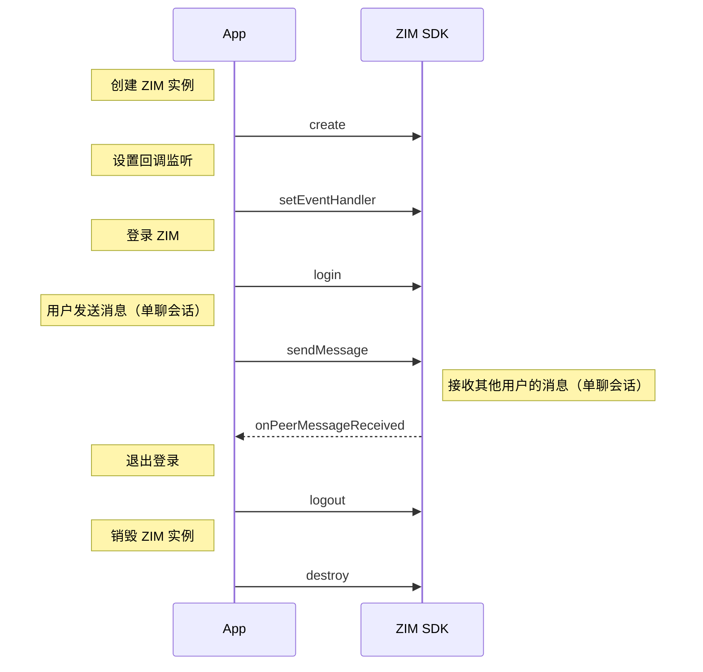

export const getPlatformData = (props, data) => {
    const platform = (props.platform ?? "Android").toLowerCase();
    for (const [key, value] of Object.entries(data)) {
        const pList = key.split(",").map((v) => v.toLowerCase());
        if (pList.includes(platform)) {
            return value;
        }
    }
    return data["Android"] || data["android"] || data["default"];
};

export const getPlatformData2 = (props, data) => {
    const platform = (props.platform ?? "default").toLowerCase();
    for (const [key, value] of Object.entries(data)) {
        const pList = key.split(",").map((v) => v.toLowerCase());
        if (pList.includes(platform)) {
            return value;
        }
    }
    return data["default"];
};

export const ZIMMessageTypeMap = {
  'default': <a href="@-ZIMMessageType" target='_blank'>ZIMMessageType</a>,
  'flutter': <a href="https://pub.dev/documentation/zego_zim/latest/zego_zim/ZIMMessageType.html" target='_blank'>ZIMMessageType</a>,
}
export const ZIMMessageMentionedTypeMap = {
  'default': <a href="@-ZIMMessageMentionedType" target='_blank'>ZIMMessageMentionedType</a>,
  'flutter': <a href="https://pub.dev/documentation/zego_zim/latest/zego_zim/ZIMMessageMentionedType.html" target='_blank'>ZIMMessageMentionedType</a>,
}

export const ZIMConversationMap = {
  'default': <a href="@-ZIMConversation" target='_blank'>ZIMConversation</a>,
  'flutter': <a href="https://pub.dev/documentation/zego_zim/latest/zego_zim/ZIMConversation-class.html" target='_blank'>ZIMConversation</a>,
}
export const ZIMMessageMap = {
  'default': <a href="@-ZIMMessage" target='_blank'>ZIMMessage</a>,
  'flutter': <a href="https://pub.dev/documentation/zego_zim/latest/zego_zim/ZIMMessage-class.html" target='_blank'>ZIMMessage</a>,
}
export const ZIMTextMessageMap = {
  'default': <a href="@-ZIMTextMessage" target='_blank'>ZIMTextMessage</a>,
  'flutter': <a href="https://pub.dev/documentation/zego_zim/latest/zego_zim/ZIMTextMessage-class.html" target='_blank'>ZIMTextMessage</a>,
}
export const ZIMCommandMessageMap = {
  'default': <a href="@-ZIMCommandMessage" target='_blank'>ZIMCommandMessage</a>,
  'flutter': <a href="https://pub.dev/documentation/zego_zim/latest/zego_zim/ZIMCommandMessage-class.html" target='_blank'>ZIMCommandMessage</a>,
}
export const ZIMCustomMessageMap = {
  'default': <a href="@-ZIMCustomMessage" target='_blank'>ZIMCustomMessage</a>,
  'flutter': <a href="https://pub.dev/documentation/zego_zim/latest/zego_zim/ZIMCustomMessage-class.html" target='_blank'>ZIMCustomMessage</a>,
}
export const ZIMMultipleMessageMap = {
  'default': <a href="@-ZIMMultipleMessage" target='_blank'>ZIMMultipleMessage</a>,
  'flutter': <a href="https://pub.dev/documentation/zego_zim/latest/zego_zim/ZIMMultipleMessage-class.html" target='_blank'>ZIMMultipleMessage</a>,
}
export const isMentionAllMap = {
  'default': <a href="@isMentionAll-ZIMMessage" target='_blank'>isMentionAll</a>,
  'flutter': <a href="https://pub.dev/documentation/zego_zim/latest/zego_zim/ZIMMessage/isMentionAll.html"target='_blank'>isMentionAll</a>,
}
export const mentionedUserIDsMap = {
  'default': <a href="@mentionedUserIDs-ZIMMessage" target='_blank'>mentionedUserIDs</a>,
  'android': <a href="https://pub.dev/documentation/zego_zim/latest/zego_zim/ZIMMessage/mentionedUserIds.html" target='_blank'>mentionedUserIds</a>,
}
export const mentionedInfoListMap = {
  'default': <a href="@mentionedInfoList-ZIMConversation" target='_blank'>mentionedInfoList</a>,
  'flutter': <a href="https://pub.dev/documentation/zego_zim/latest/zego_zim/ZIMConversation/mentionedInfoList.html" target='_blank'>mentionedInfoList</a>,
}


export const onMediaUploadingProgressMap = {
  'default': <a href="@onMediaUploadingProgress" target='_blank'>onMediaUploadingProgress</a>,
  // 'android': <a href="@ZIMMediaUploadingProgress" target='_blank'>ZIMMediaUploadingProgress</a>,
  'flutter': <a href="https://pub.dev/documentation/zego_zim/latest/zego_zim/ZIMMediaUploadingProgress.html" target='_blank'>ZIMMediaUploadingProgress</a>,
}
export const onMediaDownloadingProgressMap = {
  'default': <a href="@ZIMMediaDownloadingProgress" target='_blank'>ZIMMediaDownloadingProgress</a>,
  'android': <a href="@onMediaDownloadingProgress" target='_blank'>onMediaDownloadingProgress</a>,
  'flutter': <a href="https://pub.dev/documentation/zego_zim/latest/zego_zim/ZIMMediaDownloadingProgress.html" target='_blank'>ZIMMediaDownloadingProgress</a>,
}
export const multipleMediaUploadingProgressMap = {
  'default': <a href="@multipleMediaUploadingProgress" target='_blank'>multipleMediaUploadingProgress</a>,
  'android,win,window,windows,ios,mac': <a href="@onMultipleMediaUploadingProgress" target='_blank'>onMultipleMediaUploadingProgress</a>,
  'flutter': <a href="https://pub.dev/documentation/zego_zim/latest/zego_zim/ZIMMessageSendNotification/onMultipleMediaUploadingProgress.html" target='_blank'>onMultipleMediaUploadingProgress</a>,
}


export const setEventHandlerMap = {
  'default': <a href="@setEventHandler" target='_blank'>setEventHandler</a>,
  'Web,miniprogram,rn,uniapp,uni-app,harmonyos,UTS': <a href="@on" target='_blank'>on</a>,
}
export const conversationChangedMap = {
  'default': <a href="@conversationChanged" target='_blank'>conversationChanged</a>,
  'UTS': <a href="@conversationChanged" target='_blank'>onConversationChanged</a>,
  'android,win,window,windows': <a href="@onConversationChanged" target='_blank'>onConversationChanged</a>,
  'ios': <a href="https://doc-zh.zego.im/article/api?doc=zim_API~objective-c_ios~protocol~ZIMEventHandler#zim-conversation-changed" target='_blank'>conversationChanged</a>,
  'mac': <a href="https://doc-zh.zego.im/article/api?doc=zim_API~objective-c_macos~protocol~ZIMEventHandler#zim-conversation-changed" target='_blank'>conversationChanged</a>,
  'flutter': <a href="https://pub.dev/documentation/zego_zim/latest/zego_zim/ZIMEventHandler/onConversationChanged.html" target='_blank'>onConversationChanged</a>,
}
export const peerMessageReceivedMap = {
  'default': <a href="@peerMessageReceived" target='_blank'>peerMessageReceived</a>,
  'UTS': <a href="@peerMessageReceived" target='_blank'>onPeerMessageReceived</a>,
  'android,win,window,windows': <a href="@onPeerMessageReceived" target='_blank'>onPeerMessageReceived</a>,
  'ios': <a href="https://doc-zh.zego.im/article/api?doc=zim_API~objective-c_ios~protocol~ZIMEventHandler#zim-peer-message-received-info-from-user-id" target='_blank'>peerMessageReceived</a>,
  'mac': <a href="https://doc-zh.zego.im/article/api?doc=zim_API~objective-c_macos~protocol~ZIMEventHandler#zim-peer-message-received-info-from-user-id" target='_blank'>peerMessageReceived</a>,
  'flutter': <a href="https://pub.dev/documentation/zego_zim/latest/zego_zim/ZIMEventHandler/onPeerMessageReceived.html" target='_blank'>onPeerMessageReceived</a>,
  'u3d': <a href="@OnPeerMessageReceived" target='_blank'>OnPeerMessageReceived</a>,
}
export const roomMessageReceivedMap = {
  'default': <a href="@roomMessageReceived" target='_blank'>roomMessageReceived</a>,
  'UTS': <a href="@roomMessageReceived" target='_blank'>onRoomMessageReceived</a>,
  'android,win,window,windows': <a href="@onRoomMessageReceived" target='_blank'>onRoomMessageReceived</a>,
  'ios': <a href="https://doc-zh.zego.im/article/api?doc=zim_API~objective-c_ios~protocol~ZIMEventHandler#zim-room-message-received-info-from-room-id" target='_blank'>roomMessageReceived</a>,
  'mac': <a href="https://doc-zh.zego.im/article/api?doc=zim_API~objective-c_macos~protocol~ZIMEventHandler#zim-room-message-received-info-from-room-id" target='_blank'>roomMessageReceived</a>,
  'flutter': <a href="https://pub.dev/documentation/zego_zim/latest/zego_zim/ZIMEventHandler/onRoomMessageReceived.html" target='_blank'>onRoomMessageReceived</a>,
  'u3d': <a href="@OnRoomMessageReceived" target='_blank'>OnRoomMessageReceived</a>,
}
export const groupMessageReceivedMap = {
  'default': <a href="@groupMessageReceived" target='_blank'>groupMessageReceived</a>,
  'UTS': <a href="@groupMessageReceived" target='_blank'>onGroupMessageReceived</a>,
  'android,win,window,windows': <a href="@onGroupMessageReceived" target='_blank'>onGroupMessageReceived</a>,
  'ios': <a href="https://doc-zh.zego.im/article/api?doc=zim_API~objective-c_ios~protocol~ZIMEventHandler#zim-group-message-received-info-from-group-id" target='_blank'>groupMessageReceived</a>,
  'mac': <a href="https://doc-zh.zego.im/article/api?doc=zim_API~objective-c_macos~protocol~ZIMEventHandler#zim-group-message-received-info-from-group-id" target='_blank'>groupMessageReceived</a>,
  'flutter': <a href="https://pub.dev/documentation/zego_zim/latest/zego_zim/ZIMEventHandler/onGroupMessageReceived.html" target='_blank'>onGroupMessageReceived</a>,
  'u3d': <a href="@OnGroupMessageReceived" target='_blank'>OnGroupMessageReceived</a>,
}
export const broadcastMessageReceivedMap = {
  'default': <a href="@broadcastMessageReceived" target='_blank'>broadcastMessageReceived</a>,
  'UTS': <a href="@broadcastMessageReceived" target='_blank'>onBroadcastMessageReceived</a>,
  'android,win,window,windows': <a href="@onBroadcastMessageReceived" target='_blank'>onBroadcastMessageReceived</a>,
  'ios': <a href="https://doc-zh.zego.im/article/api?doc=zim_API~objective-c_ios~protocol~ZIMEventHandler#zim-broadcast-message-received" target='_blank'>broadcastMessageReceived</a>,
  'mac': <a href="https://doc-zh.zego.im/article/api?doc=zim_API~objective-c_macos~protocol~ZIMEventHandler#zim-broadcast-message-received" target='_blank'>broadcastMessageReceived</a>,
  'flutter': <a href="https://pub.dev/documentation/zego_zim/latest/zego_zim/ZIMEventHandler/onBroadcastMessageReceived.html" target='_blank'>onBroadcastMessageReceived</a>,
}
export const messageSentStatusChangedMap = {
  'default': <a href="@messageSentStatusChanged" target='_blank'>messageSentStatusChanged</a>,
  'UTS': <a href="@messageSentStatusChanged" target='_blank'>onMessageSentStatusChanged</a>,
  'android,win,window,windows': <a href="@onMessageSentStatusChanged" target='_blank'>onMessageSentStatusChanged</a>,
  'ios': <a href="https://doc-zh.zego.im/article/api?doc=zim_API~objective-c_ios~protocol~ZIMEventHandler#zim-message-sent-status-changed" target='_blank'>messageSentStatusChanged</a>,
  'mac': <a href="https://doc-zh.zego.im/article/api?doc=zim_API~objective-c_macos~protocol~ZIMEventHandler#zim-message-sent-status-changed" target='_blank'>messageSentStatusChanged</a>,
  'flutter': <a href="https://pub.dev/documentation/zego_zim/latest/zego_zim/ZIMEventHandler/onMessageSentStatusChanged.html" target='_blank'>onMessageSentStatusChanged</a>,
}
export const messageEditedMap = {
  'default': <a href="@messageEdited" target='_blank'>messageEdited</a>,
  'UTS': <a href="@messageEdited" target='_blank'>onMessageEdited</a>,
  'android,win,window,windows': <a href="@onMessageEdited" target='_blank'>onMessageEdited</a>,
  'ios': <a href="https://doc-zh.zego.im/article/api?doc=zim_API~objective-c_ios~protocol~ZIMEventHandler#zim-message-edited" target='_blank'>messageEdited</a>,
  'mac': <a href="https://doc-zh.zego.im/article/api?doc=zim_API~objective-c_macos~protocol~ZIMEventHandler#zim-message-edited" target='_blank'>messageEdited</a>,
  'flutter': <a href="https://pub.dev/documentation/zego_zim/latest/zego_zim/ZIMEventHandler/onMessageEdited.html" target='_blank'>onMessageEdited</a>,
}
export const sendMessageMap = {
  'default': <a href="@sendMessage" target='_blank'>sendMessage</a>,
  'flutter': <a href="https://pub.dev/documentation/zego_zim/latest/zego_zim/ZIM/sendMessage.html" target='_blank'>sendMessage</a>,
  'u3d': <a href="@SendMessage" target='_blank'>SendMessage</a>,
}
export const replyMessageMap = {
  'default': <a href="@replyMessage" target='_blank'>replyMessage</a>,
  'flutter': <a href="https://pub.dev/documentation/zego_zim/latest/zego_zim/ZIM/replyMessage.html" target='_blank'>replyMessage</a>,
  'u3d': <a href="@ReplyMessage" target='_blank'>ReplyMessage</a>,
}
export const downloadMediaFileMap = {
  'default': <a href="@downloadMediaFile" target='_blank'>downloadMediaFile</a>,
  'ios,mac': <a href="@downloadMediaFileWithMessage" target='_blank'>downloadMediaFileWithMessage</a>,
  'flutter': <a href="https://pub.dev/documentation/zego_zim/latest/zego_zim/ZIM/downloadMediaFile.html" target='_blank'>downloadMediaFile</a>,
}
export const queryConversationListMap = {
  'default': <a href="@queryConversationList" target='_blank'>queryConversationList</a>,
  'ios,mac': <a href="@queryConversationListWithConfig" target='_blank'>queryConversationListWithConfig</a>,
  'flutter': <a href="https://pub.dev/documentation/zego_zim/latest/zego_zim/ZIM/queryConversationList.html" target='_blank'>queryConversationList</a>,
}
export const queryConversationMap = {
  'default': <a href="@queryConversation" target='_blank'>queryConversation</a>,
  'flutter': <a href="https://pub.dev/documentation/zego_zim/latest/zego_zim/ZIM/queryConversation.html" target='_blank'>queryConversation</a>,
}
export const clearConversationUnreadMessageCountMap = {
  'default': <a href="@clearConversationUnreadMessageCount" target='_blank'>clearConversationUnreadMessageCount</a>,
  'ios,mac': <a href="@clearConversationUnreadMessageCountWithConversationID" target='_blank'>clearConversationUnreadMessageCountWithConversationID</a>,
  'flutter': <a href="https://pub.dev/documentation/zego_zim/latest/zego_zim/ZIM/clearConversationUnreadMessageCount.html" target='_blank'>clearConversationUnreadMessageCount</a>,
}
export const clearConversationTotalUnreadMessageCountMap = {
  'default': <a href="@clearConversationTotalUnreadMessageCount" target='_blank'>clearConversationTotalUnreadMessageCount</a>,
  'flutter': <a href="https://pub.dev/documentation/zego_zim/latest/zego_zim/ZIM/clearConversationTotalUnreadMessageCount.html" target='_blank'>clearConversationTotalUnreadMessageCount</a>,
}
export const editMessageMap = {
  'default': <a href="@editMessage" target='_blank'>editMessage</a>,
  'flutter': <a href="https://pub.dev/documentation/zego_zim/latest/zego_zim/ZIM/editMessage.html" target='_blank'>editMessage</a>,
}
export const tokenWillExpireMap = {
  'default': <a href="@tokenWillExpire" target='_blank'>tokenWillExpire</a>,
  'UTS': <a href="@tokenWillExpire" target='_blank'>onTokenWillExpire</a>,
  'android,win,window,windows': <a href="@onTokenWillExpire" target='_blank'>onTokenWillExpire</a>,
  'ios': <a href="https://doc-zh.zego.im/article/api?doc=zim_API~objective-c_ios~protocol~ZIMEventHandler#zim-token-will-expire" target='_blank'>tokenWillExpire</a>,
  'mac': <a href="https://doc-zh.zego.im/article/api?doc=zim_API~objective-c_macos~protocol~ZIMEventHandler#zim-token-will-expire" target='_blank'>tokenWillExpire</a>,
  'flutter': <a href="https://pub.dev/documentation/zego_zim/latest/zego_zim/ZIMEventHandler/onTokenWillExpire.html" target='_blank'>onTokenWillExpire</a>,
}
export const connectionStateChangedMap = {
  'default': <a href="@connectionStateChanged" target='_blank'>connectionStateChanged</a>,
  'UTS': <a href="@connectionStateChanged" target='_blank'>onConnectionStateChanged</a>,
  'android,win,window,windows': <a href="@onConnectionStateChanged" target='_blank'>onConnectionStateChanged</a>,
  'ios': <a href="https://doc-zh.zego.im/article/api?doc=zim_API~objective-c_ios~protocol~ZIMEventHandler#zim-connection-state-changed-event-extended-data" target='_blank'>connectionStateChanged</a>,
  'mac': <a href="https://doc-zh.zego.im/article/api?doc=zim_API~objective-c_macos~protocol~ZIMEventHandler#zim-connection-state-changed-event-extended-data" target='_blank'>connectionStateChanged</a>,
  'flutter': <a href="https://pub.dev/documentation/zego_zim/latest/zego_zim/ZIMEventHandler/onConnectionStateChanged.html" target='_blank'>onConnectionStateChanged</a>,
}
<table>
<tbody>
<tr data-row-level="1">
<th>消息类型</th>
<th>说明</th>
<th>特性及适用场景</th>
</tr>

<tr data-row-level="2">
<td>ZIMCommandMessage(2)</td>
<td>开发者可自定义数据内容的信令消息。消息大小不超过 5 KB，单个客户端发送频率限制为 10 次/秒。</td>
<td>
<p>不可存储，一般适用于“语聊房”、“在线课堂”等房间内的信令传输，比如上下麦操作、送礼物，发送在线课堂课件等。</p>
<p>支持更高的并发，但不可靠，不保证消息送达和消息顺序。</p>

相关接口：{getPlatformData2(props, sendMessageMap)}
</td>
</tr>
<tr data-row-level="3">
<td>ZIMBarrageMessage(20)</td>
<td>房间内弹幕文本消息。消息大小不超过 5 KB，单个客户端发送频率无限制。</td>
<td>
<p>不可存储，专门用于房间内的高频、不可靠、允许丢掉的消息，一般适用于发送“弹幕消息”的场景中。</p><p>支持高并发，但不可靠，不保证消息送达。</p>

相关接口：{getPlatformData2(props, sendMessageMap)}

</td>
</tr>

<tr data-row-level="4">
<td>ZIMTextMessage(1)</td>
<td>文本消息。消息大小上限默认为 2 KB。如有需要，请联系 ZEGO 技术支持配置，最大可达 32 KB。单个客户端发送频率限制为 10 次/秒。</td>
<td rowspan="8">
消息可靠有序，可存储为历史消息（保存时间请参考 [计费说明 - 版本差异](/zim-win/introduction/pricing) 中“历史消息存储天数”）。<br />
可用于单聊、房间、群聊等即时聊天场景。房间解散后，“房间聊天”的消息不存储。

- 图片、文件、语音、视频：通常用于发送富媒体文件类型的消息。
- 自定义消息：通常用于发送投票类型、接龙类型、视频卡片类型等消息。
- 组合消息：常用于发送图文消息。

相关接口：{getPlatformData2(props, sendMessageMap)}、{getPlatformData2(props, replyMessageMap)}
</td>
</tr>
<tr data-row-level="5">
<td>ZIMMultipleMessage(10)</td>
<td>组合消息，即包含多个 item 的消息，可包括多条文本、至多 10 张图片、1 个文件、1 个音频、1 个视频和 1 条自定义消息。<Note title="说明"><ul><li>Item 总量不得超过 20。</li><li>图片、音频、文件和视频的大小和格式限制与对应的富媒体消息类型相同。</li></ul></Note></td>
</tr>
<tr data-row-level="6">
<td>ZIMImageMessage(11)</td>
<td>图片消息。支持主流图片格式，包括 JPG、PNG、BMP、TIFF、GIF、WebP，大小不超过 10 MB，单个客户端发送频率限制为 10 次/秒。</td>
</tr>
<tr data-row-level="7">
<td>ZIMFileMessage(12)</td>
<td>文件消息。消息内容为文件，格式不限，大小不超过 100 MB，单个客户端发送频率限制为 10 次/秒。</td>
</tr>
<tr data-row-level="8">
<td>ZIMAudioMessage(13)</td>
<td>语音消息。支持 MP3、M4A 格式的语音文件，时长不超过 300 秒，大小不超过 6 MB，单个客户端发送频率限制为 10 次/秒。</td>
</tr>
<tr data-row-level="9">
<td>ZIMVideoMessage(14)</td>
<td>视频消息。支持 MP4、MOV 格式的视频文件，大小不超过 100 MB，单个客户端发送频率限制为 10 次/秒。<Note title="说明">若要在消息发送成功后获取视频首帧的宽高信息，视频必须使用 H.264 或 H.265 编码格式。</Note></td>
</tr>
<tr data-row-level="10">
<td>ZIMCombineMessage(100)</td>
<td>合并消息，消息大小无限制，单个客户端发送频率限制为 10 次/秒。</td>
</tr>
<tr data-row-level="11">
<td>ZIMCustomMessage(200)</td>
<td>自定义消息。消息大小上限默认为 2 KB。如有需要，请联系 ZEGO 技术支持配置，最大可达 32 KB。开发者可自定义消息的类型，并自行完成消息的解析，ZIM SDK 不负责定义和解析自定义消息的具体内容。</td>
</tr>
</tbody>
</table>

export const getPlatformData = (props, data) => {
    const platform = (props.platform ?? "Android").toLowerCase();
    for (const [key, value] of Object.entries(data)) {
        const pList = key.split(",").map((v) => v.toLowerCase());
        if (pList.includes(platform)) {
            return value;
        }
    }
    return data["Android"] || data["android"] || data["default"];
};

export const getPlatformData2 = (props, data) => {
    const platform = (props.platform ?? "default").toLowerCase();
    for (const [key, value] of Object.entries(data)) {
        const pList = key.split(",").map((v) => v.toLowerCase());
        if (pList.includes(platform)) {
            return value;
        }
    }
    return data["default"];
};

export const ZIMMessageTypeMap = {
  'default': <a href="@-ZIMMessageType" target='_blank'>ZIMMessageType</a>,
  'flutter': <a href="https://pub.dev/documentation/zego_zim/latest/zego_zim/ZIMMessageType.html" target='_blank'>ZIMMessageType</a>,
}
export const ZIMMessageMentionedTypeMap = {
  'default': <a href="@-ZIMMessageMentionedType" target='_blank'>ZIMMessageMentionedType</a>,
  'flutter': <a href="https://pub.dev/documentation/zego_zim/latest/zego_zim/ZIMMessageMentionedType.html" target='_blank'>ZIMMessageMentionedType</a>,
}

export const ZIMConversationMap = {
  'default': <a href="@-ZIMConversation" target='_blank'>ZIMConversation</a>,
  'flutter': <a href="https://pub.dev/documentation/zego_zim/latest/zego_zim/ZIMConversation-class.html" target='_blank'>ZIMConversation</a>,
}
export const ZIMMessageMap = {
  'default': <a href="@-ZIMMessage" target='_blank'>ZIMMessage</a>,
  'flutter': <a href="https://pub.dev/documentation/zego_zim/latest/zego_zim/ZIMMessage-class.html" target='_blank'>ZIMMessage</a>,
}
export const ZIMTextMessageMap = {
  'default': <a href="@-ZIMTextMessage" target='_blank'>ZIMTextMessage</a>,
  'flutter': <a href="https://pub.dev/documentation/zego_zim/latest/zego_zim/ZIMTextMessage-class.html" target='_blank'>ZIMTextMessage</a>,
}
export const ZIMCommandMessageMap = {
  'default': <a href="@-ZIMCommandMessage" target='_blank'>ZIMCommandMessage</a>,
  'flutter': <a href="https://pub.dev/documentation/zego_zim/latest/zego_zim/ZIMCommandMessage-class.html" target='_blank'>ZIMCommandMessage</a>,
}
export const ZIMCustomMessageMap = {
  'default': <a href="@-ZIMCustomMessage" target='_blank'>ZIMCustomMessage</a>,
  'flutter': <a href="https://pub.dev/documentation/zego_zim/latest/zego_zim/ZIMCustomMessage-class.html" target='_blank'>ZIMCustomMessage</a>,
}
export const ZIMMultipleMessageMap = {
  'default': <a href="@-ZIMMultipleMessage" target='_blank'>ZIMMultipleMessage</a>,
  'flutter': <a href="https://pub.dev/documentation/zego_zim/latest/zego_zim/ZIMMultipleMessage-class.html" target='_blank'>ZIMMultipleMessage</a>,
}
export const isMentionAllMap = {
  'default': <a href="@isMentionAll-ZIMMessage" target='_blank'>isMentionAll</a>,
  'flutter': <a href="https://pub.dev/documentation/zego_zim/latest/zego_zim/ZIMMessage/isMentionAll.html"target='_blank'>isMentionAll</a>,
}
export const mentionedUserIDsMap = {
  'default': <a href="@mentionedUserIDs-ZIMMessage" target='_blank'>mentionedUserIDs</a>,
  'android': <a href="https://pub.dev/documentation/zego_zim/latest/zego_zim/ZIMMessage/mentionedUserIds.html" target='_blank'>mentionedUserIds</a>,
}
export const mentionedInfoListMap = {
  'default': <a href="@mentionedInfoList-ZIMConversation" target='_blank'>mentionedInfoList</a>,
  'flutter': <a href="https://pub.dev/documentation/zego_zim/latest/zego_zim/ZIMConversation/mentionedInfoList.html" target='_blank'>mentionedInfoList</a>,
}


export const onMediaUploadingProgressMap = {
  'default': <a href="@onMediaUploadingProgress" target='_blank'>onMediaUploadingProgress</a>,
  // 'android': <a href="@ZIMMediaUploadingProgress" target='_blank'>ZIMMediaUploadingProgress</a>,
  'flutter': <a href="https://pub.dev/documentation/zego_zim/latest/zego_zim/ZIMMediaUploadingProgress.html" target='_blank'>ZIMMediaUploadingProgress</a>,
}
export const onMediaDownloadingProgressMap = {
  'default': <a href="@ZIMMediaDownloadingProgress" target='_blank'>ZIMMediaDownloadingProgress</a>,
  'android': <a href="@onMediaDownloadingProgress" target='_blank'>onMediaDownloadingProgress</a>,
  'flutter': <a href="https://pub.dev/documentation/zego_zim/latest/zego_zim/ZIMMediaDownloadingProgress.html" target='_blank'>ZIMMediaDownloadingProgress</a>,
}
export const multipleMediaUploadingProgressMap = {
  'default': <a href="@multipleMediaUploadingProgress" target='_blank'>multipleMediaUploadingProgress</a>,
  'android,win,window,windows,ios,mac': <a href="@onMultipleMediaUploadingProgress" target='_blank'>onMultipleMediaUploadingProgress</a>,
  'flutter': <a href="https://pub.dev/documentation/zego_zim/latest/zego_zim/ZIMMessageSendNotification/onMultipleMediaUploadingProgress.html" target='_blank'>onMultipleMediaUploadingProgress</a>,
}


export const setEventHandlerMap = {
  'default': <a href="@setEventHandler" target='_blank'>setEventHandler</a>,
  'Web,miniprogram,rn,uniapp,uni-app,harmonyos,UTS': <a href="@on" target='_blank'>on</a>,
}
export const conversationChangedMap = {
  'default': <a href="@conversationChanged" target='_blank'>conversationChanged</a>,
  'UTS': <a href="@conversationChanged" target='_blank'>onConversationChanged</a>,
  'android,win,window,windows': <a href="@onConversationChanged" target='_blank'>onConversationChanged</a>,
  'ios': <a href="https://doc-zh.zego.im/article/api?doc=zim_API~objective-c_ios~protocol~ZIMEventHandler#zim-conversation-changed" target='_blank'>conversationChanged</a>,
  'mac': <a href="https://doc-zh.zego.im/article/api?doc=zim_API~objective-c_macos~protocol~ZIMEventHandler#zim-conversation-changed" target='_blank'>conversationChanged</a>,
  'flutter': <a href="https://pub.dev/documentation/zego_zim/latest/zego_zim/ZIMEventHandler/onConversationChanged.html" target='_blank'>onConversationChanged</a>,
}
export const peerMessageReceivedMap = {
  'default': <a href="@peerMessageReceived" target='_blank'>peerMessageReceived</a>,
  'UTS': <a href="@peerMessageReceived" target='_blank'>onPeerMessageReceived</a>,
  'android,win,window,windows': <a href="@onPeerMessageReceived" target='_blank'>onPeerMessageReceived</a>,
  'ios': <a href="https://doc-zh.zego.im/article/api?doc=zim_API~objective-c_ios~protocol~ZIMEventHandler#zim-peer-message-received-info-from-user-id" target='_blank'>peerMessageReceived</a>,
  'mac': <a href="https://doc-zh.zego.im/article/api?doc=zim_API~objective-c_macos~protocol~ZIMEventHandler#zim-peer-message-received-info-from-user-id" target='_blank'>peerMessageReceived</a>,
  'flutter': <a href="https://pub.dev/documentation/zego_zim/latest/zego_zim/ZIMEventHandler/onPeerMessageReceived.html" target='_blank'>onPeerMessageReceived</a>,
  'u3d': <a href="@OnPeerMessageReceived" target='_blank'>OnPeerMessageReceived</a>,
}
export const roomMessageReceivedMap = {
  'default': <a href="@roomMessageReceived" target='_blank'>roomMessageReceived</a>,
  'UTS': <a href="@roomMessageReceived" target='_blank'>onRoomMessageReceived</a>,
  'android,win,window,windows': <a href="@onRoomMessageReceived" target='_blank'>onRoomMessageReceived</a>,
  'ios': <a href="https://doc-zh.zego.im/article/api?doc=zim_API~objective-c_ios~protocol~ZIMEventHandler#zim-room-message-received-info-from-room-id" target='_blank'>roomMessageReceived</a>,
  'mac': <a href="https://doc-zh.zego.im/article/api?doc=zim_API~objective-c_macos~protocol~ZIMEventHandler#zim-room-message-received-info-from-room-id" target='_blank'>roomMessageReceived</a>,
  'flutter': <a href="https://pub.dev/documentation/zego_zim/latest/zego_zim/ZIMEventHandler/onRoomMessageReceived.html" target='_blank'>onRoomMessageReceived</a>,
  'u3d': <a href="@OnRoomMessageReceived" target='_blank'>OnRoomMessageReceived</a>,
}
export const groupMessageReceivedMap = {
  'default': <a href="@groupMessageReceived" target='_blank'>groupMessageReceived</a>,
  'UTS': <a href="@groupMessageReceived" target='_blank'>onGroupMessageReceived</a>,
  'android,win,window,windows': <a href="@onGroupMessageReceived" target='_blank'>onGroupMessageReceived</a>,
  'ios': <a href="https://doc-zh.zego.im/article/api?doc=zim_API~objective-c_ios~protocol~ZIMEventHandler#zim-group-message-received-info-from-group-id" target='_blank'>groupMessageReceived</a>,
  'mac': <a href="https://doc-zh.zego.im/article/api?doc=zim_API~objective-c_macos~protocol~ZIMEventHandler#zim-group-message-received-info-from-group-id" target='_blank'>groupMessageReceived</a>,
  'flutter': <a href="https://pub.dev/documentation/zego_zim/latest/zego_zim/ZIMEventHandler/onGroupMessageReceived.html" target='_blank'>onGroupMessageReceived</a>,
  'u3d': <a href="@OnGroupMessageReceived" target='_blank'>OnGroupMessageReceived</a>,
}
export const broadcastMessageReceivedMap = {
  'default': <a href="@broadcastMessageReceived" target='_blank'>broadcastMessageReceived</a>,
  'UTS': <a href="@broadcastMessageReceived" target='_blank'>onBroadcastMessageReceived</a>,
  'android,win,window,windows': <a href="@onBroadcastMessageReceived" target='_blank'>onBroadcastMessageReceived</a>,
  'ios': <a href="https://doc-zh.zego.im/article/api?doc=zim_API~objective-c_ios~protocol~ZIMEventHandler#zim-broadcast-message-received" target='_blank'>broadcastMessageReceived</a>,
  'mac': <a href="https://doc-zh.zego.im/article/api?doc=zim_API~objective-c_macos~protocol~ZIMEventHandler#zim-broadcast-message-received" target='_blank'>broadcastMessageReceived</a>,
  'flutter': <a href="https://pub.dev/documentation/zego_zim/latest/zego_zim/ZIMEventHandler/onBroadcastMessageReceived.html" target='_blank'>onBroadcastMessageReceived</a>,
}
export const messageSentStatusChangedMap = {
  'default': <a href="@messageSentStatusChanged" target='_blank'>messageSentStatusChanged</a>,
  'UTS': <a href="@messageSentStatusChanged" target='_blank'>onMessageSentStatusChanged</a>,
  'android,win,window,windows': <a href="@onMessageSentStatusChanged" target='_blank'>onMessageSentStatusChanged</a>,
  'ios': <a href="https://doc-zh.zego.im/article/api?doc=zim_API~objective-c_ios~protocol~ZIMEventHandler#zim-message-sent-status-changed" target='_blank'>messageSentStatusChanged</a>,
  'mac': <a href="https://doc-zh.zego.im/article/api?doc=zim_API~objective-c_macos~protocol~ZIMEventHandler#zim-message-sent-status-changed" target='_blank'>messageSentStatusChanged</a>,
  'flutter': <a href="https://pub.dev/documentation/zego_zim/latest/zego_zim/ZIMEventHandler/onMessageSentStatusChanged.html" target='_blank'>onMessageSentStatusChanged</a>,
}
export const messageEditedMap = {
  'default': <a href="@messageEdited" target='_blank'>messageEdited</a>,
  'UTS': <a href="@messageEdited" target='_blank'>onMessageEdited</a>,
  'android,win,window,windows': <a href="@onMessageEdited" target='_blank'>onMessageEdited</a>,
  'ios': <a href="https://doc-zh.zego.im/article/api?doc=zim_API~objective-c_ios~protocol~ZIMEventHandler#zim-message-edited" target='_blank'>messageEdited</a>,
  'mac': <a href="https://doc-zh.zego.im/article/api?doc=zim_API~objective-c_macos~protocol~ZIMEventHandler#zim-message-edited" target='_blank'>messageEdited</a>,
  'flutter': <a href="https://pub.dev/documentation/zego_zim/latest/zego_zim/ZIMEventHandler/onMessageEdited.html" target='_blank'>onMessageEdited</a>,
}
export const sendMessageMap = {
  'default': <a href="@sendMessage" target='_blank'>sendMessage</a>,
  'flutter': <a href="https://pub.dev/documentation/zego_zim/latest/zego_zim/ZIM/sendMessage.html" target='_blank'>sendMessage</a>,
  'u3d': <a href="@SendMessage" target='_blank'>SendMessage</a>,
}
export const replyMessageMap = {
  'default': <a href="@replyMessage" target='_blank'>replyMessage</a>,
  'flutter': <a href="https://pub.dev/documentation/zego_zim/latest/zego_zim/ZIM/replyMessage.html" target='_blank'>replyMessage</a>,
  'u3d': <a href="@ReplyMessage" target='_blank'>ReplyMessage</a>,
}
export const downloadMediaFileMap = {
  'default': <a href="@downloadMediaFile" target='_blank'>downloadMediaFile</a>,
  'ios,mac': <a href="@downloadMediaFileWithMessage" target='_blank'>downloadMediaFileWithMessage</a>,
  'flutter': <a href="https://pub.dev/documentation/zego_zim/latest/zego_zim/ZIM/downloadMediaFile.html" target='_blank'>downloadMediaFile</a>,
}
export const queryConversationListMap = {
  'default': <a href="@queryConversationList" target='_blank'>queryConversationList</a>,
  'ios,mac': <a href="@queryConversationListWithConfig" target='_blank'>queryConversationListWithConfig</a>,
  'flutter': <a href="https://pub.dev/documentation/zego_zim/latest/zego_zim/ZIM/queryConversationList.html" target='_blank'>queryConversationList</a>,
}
export const queryConversationMap = {
  'default': <a href="@queryConversation" target='_blank'>queryConversation</a>,
  'flutter': <a href="https://pub.dev/documentation/zego_zim/latest/zego_zim/ZIM/queryConversation.html" target='_blank'>queryConversation</a>,
}
export const clearConversationUnreadMessageCountMap = {
  'default': <a href="@clearConversationUnreadMessageCount" target='_blank'>clearConversationUnreadMessageCount</a>,
  'ios,mac': <a href="@clearConversationUnreadMessageCountWithConversationID" target='_blank'>clearConversationUnreadMessageCountWithConversationID</a>,
  'flutter': <a href="https://pub.dev/documentation/zego_zim/latest/zego_zim/ZIM/clearConversationUnreadMessageCount.html" target='_blank'>clearConversationUnreadMessageCount</a>,
}
export const clearConversationTotalUnreadMessageCountMap = {
  'default': <a href="@clearConversationTotalUnreadMessageCount" target='_blank'>clearConversationTotalUnreadMessageCount</a>,
  'flutter': <a href="https://pub.dev/documentation/zego_zim/latest/zego_zim/ZIM/clearConversationTotalUnreadMessageCount.html" target='_blank'>clearConversationTotalUnreadMessageCount</a>,
}
export const editMessageMap = {
  'default': <a href="@editMessage" target='_blank'>editMessage</a>,
  'flutter': <a href="https://pub.dev/documentation/zego_zim/latest/zego_zim/ZIM/editMessage.html" target='_blank'>editMessage</a>,
}
export const tokenWillExpireMap = {
  'default': <a href="@tokenWillExpire" target='_blank'>tokenWillExpire</a>,
  'UTS': <a href="@tokenWillExpire" target='_blank'>onTokenWillExpire</a>,
  'android,win,window,windows': <a href="@onTokenWillExpire" target='_blank'>onTokenWillExpire</a>,
  'ios': <a href="https://doc-zh.zego.im/article/api?doc=zim_API~objective-c_ios~protocol~ZIMEventHandler#zim-token-will-expire" target='_blank'>tokenWillExpire</a>,
  'mac': <a href="https://doc-zh.zego.im/article/api?doc=zim_API~objective-c_macos~protocol~ZIMEventHandler#zim-token-will-expire" target='_blank'>tokenWillExpire</a>,
  'flutter': <a href="https://pub.dev/documentation/zego_zim/latest/zego_zim/ZIMEventHandler/onTokenWillExpire.html" target='_blank'>onTokenWillExpire</a>,
}
export const connectionStateChangedMap = {
  'default': <a href="@connectionStateChanged" target='_blank'>connectionStateChanged</a>,
  'UTS': <a href="@connectionStateChanged" target='_blank'>onConnectionStateChanged</a>,
  'android,win,window,windows': <a href="@onConnectionStateChanged" target='_blank'>onConnectionStateChanged</a>,
  'ios': <a href="https://doc-zh.zego.im/article/api?doc=zim_API~objective-c_ios~protocol~ZIMEventHandler#zim-connection-state-changed-event-extended-data" target='_blank'>connectionStateChanged</a>,
  'mac': <a href="https://doc-zh.zego.im/article/api?doc=zim_API~objective-c_macos~protocol~ZIMEventHandler#zim-connection-state-changed-event-extended-data" target='_blank'>connectionStateChanged</a>,
  'flutter': <a href="https://pub.dev/documentation/zego_zim/latest/zego_zim/ZIMEventHandler/onConnectionStateChanged.html" target='_blank'>onConnectionStateChanged</a>,
}
<Note title="说明">
- 发送消息时，统一使用 {getPlatformData2(props, sendMessageMap)} 接口，并根据会话类型传入对应的 conversationType 取值。
- 接收消息时：
  + 单聊消息（Peer 类型），通过 {getPlatformData2(props, peerMessageReceivedMap)} 回调接收。
  + 房间消息（Room 类型），通过 {getPlatformData2(props, roomMessageReceivedMap)} 回调接收。
  + 群组消息（Group 类型），通过 {getPlatformData2(props, groupMessageReceivedMap)} 回调接收。
</Note>


# 实现基本消息收发

--- 

本文介绍如何使用 ZIM SDK 快速实现基本的单聊会话消息收发功能。

## 1 前提条件

在使用 ZIM SDK 前，请确保：

- 开发环境满足以下要求：
    - Visual Studio 2015 或以上版本。
    - Windows 7 或以上版本。
- 已在 [ZEGO 控制台](https://console.zego.im) 创建项目，获取到了接入 ZIM SDK 服务所需的 AppID、AppSign。ZIM 服务权限不是默认开启的，使用前，请先在 [ZEGO 控制台](https://console.zego.im) 自助开通 ZIM 服务（详情请参考 [项目管理 - 即时通讯](https://doc-zh.zego.im/article/14994)），若无法开通 ZIM 服务，请联系 ZEGO 技术支持开通。

<Warning title="注意">

`2.3.0 及以上`版本的 SDK，开始支持 “AppSign 鉴权”，同时仍支持 “Token 鉴权”，若您需要升级鉴权方式，可参考 [ZIM 如何从 AppSign 鉴权升级为 Token 鉴权](http://doc-zh.zego.im/faq/token_upgrade_zim)。
</Warning>


## 2 集成 SDK  

### 2.1 （可选）新建项目

<Accordion title="此步骤以如何创建新项目为例，如果是集成到已有项目，可忽略此步" defaultOpen="false">

1. 打开 Microsoft Visual Studio，选择“文件 > 新建 > 项目”菜单。
<Frame width="512" height="auto" caption="">
  
</Frame>

2. 在新建项目窗口，选择项目类型为“MFC 应用程序”，输入项目名称，选择项目存储路径，并单击“确定”。
<Frame width="512" height="auto" caption="">
  
</Frame>

3. 进入 MFC 应用程序窗口，选择“应用程序类型”为“基于对话框”，并单击“完成”。 
<Frame width="512" height="auto" caption="">
  
</Frame>

</Accordion>

### 2.2 导入 SDK  
 
1. 请参考 [下载 SDK](/zim-win/client-sdks/sdk-downloads)，下载最新版本的 SDK。
2. 解压 SDK，并拷贝到项目SDK目录下。

    SDK 包含 “include” 和 “lib” 两个目录，每个目录包含的文件说明如下。 
    
    ```cpp
    x86            --------------- 32位版本,包含SDK的.lib和.dll文件
    | include      --------------- 包含SDK头文件
    x64            --------------- 64位版本,包含SDK的.lib和.dll文件
    | include      --------------- 包含SDK头文件
   ```

### 2.3 设置项目属性  

在解决方案资源管理器窗口中，右击项目名称，单击“属性”，进入项目属性页。在项目属性页面内进行以下配置，配置完成后单击“确定”。

1. 将 “include” 目录加入到头文件搜索路径。
选择“配置属性 > C/C++ > 常规”菜单，在“附加包含目录”中添加 “SDK/x86/include” 或 “SDK/x64/include” 目录。
<Frame width="512" height="auto" caption="">
  
</Frame>

2. 将 “lib” 目录加入到库搜索路径。
选择“配置属性 > 链接器 > 常规”菜单，在“附加库目录”中添加 “SDK/x86” 或 “SDK/x64” 目录。
<Frame width="512" height="auto" caption="">
  
</Frame>

3. 指定链接库 “ZIM.lib”。
选择“配置属性 > 链接器 > 输入”菜单，在“附加依赖项”中添加 “ZIM.lib”。
<Frame width="512" height="auto" caption="">
  
</Frame>


## 3 实现基本收发消息

以下流程中，我们以客户端 A 和 B 的消息交互为例：

<Frame width="512" height="auto" caption="">
  
</Frame>


### 3.1 实现流程

请参考 [跑通示例源码](/zim-win/sample-code) 获取源码，相关功能的源码请查看 “ZIMDemo” 文件下的 “CZIMConversationView.h” 和 “CZIMConversationView.cpp” 文件。


#### 1. 导入头文件

在项目文件中引入头文件 “ZIM.h”，并在项目文件的源文件（“*.cpp” 或 “*.cc” 文件）中定义一次宏 `ZIM_MAIN_CONFIG`（需要且仅需要定义一次，且需要放到最前面定义）。


```cpp
//头文件
#include "ZIM.h"
...
```

```cpp
//源文件
#include "pch.h"
#define ZIM_MAIN_CONFIG
#include "framework.h"
...
```

#### 2. 创建 ZIM 实例

首先我们需要在 SDK 中创建 ZIM 实例，一个实例对应的是一个用户，表示一个用户以客户端的身份登录系统。

例如，客户端 A、B 分别调用 [create](https://doc-zh.zego.im/article/api?doc=zim_API~cpp_windows~class~ZIM#create) 接口，传入在 [1 前提条件](#1-前提条件) 中获取到的 AppID、AppSign，创建了 A、B 的实例：

```cpp
// 创建 ZIM 对象，传入 appID、appSign，目前仅建议一个客户端创建一个zim实例
// 请注意：ZIM 从 2.3.0 版本开始支持 AppSign 鉴权，SDK 也默认为 AppSign 鉴权，如果您需要切换鉴权方式：
// (1) 2.3.3 及以上版本的 SDK，支持鉴权方式的自主切换; (2) 2.3.0 ~ 2.3.1 版本的 SDK，需要切换为 “Token 鉴权” 时，请联系 ZEGO 技术支持处理
zim::ZIMAppConfig app_config;
app_config.appID = 0;     //替换为您申请到的 AppID
app_config.appSign = "";   //替换为您申请到的 AppSign
zim_ = zim::ZIM::create(app_config);
```

由于大多数开发者，在整个流程中，只需要将 ZIM 实例化一次。因此，ZEGO 建议您调用 [getInstance](https://doc-zh.zego.im/article/api?doc=zim_API~cpp_windows~class~ZIM#get-instance) 方法获取已创建的实例对象。

```cpp
// 在成功调用 create 方法创建实例后，可以通过 getInstance 方法获取 zim 对象。
// 在调用 create 方法之前，或者在调用 destroy 方法销毁实例之后，调用 getInstance 方法将返回 nullptr。
ZIM *zim = ZIM::getInstance();
```

#### 3. 设置 setEventHandler 回调

在客户端登录前，开发者可以通过调用 [setEventHandler](https://doc-zh.zego.im/article/api?doc=zim_API~cpp_windows~class~ZIM#set-event-handler) 接口，自定义 ZIM 中的事件回调，接收到 SDK 异常、消息通知回调等的通知。

```cpp
class CZIMEventHandler :public zim::ZIMEventHandler
{
public:
    CZIMEventHandler();
    ~CZIMEventHandler();
private:
    // 错误消息回调
    virtual void onError(zim::ZIM* /*zim*/, zim::ZIMError /*errorInfo*/, const std::string& /*desc*/) override;
    // 连接状态变更回调
    virtual void onConnectionStateChanged(zim::ZIM* /*zim*/, zim::ZIMConnectionState /*state*/, zim::ZIMConnectionEvent /*event*/, const std::string& /*extendedData*/)  override;
    // token即将过期提醒回调
    virtual void onTokenWillExpire(zim::ZIM* /*zim*/, unsigned int /*second*/)  override;
    // 收到 1v1 通信的消息回调
    virtual void onPeerMessageReceived(ZIM * /*zim*/, const std::vector<std::shared_ptr<ZIMMessage>> & /*messageList*/,const ZIMMessageReceivedInfo & /*info*/, const std::string & /*fromUserID*/) override;
}
```

```cpp
im_event_handler_ = std::make_shared<CZIMEventHandler>();
zim_->setEventHandler(im_event_handler_);

// 开发者接下来可通过 Register##callback_name 注册自己希望接受到的回调
```

详细的接口介绍，请参考 [onConnectionStateChanged](https://doc-zh.zego.im/article/api?doc=zim_API~cpp_windows~class~ZIMEventHandler#on-connection-state-changed)、[onTokenWillExpire](https://doc-zh.zego.im/article/api?doc=zim_API~cpp_windows~class~ZIMEventHandler#on-token-will-expire)、[onPeerMessageReceived](https://doc-zh.zego.im/article/api?doc=zim_API~cpp_windows~class~ZIMEventHandler#on-peer-message-received)。


<Warning title="注意">

请注意，收到 SDK 回调消息时，开发者需要切换到自己的线程进行操作。
</Warning>

例如收到房间消息时，若要处理该消息，开发者需要将其切换至自己的线程进行操作（示例代码中以切换至 UI 线程为例）。

```cpp
// 此处的 OnRoomMessageReceived 是绑定的 SDK 中的 onRoomMessageReceived
void CZIMDemoDlg::OnRoomMessageReceived(zim::ZIM* zim,
    const std::vector<std::shared_ptr<zim::ZIMMessage>>& message_list,
    const ZIMMessageReceivedInfo& info, const std::string& from_room_id)
{
  global_main_dialog_->PostUiThread([=]() {
    global_main_dialog_->im_mode_select_dialog_->OnRoomMessageReceived(zim, message_list, info, from_room_id);
  });
}
```

<a id="login"></a>

#### 4. 登录 ZIM

创建实例后，客户端 A 和 B 需要登录 ZIM，只有登录成功后才可以开始发送、接收消息、更新 Token 等。

客户端需要使用各自的用户信息进行登录。调用 [login](https://doc-zh.zego.im/article/api?doc=zim_API~cpp_windows~class~ZIM#login-2) 接口，传入 userID 和 [ZIMLoginConfig](https://doc-zh.zego.im/article/api?doc=zim_API~cpp_windows~struct~ZIMLoginConfig) 对象，进行登录。

<Warning title="注意">

- “userID”、“userName” 支持开发者自定义规则生成。建议开发者将 “userID” 设置为一个有意义的值，可将其与自己的业务账号系统进行关联。
- `2.3.0` 或以上版本的 SDK，默认鉴权方式为 “AppSign 鉴权”，登录 ZIM 时 Token 传入空字符串即可。
- 如果您使用的是 “Token 鉴权”，请参考 [使用 Token 鉴权](/zim-win/guides/users/authentication) 文档，获取 Token 后，并在登录 ZIM 时传入 Token，鉴权通过后才能登录成功。
</Warning>
```cpp
// userID 最大 32 字节的字符串。仅支持数字，英文字符 和 '!', '#', '$', '%', '&', '(', ')', '+', '-', ':', ';', '<', '=', '.', '>', '?', '@', '[', ']', '^', '_', '{', '}', '|', '~'。
// userName 最大 256 字节的字符串，无特殊字符限制。
zim::ZIMLoginConfig config;
config.userName = "";
// 使用 Token 鉴权，请传入您的 Token，详情请参考 [使用 Token 鉴权] 或使用临时 Token
// 使用 AppSign 鉴权 (2.3.0 或以上版本的默认鉴权方式)，Token 字段填空字符串
config.token = "";

zim_->login(userID, config, [=](/zim-win/zim::zimerror-errorinfo){
    // 这里可以获取登录结果返回值，并根据错误码执行用户代码
});
```

#### 5. 发送消息

客户端 A 登录成功后，可以向客户端 B 发送消息。

目前 ZIM 支持的消息类型如下：

<MarkMessageType />

以下为发送`单聊文本消息`为例：客户端 A 可以调用 [sendMessage](https://doc-zh.zego.im/article/api?doc=zim_API~cpp_windows~class~ZIM#send-message) 接口，传入客户端 B 的 userID、消息内容、消息类型 [ZIMConversationType](https://doc-zh.zego.im/article/api?doc=zim_API~cpp_windows~enum~ZIMConversationType)，即可发送一条`文本消息`到 B 的客户端。

- [ZIMMessageSentCallback](https://doc-zh.zego.im/article/api?doc=zim_API~cpp_windows~interface~ZIMDefines#zim-message-sent-callback) 回调，判断消息是否发送成功。
- [onMessageAttached](https://doc-zh.zego.im/article/api?doc=zim_API~cpp_windows~class~ZIMMessageSendNotification#on-message-attached) 回调，在消息发送前，可以获得一个临时的 [ZIMMessage](https://doc-zh.zego.im/article/api?doc=zim_API~cpp_windows~class~ZIMMessage)，以便您添加一些业务处理逻辑。例如：在发送消息前，获取到该条消息的 ID 信息。开发者在发送“视频”等内容较大的消息时，可以在消息上传完成前，获取对应该条消息的 localMessageID，实现发送前 Loading 的效果。

```cpp
// 发送单聊信息，此处示例为发送文本消息
zim::ZIMMessage* message = nullptr;
zim::ZIMTextMessage text_message;
text_message.message = "message";
// 消息优先级，取值为 低:1 默认,中:2,高:3
zim::ZIMMessageSendConfig config;
config.priority = zim::ZIM_MESSAGE_PRIORITY_LOW;
message = &text_message;

auto smessage = std::make_shared<zim::ZIMTextMessage>("test 1");
auto notification = std::make_shared<zim::ZIMMessageSendNotification>();

notification->onMessageAttached = std::move([=](/zim-win/const-std::shared_ptr<zim::zimmessage>-&message) { int i = 0; });

// 单聊时，conversationID 即是对方的 userID；群组时，conversationID 即是群组的 groupID；房间时，conversationID 即是房间的 roomID
zim_->sendMessage(std::static_pointer_cast<zim::ZIMMessage>(smessage), "conversationID",
                          zim::ZIMConversationType::ZIM_CONVERSATION_TYPE_PEER, sendConfig,
                          notification,
                          [=](/zim-win/const-std::shared_ptr<zim::zimmessage>-&message,-const-zim::zimerror-&errorinfo) { int i = 0; });

```

#### 6. 接收消息

客户端 B 登录 ZIM 后，将会收到在 [setEventHandler](https://doc-zh.zego.im/article/api?doc=zim_API~cpp_windows~class~ZIM#set-event-handler) 设置的回调类中 [onPeerMessageReceived](https://doc-zh.zego.im/article/api?doc=zim_API~cpp_windows~class~ZIMEventHandler#on-peer-message-received) 监听接口，收到客户端 A 发送过来的消息。

<Warning title="注意">

收到消息时，由于类型是基类，首先需要判断消息类型是 Text 还是 Command，开发者需要强转基类为具体的子类，然后从 message 字段获取消息内容。
</Warning>

```cpp
void ZIMConversationView::onPeerMessageReceived(
        ZIM * /*zim*/, const std::vector<std::shared_ptr<ZIMMessage>> & messageList,
        const ZIMMessageReceivedInfo & info, const std::string & fromUserID) 
{
  for (auto message : message_list)
  {
    if (message->type == zim::ZIM_MESSAGE_TYPE_COMMAND)
    {
      auto command_message = std::dynamic_pointer_cast<zim::ZIM_MESSAGE_TYPE_COMMAND>(message);

      CFile file;
      file.Open(L"二进制消息文件", CFile::typeBinary | CFile::shareDenyNone | CFile::modeCreate | CFile::modeReadWrite);

      file.Write(& command_message->message[0], command_message->message.size());
    }
  }

  auto conversation = FindConversation(Utf8ToUnicode(from_user_id), kCurrentConversationTypePeer);
  conversation->messages.insert(conversation->messages.end(), message_list.begin(), message_list.end());
  UpdateConversationList();
}
```

#### 7. 退出登录

如果客户端需要退出登录，直接调用 [logout](https://doc-zh.zego.im/article/api?doc=zim_API~cpp_windows~class~ZIM#logout) 接口即可。

```cpp
zim_->logout();
```

#### 8. 销毁 ZIM 实例

如果不需要 ZIM 实例，可直接调用 [destroy](https://doc-zh.zego.im/article/api?doc=zim_API~cpp_windows~class~ZIM#destroy) 接口，销毁实例。

```cpp
zim_->destroy();
```

### 3.2 API 时序图

通过以上的实现流程描述，API 接口调用时序图如下：

<MessageSequenceDiagramCommon />

<MarkSendMessageEvent platform="win" />

## 相关文档

- [如何获取 SDK 的堆栈信息？](https://doc-zh.zego.im/faq/IM_sdkStack)
- [如何获取 SDK 的日志信息？](https://doc-zh.zego.im/faq/IM_sdkLog)
- [如何设置消息的优先级更为合理？](https://doc-zh.zego.im/faq/IM_Message_Priority)
- [什么时候使用自定义消息？](https://doc-zh.zego.im/faq/IM_CustomMessage)
- [如何限制只有好友之间才能互发消息？](https://doc-zh.zego.im/faq/IM_FriendMeassge)
- [支持发送消息给自己吗？](http://doc-zh.zego.im/faq/IM_send_toSelf)
